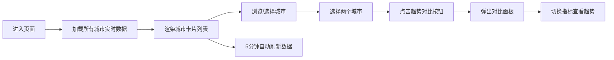

## 1. 产品概述

城市空气质量在线监测与历史趋势对比平台，为用户提供北京、上海、广州、深圳、成都五大城市的实时空气质量数据监测和历史趋势分析功能。

- 主要目的：让用户直观了解各城市当前空气质量状况，并支持多城市历史数据对比分析
- 目标用户：关注空气质量的普通市民、环境研究者、数据分析爱好者
- 产品价值：提供清晰、美观、可交互的空气质量数据可视化体验

## 2. 核心功能

### 2.1 功能模块

1. **仪表盘页面**：导航栏、城市卡片列表、趋势对比浮动按钮
2. **城市卡片**：实时AQI展示、PM2.5/PM10/臭氧/二氧化氮指标展示、进度条动画
3. **趋势对比面板**：双城市折线图、指标标签页切换、数据点悬停交互

### 2.2 页面详情

| 页面名称 | 模块名称 | 功能描述 |
|---------|---------|---------|
| 仪表盘 | 顶部导航栏 | 半透明深色毛玻璃效果，动态粒子图标，城市快速跳转下拉选择器 |
| 仪表盘 | 城市卡片列表 | 5个城市卡片，实时AQI彩色展示，4项指标进度条计数动画 |
| 仪表盘 | 趋势对比按钮 | 左下角浮动按钮，hover放大效果，点击弹出对比面板 |
| 仪表盘 | 趋势对比面板 | 可拖动毛玻璃面板，双折线图叠加，4项指标标签页切换 |

## 3. 核心流程

用户进入页面 → 自动加载所有城市实时空气质量数据 → 浏览各城市卡片数据 → 通过导航栏下拉选择器快速跳转到目标城市 → 选择两个城市进行对比 → 点击趋势对比按钮弹出面板 → 切换指标查看不同污染物的历史趋势 → 数据每5分钟自动刷新

## 4. 用户界面设计

### 4.1 设计风格

- **主色调**：深蓝色渐变背景（#0a1628 → #1a2a4a），青色(#00b4d8)、珊瑚粉(#ff6b6b)作为折线对比色
- **AQI等级色**：优绿#00e400、良黄#ffff00、轻度橙#ff7e00、中度红#ff0000、重度紫#99004c
- **按钮样式**：圆形浮动按钮，青蓝渐变(#00b4d8 → #0077b6)，带浮动阴影，hover放大1.1倍
- **字体**：现代无衬线字体，白色为主，根据数据等级动态变色
- **布局风格**：卡片式布局，毛玻璃效果（backdrop-filter: blur），圆角设计
- **图标**：城市标志性建筑emoji图标，动态粒子圆点图标

### 4.2 页面设计概览

| 页面名称 | 模块名称 | UI元素 |
|---------|---------|--------|
| 仪表盘 | 顶部导航栏 | 半透明深色背景rgba(10,22,40,0.85)，10px模糊，底部发光分割线rgba(100,180,255,0.3)，居中标题，右侧城市下拉选择器 |
| 仪表盘 | 城市卡片 | 圆角20px，背景rgba(255,255,255,0.05)，1px rgba(255,255,255,0.1)边框，15px模糊毛玻璃，大号城市名，彩色AQI数值，4个带进度条的指标块 |
| 仪表盘 | 趋势对比面板 | 宽900px，最大高600px，圆角24px，毛玻璃背景，半透明边框，可拖动标题栏，双折线叠加图，数据点发光悬停效果 |

### 4.3 响应式设计

桌面端优先，卡片采用响应式网格布局，移动端自动适配单列展示。
