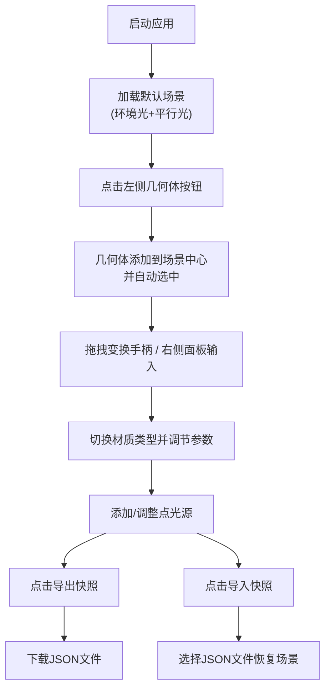

## 1. 产品概述

3D几何雕塑编辑器是一款面向设计师和艺术爱好者的浏览器端实时3D创作工具，解决用户难以快速在三维空间中组合基本几何体并自由调节其参数、直观预览光照和材质组合效果的痛点。

- 目标用户：设计师、数字艺术家、3D爱好者、教育工作者
- 核心价值：零安装门槛、直观的3D交互、实时材质光照预览、场景快照保存与分享

## 2. 核心功能

### 2.1 用户角色

| 角色 | 注册方式 | 核心权限 |
|------|----------|----------|
| 普通用户 | 无需注册，直接使用 | 完整的3D编辑、材质调节、光照设置、快照导入导出功能 |

### 2.2 功能模块

1. **主编辑界面**：左侧几何体面板、中央3D视口、右侧属性面板
2. **几何体创建与变换**：5种基本几何体的添加、三轴平移/旋转/缩放变换
3. **材质编辑器**：4种材质类型（漫反射、金属、光泽、半透明）及其参数调节
4. **多光源系统**：默认环境光+平行光，可添加最多3个点光源
5. **场景快照管理**：JSON格式快照的导出与导入

### 2.3 页面详情

| 页面名称 | 模块名称 | 功能描述 |
|----------|----------|----------|
| 主编辑界面 | 左侧几何体面板 | 5个大号几何体添加按钮（立方体、球体、圆柱、圆环、圆锥），下方光源控制折叠卡片区域，添加光源按钮 |
| 主编辑界面 | 中央3D视口 | Three.js渲染场景，OrbitControls相机控制，TransformControls物体变换，阴影投射 |
| 主编辑界面 | 右侧属性面板 | 选中物体名称/类型显示、position/rotation/scale数值输入、材质参数动态切换、导出/导入按钮 |

## 3. 核心流程

用户打开应用 → 从左侧面板点击添加几何体 → 场景中出现物体并自动选中 → 拖拽三轴手柄或通过右侧面板输入数值调整位置/旋转/缩放 → 切换材质类型并调节参数 → 添加/调整光源 → 点击导出快照保存场景 → 后续可通过导入快照恢复

## 4. 用户界面设计

### 4.1 设计风格

- **主色调**：深空灰渐变背景（#1a1a2e → #16213e），强调色 #6c63ff
- **面板风格**：半透明毛玻璃 rgba(30,30,50,0.9) + 8px 模糊，1px #2a2a4a 分隔线
- **按钮风格**：大号圆角矩形，圆角12px，背景rgba(255,255,255,0.08)，悬停#3a3a5a，选中边框高亮#6c63ff
- **字体**：现代无衬线字体，数值使用等宽字体
- **布局**：固定左右面板 + 中央自适应3D视口，无顶部导航栏，全屏应用

### 4.2 页面设计概览

| 页面名称 | 模块名称 | UI元素 |
|----------|----------|--------|
| 主编辑界面 | 左侧几何体面板 | 220px宽，5个64x64圆角图标按钮，下方光源折叠卡片列表，48x48添加光源按钮 |
| 主编辑界面 | 中央3D视口 | 深空灰渐变背景，红X/绿Y/蓝Z三轴手柄（末端锥形），黄色发光点光源小球，轨道控制相机 |
| 主编辑界面 | 右侧属性面板 | 280px宽，物体名称标题，position/rotation/scale三组步进0.1输入框，材质类型切换，动态参数滑块组，底部导出/导入按钮（圆角8px，#6c63ff背景） |

### 4.3 响应式

- 桌面端优先设计，最低支持1280x720分辨率
- 左右面板固定宽度，中央视口自适应填充
- 触控设备支持：触摸拖拽旋转视角、双指缩放

### 4.4 3D场景指导

- **环境**：深空灰渐变背景（非HDRI），营造科技未来感
- **光照**：默认环境光(intensity 0.3) + 方向光(intensity 1.0, direction 5,10,7)，PCFSoftShadowMap阴影
- **相机**：PerspectiveCamera，fov 50，初始位置(8, 6, 12)，OrbitControls启用阻尼
- **变换手柄**：红X绿Y蓝Z，长度2单位，末端锥形箭头
- **性能**：8个几何体+3个点光源时≥55FPS，参数调节响应≤50ms
