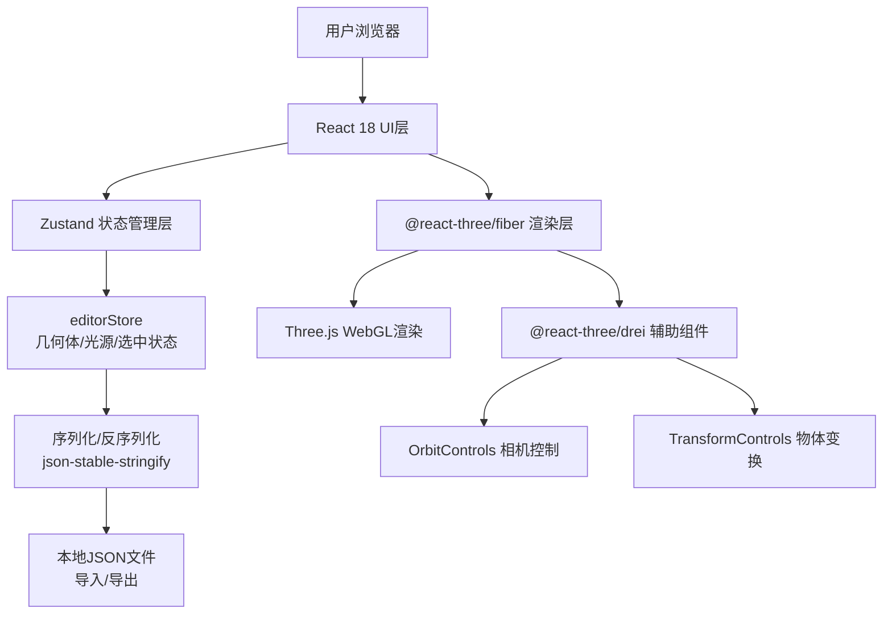

## 1. 架构设计



## 2. 技术描述

- **前端框架**：React 18 + TypeScript 5
- **构建工具**：Vite 5 + @vitejs/plugin-react
- **3D渲染**：Three.js r160 + @react-three/fiber 8 + @react-three/drei 9
- **状态管理**：Zustand 4
- **ID生成**：uuid 9
- **序列化**：json-stable-stringify
- **样式方案**：内联CSS-in-JS（不引入Tailwind，避免与Three.js Canvas背景冲突）

## 3. 文件组织

```
project-root/
├── package.json
├── vite.config.js
├── tsconfig.json
├── index.html
└── src/
    ├── main.tsx
    ├── App.tsx
    ├── store/
    │   └── editorStore.ts
    ├── components/
    │   ├── SceneCanvas.tsx
    │   ├── GeometryPanel.tsx
    │   └── PropertyPanel.tsx
    └── utils/
        └── snapshot.ts
```

## 4. 核心数据模型

### 4.1 几何体数据

```typescript
type GeometryType = 'box' | 'sphere' | 'cylinder' | 'torus' | 'cone'
type MaterialType = 'diffuse' | 'metal' | 'glossy' | 'transparent'

interface MaterialParams {
  type: MaterialType
  color: string
  envIntensity: number
  roughness?: number
  metalness?: number
  specularIntensity?: number
  specularSharpness?: number
  opacity?: number
  ior?: number
}

interface GeometryItem {
  id: string
  type: GeometryType
  position: [number, number, number]
  rotation: [number, number, number]
  scale: number
  material: MaterialParams
}
```

### 4.2 光源数据

```typescript
interface PointLightItem {
  id: string
  position: [number, number, number]
  color: string
  intensity: number
  decay: number
}

interface SceneLights {
  ambientIntensity: number
  directionalIntensity: number
  directionalDirection: [number, number, number]
  pointLights: PointLightItem[]
}
```

### 4.3 快照格式

```typescript
interface SceneSnapshot {
  version: number
  timestamp: number
  geometries: GeometryItem[]
  lights: {
    ambient: { intensity: number }
    directional: { intensity: number; direction: [number, number, number] }
    pointLights: PointLightItem[]
  }
}
```

## 5. 状态管理 Actions

```typescript
interface EditorStore {
  // state
  geometryList: GeometryItem[]
  lightList: PointLightItem[]
  selectedId: string | null
  transformMode: 'translate' | 'rotate'
  
  // geometry actions
  addGeometry: (type: GeometryType) => void
  removeGeometry: (id: string) => void
  selectGeometry: (id: string | null) => void
  updateTransform: (id: string, updates: Partial<Pick<GeometryItem, 'position' | 'rotation' | 'scale'>>) => void
  updateMaterial: (id: string, updates: Partial<MaterialParams>) => void
  setTransformMode: (mode: 'translate' | 'rotate') => void
  
  // light actions
  addPointLight: () => void
  updatePointLight: (id: string, updates: Partial<PointLightItem>) => void
  removePointLight: (id: string) => void
  
  // snapshot actions
  saveSnapshot: () => SceneSnapshot
  loadSnapshot: (snapshot: SceneSnapshot) => void
}
```

## 6. 性能优化策略

1. **几何体实例化**：同类几何体复用BufferGeometry
2. **材质缓存**：相同参数的材质对象复用
3. **阴影优化**：只启用关键物体的投射/接收阴影，shadow.mapSize限制为1024x1024
4. **状态选择器**：Zustand使用shallow选择器避免不必要重渲染
5. **防抖更新**：滑块输入采用轻量状态更新，不引入额外debounce（目标≤50ms延迟）
6. **渲染像素比**：限制为Math.min(window.devicePixelRatio, 2)

## 7. 交互约束

| 操作 | 触发方式 |
|------|----------|
| 平移模式 | 按 T 键 |
| 旋转模式 | 按 R 键 |
| 视角旋转 | 鼠标左键拖拽 |
| 视角平移 | 鼠标右键拖拽 |
| 视角缩放 | 鼠标滚轮 |
| 选中物体 | 左键点击几何体 |
| 取消选中 | 左键点击空白区域 |
