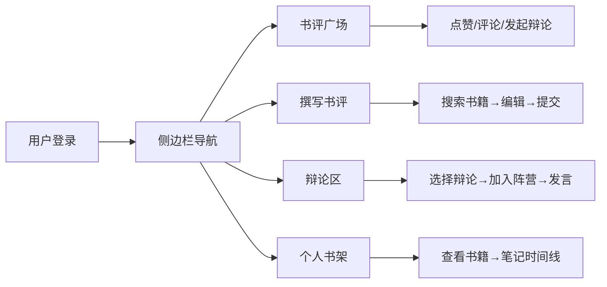

# 在线互动式书评撰写与文学观点碰撞社区 PRD

## 1. 产品概述

在线互动式书评社区是一个让读者分享书评、交流文学观点、发起思想碰撞的平台。用户可以创建个人书架、撰写带标签的书评、对其他书评点赞评论，并参与文学观点辩论。

- **核心价值**：为文学爱好者提供深度交流的空间，促进思想碰撞与阅读成长
- **目标用户**：热爱阅读、喜欢分享阅读感悟的读者群体

## 2. 核心功能

### 2.1 用户角色

| 角色 | 注册方式 | 核心权限 |
|------|----------|----------|
| 普通用户 | 账号注册 | 浏览书评、撰写书评、参与辩论、管理书架 |

### 2.2 功能模块

1. **书评广场**：瀑布流展示书评卡片，支持点赞、评论、发起辩论
2. **书评撰写**：书籍搜索、Markdown编辑、标签管理、提交审核
3. **辩论区**：辩论列表、正反方观点PK、实时聊天气泡、@提及功能
4. **个人书架**：书籍收藏网格、阅读进度环、书籍详情时间线

### 2.3 页面详情

| 页面名称 | 模块名称 | 功能描述 |
|----------|----------|----------|
| 书评广场 | 瀑布流卡片 | 自适应列数(最小300px)，圆角16px，柔和阴影，底部操作按钮 |
| 书评广场 | 点赞交互 | 爱心灰色变玫瑰红(#e74c3c)，scale 1.2弹跳动画 |
| 书评撰写 | 书籍搜索 | 输入3字符触发搜索，下拉列表展示封面书名，选中自动填充 |
| 书评撰写 | Markdown编辑器 | 左侧标签输入(最多5个，渐变胶囊)，右侧实时预览 |
| 辩论区 | 辩论列表 | 卡片展示标题、发起人、参与人数、最新回复时间 |
| 辩论区 | 辩论详情 | 左侧正方(浅蓝#e8f4fd)、右侧反方(浅粉#fde8e8)、中间虚线分隔 |
| 辩论区 | 聊天消息 | 气泡式排列，0.3秒渐显动画，底部输入支持@提及 |
| 个人书架 | 书籍网格 | 正方形封面缩略图，悬停上移5px显示阅读进度环 |
| 个人书架 | 书籍详情 | 全部书评、笔记时间线(左侧垂直细线+圆点标记) |

## 3. 核心流程

### 主要用户流程
用户登录 → 侧边栏导航 → 浏览书评广场 → 点赞/评论/发起辩论
用户登录 → 进入书评撰写页 → 搜索书籍 → 编辑内容+添加标签 → 提交审核
用户登录 → 进入辩论区 → 选择辩论 → 加入正方/反方 → 发言交流
用户登录 → 进入书架 → 查看收藏书籍 → 点击查看详情/笔记

## 4. 用户界面设计

### 4.1 设计风格

- **主色调**：极浅灰蓝背景(#f0f4f8)，玫瑰红强调色(#e74c3c)，渐变标签(#3498db→#2ecc71)
- **毛玻璃效果**：侧边栏半透明(rgba(255,255,255,0.6))，模糊12px，边框1px rgba(200,200,200,0.3)
- **卡片风格**：白色背景，圆角16px，柔和阴影(rgba(0,0,0,0.06))
- **按钮样式**：圆角胶囊形，过渡动画
- **字体**：现代无衬线字体，清晰易读
- **动效**：点赞弹跳、消息渐显、悬停微动效

### 4.2 页面设计概览

| 页面名称 | 模块名称 | UI元素 |
|----------|----------|--------|
| 主布局 | 侧边栏 | 260px宽，毛玻璃，头像昵称，4个导航项 |
| 主布局 | 主区域 | #f0f4f8背景，响应式内容区 |
| 书评广场 | 瀑布流 | 自适应列数，卡片间距，滚动加载 |
| 书评撰写 | 编辑器 | 左侧标签，中间编辑区，右侧预览 |
| 辩论详情 | 双栏布局 | 左浅蓝右浅粉，中间虚线，气泡消息 |
| 书架 | 网格 | 正方形封面，悬停进度环，上移动效 |

### 4.3 响应式设计

- 桌面端优先设计
- 瀑布流列数随屏幕宽度自动调整（最小列宽300px）
- 侧边栏在小屏幕可折叠

### 4.4 性能要求

- 瀑布流滚动加载帧率不低于55fps
- 书籍搜索响应时间不超过800ms
