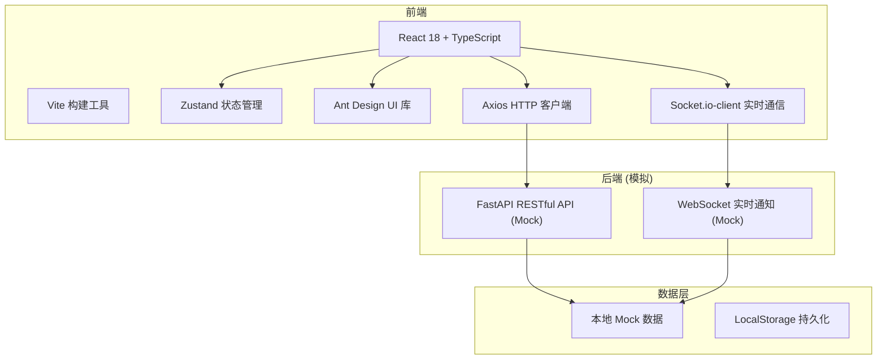
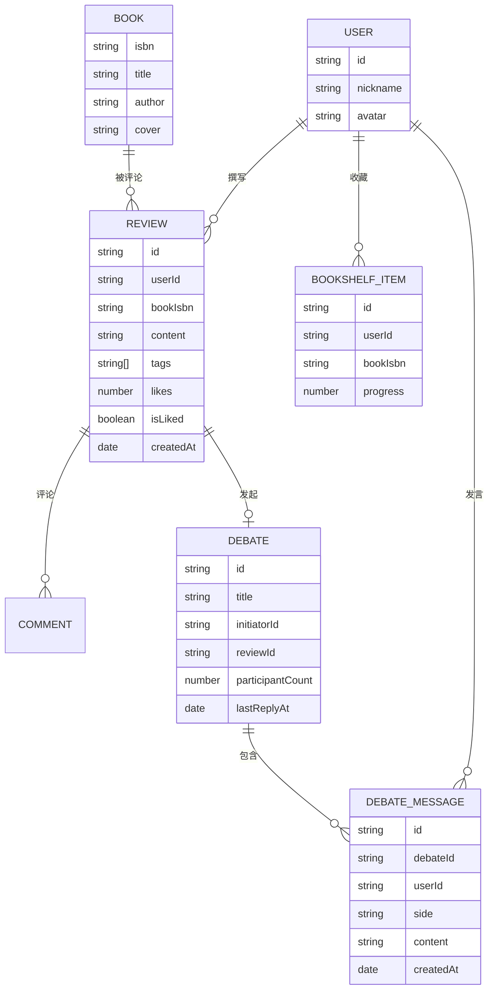

# 在线互动式书评社区 技术架构文档

## 1. 架构设计



## 2. 技术选型说明

- **前端框架**：React 18 + TypeScript
- **构建工具**：Vite
- **状态管理**：Zustand
- **UI 组件库**：Ant Design
- **HTTP 客户端**：Axios
- **实时通信**：Socket.io-client
- **日期处理**：Day.js
- **Markdown 渲染**：Marked
- **唯一ID**：UUID

## 3. 路由定义

| 路由 | 页面 | 说明 |
|------|------|------|
| / | 书评广场 | 首页，瀑布流展示书评 |
| /review/new | 书评撰写 | 新建书评页面 |
| /debate | 辩论区 | 辩论列表页面 |
| /debate/:id | 辩论详情 | 单场辩论的正反方PK界面 |
| /bookshelf | 个人书架 | 用户收藏的书籍网格 |
| /bookshelf/:bookId | 书籍详情 | 单本书的书评、笔记时间线 |
| /settings | 设置 | 用户设置页面 |

## 4. 目录结构

```
src/
├── components/       # 通用组件
│   ├── Sidebar.tsx       # 侧边栏导航
│   └── BookSearch.tsx    # 书籍搜索组件
├── pages/            # 页面组件
│   ├── Bookshelf.tsx     # 书架页面
│   ├── ReviewEditor.tsx  # 书评编辑器
│   └── DebateZone.tsx    # 辩论区页面
├── stores/           # Zustand 状态仓库
│   ├── userStore.ts      # 用户状态
│   ├── reviewStore.ts    # 书评状态
│   └── debateStore.ts    # 辩论状态
├── api/              # API 封装
│   ├── userApi.ts        # 用户相关接口
│   ├── bookApi.ts        # 书籍搜索接口
│   ├── reviewApi.ts      # 书评相关接口
│   └── debateApi.ts      # 辩论相关接口
├── App.tsx           # 主应用组件
└── main.tsx          # 应用入口
```

## 5. 数据模型

### 5.1 数据模型定义



### 5.2 类型定义

```typescript
interface User {
  id: string;
  nickname: string;
  avatar: string;
}

interface Book {
  isbn: string;
  title: string;
  author: string;
  cover: string;
}

interface Review {
  id: string;
  userId: string;
  user?: User;
  bookIsbn: string;
  book?: Book;
  content: string;
  tags: string[];
  likes: number;
  isLiked: boolean;
  comments: number;
  createdAt: string;
}

interface Debate {
  id: string;
  title: string;
  initiatorId: string;
  initiator?: User;
  reviewId: string;
  participantCount: number;
  lastReplyAt: string;
  proMessages: DebateMessage[];
  conMessages: DebateMessage[];
}

interface DebateMessage {
  id: string;
  debateId: string;
  userId: string;
  user?: User;
  side: 'pro' | 'con';
  content: string;
  createdAt: string;
}

interface BookshelfItem {
  id: string;
  book: Book;
  progress: number;
  addedAt: string;
}
```
