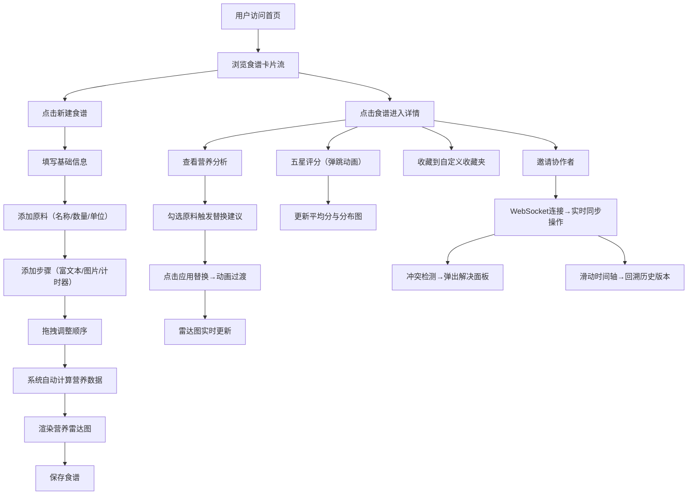

## 1. 产品概述

智能食谱协作平台，面向烹饪爱好者提供系统化的食谱创建、管理、营养分析与多人协作优化解决方案，解决传统食谱难以结构化管理、营养不透明、协作效率低的问题。

- **目标用户**：家庭厨师、美食博主、烹饪教练、饮食管理人群
- **核心价值**：一站式食谱全生命周期管理 + 智能营养分析 + 多人实时协作

## 2. 核心功能

### 2.1 用户角色

| 角色 | 注册方式 | 核心权限 |
|------|----------|----------|
| 普通用户 | 邮箱/用户名注册 | 创建食谱、收藏评分、协作编辑 |
| 食谱创建者 | 同上 | 邀请协作、管理版本、权限控制 |

### 2.2 功能模块

1. **首页食谱流**：网格布局食谱卡片、搜索筛选、分类浏览
2. **食谱详情页**：大图轮播、原料列表、步骤说明、营养雷达图
3. **食谱编辑器**：动态增删原料/步骤、拖拽排序、富文本编辑、步骤计时器
4. **收藏与评分**：侧边栏收藏夹管理、五星动画评分、评分分布图
5. **营养分析**：原料营养数据库、自动计算五维营养、渐变雷达图动画
6. **多人协作**：WebSocket实时同步、光标高亮、操作气泡、版本时间轴、冲突解决
7. **智能替换**：原料替代推荐、动画过渡、实时更新营养数据

### 2.3 页面详情

| 页面名称 | 模块名称 | 功能描述 |
|----------|----------|----------|
| 首页 | 导航栏 | Logo、搜索框、新建食谱按钮、用户头像 |
| 首页 | 食谱卡片流 | 响应式网格、缩略图、星级、总时长、悬停预览 |
| 首页 | 侧边收藏栏 | 收藏夹列表、新建/重命名/删除操作 |
| 食谱详情 | 图片轮播 | 大图渐隐切换、指示器 |
| 食谱详情 | 基础信息 | 标题、简介、准备/烹饪时间、难度等级 |
| 食谱详情 | 营养雷达图 | 五维渐变雷达图、动画过渡 |
| 食谱详情 | 原料列表 | 动态增删、勾选复选框、删除按钮、替换建议卡片 |
| 食谱详情 | 步骤列表 | 圆形序号、富文本、图片嵌入、计时器、拖拽排序 |
| 食谱详情 | 协作面板 | 在线用户列表、光标位置、版本时间轴、冲突提示 |
| 食谱详情 | 评分区域 | 五星动画评分、平均分、评分分布条形图 |
| 编辑器 | 表单区域 | 所有字段可编辑、拖拽排序、动态添加 |

## 3. 核心流程

## 4. 用户界面设计

### 4.1 设计风格

- **主色调**：米白色 `#FFF8F0` 背景 + 浅橙色 `#FFB380` 点缀
- **辅助色**：深褐色 `#5D4037` 文字与图标
- **强调色**：暖橙 `#FF8A3D` 用于按钮、金色 `#FFD54F` 用于星级
- **按钮风格**：圆角 12px、2px 微缩波纹动效、悬停轻微上浮
- **字体**：标题使用 "Noto Serif SC" 衬线体，正文 "Noto Sans SC" 无衬线
- **布局风格**：卡片式设计、柔和阴影、圆润边角（8-16px）
- **图标**：Lucide React 线性风格图标，深褐色

### 4.2 页面设计概览

| 页面名称 | 模块名称 | UI 元素与动效 |
|----------|----------|---------------|
| 首页 | 食谱卡片流 | 3列网格→平板2列→手机1列，卡片悬停 translateY(-6px) + 阴影加深，300ms 缓动，显示半透明浮动摘要层 |
| 食谱详情 | 图片轮播 | 顶部全宽大图，渐隐切换（opacity 0→1，400ms），圆点指示器 |
| 食谱详情 | 营养雷达图 | Recharts RadarChart，渐变填充（橙→透明），数据变化时 50ms 平滑动画 |
| 食谱详情 | 星级评分 | SVG 五角星，未选中灰色 `#9E9E9E`，选中金色 `#FFD54F`，鼠标悬停时星星依次弹跳（scale 1.3 + translateY(-4px)，80ms 延迟差） |
| 食谱详情 | 原料替换 | 勾选原料后右侧滑出浮动卡片（translateX 40px→0），应用替换时旧原料淡出+新原料淡入（crossfade 250ms） |
| 食谱详情 | 步骤序号 | 40px 圆形灰色徽章，内部白色数字 |
| 全局 | 按钮动效 | 点击时 scale(0.96) + 背景色水波纹扩散（300ms） |
| 全局 | 加载状态 | Skeleton 骨架屏（脉冲动画），覆盖各区域 |
| 全局 | 拖拽反馈 | 被拖拽元素 opacity: 0.7，跟随手指移动 + 轻微旋转 2° |

### 4.3 响应式设计

- **桌面端**（≥1024px）：首页3列网格，侧边栏固定显示
- **平板端**（768-1023px）：首页2列网格，侧边栏可折叠
- **手机端**（<768px）：首页1列布局，底部Tab导航，所有动画保持但幅度减小
- **触摸优化**：所有可点击区域≥44px，拖拽使用触控事件

### 4.4 性能指标

| 指标 | 目标值 | 优化策略 |
|------|--------|----------|
| 首屏加载（网络+渲染） | <3s | 代码分割、图片懒加载、Skeleton预渲染、静态资源CDN |
| 营养雷达图更新 | <50ms | 纯前端计算、避免重排、useMemo缓存计算结果 |
| 拖拽流畅度 | 60fps | CSS transform、will-change 提示 |
| WebSocket同步延迟 | <100ms | 增量操作传输、OpLog合并 |
