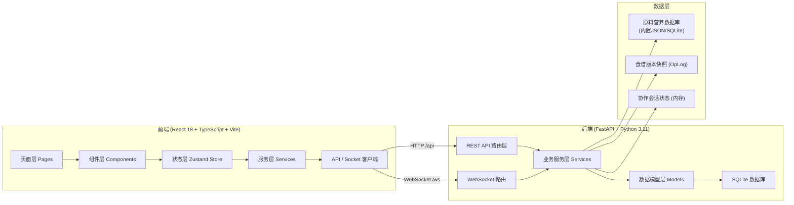
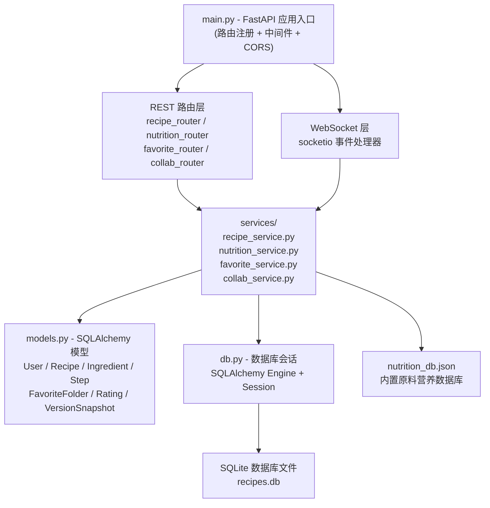
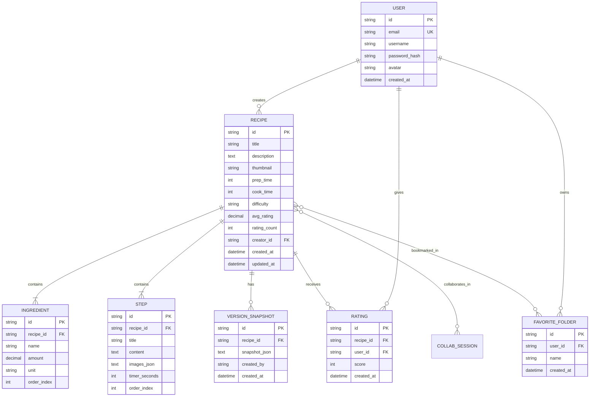

## 1. 架构设计



## 2. 技术说明

### 2.1 前端技术栈

| 分类 | 技术选型 | 版本 | 用途 |
|------|----------|------|------|
| 框架 | React | ^18.2.0 | UI 渲染 |
| 构建 | Vite | ^5.0.0 | 极速构建 + HMR |
| 类型 | TypeScript | ^5.3.0 | 类型安全 |
| 路由 | react-router-dom | ^6.21.0 | 客户端路由 |
| 状态 | zustand | ^4.4.0 | 全局状态管理 |
| HTTP | axios | ^1.6.0 | API 请求 |
| 实时通信 | socket.io-client | ^4.6.0 | WebSocket 连接 |
| 图表 | recharts | ^2.10.0 | 营养雷达图 |
| 拖拽 | react-beautiful-dnd | ^13.1.0 | 拖拽排序 |
| 加载态 | react-loading-skeleton | ^3.3.0 | 骨架屏 |
| 样式 | Tailwind CSS | ^3.4.0 | 原子化样式 |

### 2.2 后端技术栈

| 分类 | 技术选型 | 版本 | 用途 |
|------|----------|------|------|
| 框架 | FastAPI | ^0.104.0 | REST + WebSocket |
| 数据库 | SQLite (标准库) | - | 轻量持久化 |
| ORM | SQLAlchemy | ^2.0.0 | 对象关系映射 |
| WebSocket | python-socketio | ^5.10.0 | 实时通信服务端 |
| 校验 | Pydantic | ^2.5.0 | 数据模型校验 |

## 3. 路由定义

| 路由 | 页面 | 主要功能 |
|------|------|----------|
| `/` | 首页 HomePage | 食谱卡片流、搜索、侧边收藏栏 |
| `/recipe/:id` | 食谱详情 RecipeDetail | 图文展示、营养雷达、评分、协作 |
| `/editor/new` | 新建编辑器 RecipeEditor | 创建新食谱 |
| `/editor/:id` | 编辑已有食谱 | 修改食谱内容 |
| `/favorites/:folderId` | 收藏夹页面 | 展示指定收藏夹内容 |

## 4. API 定义

### 4.1 TypeScript 类型定义

```typescript
interface Ingredient {
  id: string;
  name: string;
  amount: number;
  unit: string;
  order: number;
  nutritionPerUnit: NutritionData;
}

interface Step {
  id: string;
  title: string;
  content: string;
  images: string[];
  timerSeconds: number;
  order: number;
}

interface Recipe {
  id: string;
  title: string;
  description: string;
  thumbnail: string;
  images: string[];
  prepTime: number;
  cookTime: number;
  difficulty: 'easy' | 'medium' | 'hard';
  ingredients: Ingredient[];
  steps: Step[];
  nutrition: NutritionData;
  avgRating: number;
  ratingCount: number;
  ratingDistribution: number[];
  createdAt: string;
  updatedAt: string;
  collaborators: Collaborator[];
}

interface NutritionData {
  calories: number;
  protein: number;
  fat: number;
  carbs: number;
  fiber: number;
}

interface Collaborator {
  userId: string;
  username: string;
  avatar: string;
  cursorPosition?: { section: string; id: string };
  color: string;
}

interface FavoriteFolder {
  id: string;
  name: string;
  recipeIds: string[];
}
```

### 4.2 REST API 端点

| Method | Path | 功能 | Request | Response |
|--------|------|------|---------|----------|
| GET | `/api/recipes` | 获取食谱列表（分页+筛选） | `?page=&search=&difficulty=` | `{ recipes: Recipe[], total: number }` |
| GET | `/api/recipes/:id` | 获取食谱详情 | - | `Recipe` |
| POST | `/api/recipes` | 创建食谱 | `RecipeCreateDTO` | `Recipe` |
| PUT | `/api/recipes/:id` | 更新食谱 | `RecipeUpdateDTO` | `Recipe` |
| DELETE | `/api/recipes/:id` | 删除食谱 | - | `{ success: true }` |
| GET | `/api/recipes/:id/versions` | 获取版本历史 | - | `{ versions: VersionSnapshot[] }` |
| POST | `/api/recipes/:id/ratings` | 提交评分 | `{ rating: 1-5 }` | `{ avgRating, distribution }` |
| GET | `/api/nutrition/calculate` | 计算营养数据 | `{ ingredients: [...] }` | `NutritionData` |
| GET | `/api/ingredients/:id/replacements` | 获取替换建议 | - | `{ replacements: Ingredient[] }` |
| GET | `/api/favorites` | 获取收藏夹列表 | - | `FavoriteFolder[]` |
| POST | `/api/favorites` | 创建收藏夹 | `{ name }` | `FavoriteFolder` |
| PATCH | `/api/favorites/:id` | 重命名收藏夹 | `{ name }` | `FavoriteFolder` |
| DELETE | `/api/favorites/:id` | 删除收藏夹 | - | `{ success: true }` |
| POST | `/api/favorites/:id/recipes/:rid` | 添加到收藏夹 | - | `{ success: true }` |
| DELETE | `/api/favorites/:id/recipes/:rid` | 从收藏夹移除 | - | `{ success: true }` |
| POST | `/api/recipes/:id/collaborators` | 邀请协作者 | `{ email/username }` | `Collaborator` |
| DELETE | `/api/recipes/:id/collaborators/:uid` | 移除协作者 | - | `{ success: true }` |

### 4.3 WebSocket 消息协议

```typescript
// 客户端发送
type ClientMessage = 
  | { type: 'join'; recipeId: string; userId: string }
  | { type: 'leave'; recipeId: string }
  | { type: 'op'; op: OpLog; recipeId: string }
  | { type: 'cursor'; recipeId: string; position: CursorPos }
  | { type: 'conflict_resolve'; recipeId: string; resolution: 'accept_ours' | 'accept_theirs' | 'merge' };

// 服务端广播
type ServerMessage =
  | { type: 'user_join'; user: Collaborator }
  | { type: 'user_leave'; userId: string }
  | { type: 'op_broadcast'; op: OpLog; fromUserId: string }
  | { type: 'cursor_update'; userId: string; position: CursorPos }
  | { type: 'conflict'; localOp: OpLog; remoteOp: OpLog }
  | { type: 'version_snapshot'; snapshot: VersionSnapshot };
```

## 5. 服务端架构图



## 6. 数据模型

### 6.1 ER 图



### 6.2 营养数据库（nutrition_db.json 片段）

```json
{
  "牛奶": { "calories": 54, "protein": 3.2, "fat": 3.25, "carbs": 5, "fiber": 0, "unit": "ml", "replacements": ["豆奶", "燕麦奶", "杏仁奶"] },
  "小麦粉": { "calories": 364, "protein": 10.3, "fat": 1, "carbs": 76, "fiber": 2.7, "unit": "g", "replacements": ["杏仁粉", "椰子粉", "全麦粉"] },
  "鸡蛋": { "calories": 155, "protein": 13, "fat": 11, "carbs": 1.1, "fiber": 0, "unit": "个", "replacements": ["亚麻蛋", "豆腐"] },
  "白糖": { "calories": 387, "protein": 0, "fat": 0, "carbs": 100, "fiber": 0, "unit": "g", "replacements": ["蜂蜜", "枫糖浆", "椰糖"] },
  "黄油": { "calories": 717, "protein": 0.9, "fat": 81, "carbs": 0.1, "fiber": 0, "unit": "g", "replacements": ["椰子油", "橄榄油", "植物黄油"] }
}
```
