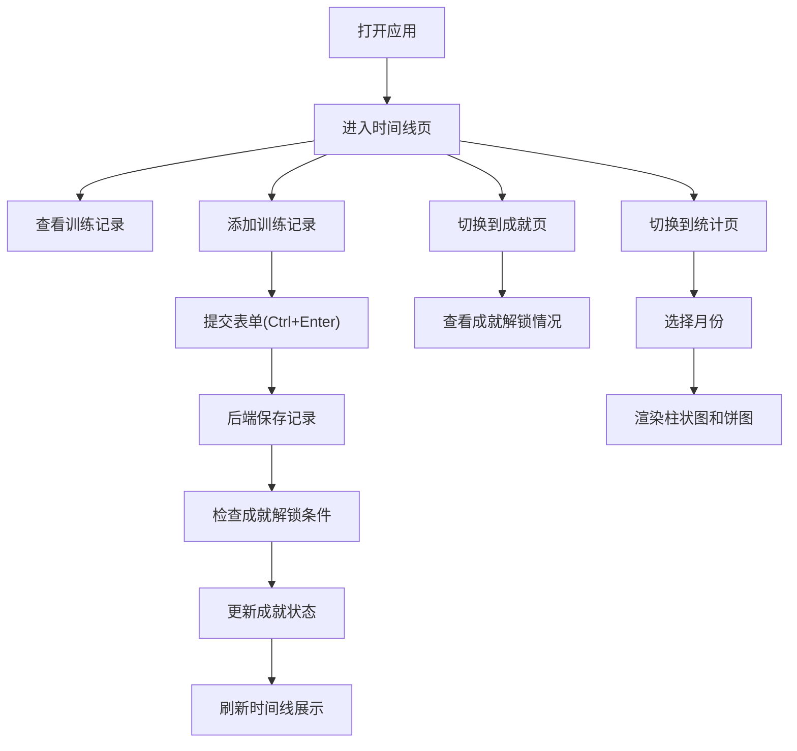

## 1. 产品概述

健身训练里程碑追踪与成就可视化应用，帮助用户记录训练历程、可视化展示训练成果并通过成就系统提供正向激励，解决健身难以长期坚持的痛点。

- 面向所有健身爱好者，提供训练记录、成就解锁、数据统计三大核心功能
- 通过可视化时间线、成就徽章和数据图表，让训练成果清晰可见，持续激发训练动力

## 2. 核心功能

### 2.1 用户角色

| 角色 | 注册方式 | 核心权限 |
|------|----------|----------|
| 普通用户 | 无需注册，本地存储 | 添加训练记录、查看时间线、解锁成就、查看统计数据 |

### 2.2 功能模块

1. **里程碑时间线页**：训练记录时间轴展示、添加训练表单、记录卡片交互
2. **成就展示页**：成就卡片网格、解锁状态展示、成就详情
3. **统计仪表盘页**：月度训练时长柱状图、训练类型分布饼图、月份切换

### 2.3 页面详情

| 页面名称 | 模块名称 | 功能描述 |
|---------|----------|----------|
| 里程碑时间线页 | 时间线展示 | 垂直时间轴展示所有训练记录，按日期倒序排列 |
| 里程碑时间线页 | 添加训练表单 | 支持选择训练类型、输入时长、日期和感想，Ctrl+Enter快捷提交 |
| 里程碑时间线页 | 记录卡片 | 展示日期、训练类型、时长和感想，彩色圆点标识训练类型 |
| 成就展示页 | 成就卡片网格 | 自适应网格布局展示所有成就，已解锁高亮显示 |
| 成就展示页 | 成就详情 | 显示成就图标、名称、描述和解锁条件 |
| 统计仪表盘页 | 月度柱状图 | 展示当月每日训练时长，亮橙色渐变 |
| 统计仪表盘页 | 类型饼图 | 展示训练类型分布占比，按类型着色 |
| 统计仪表盘页 | 月份切换 | 支持切换月份查看历史统计数据 |

## 3. 核心流程

用户打开应用后，默认进入时间线页面查看历史训练记录。用户可通过顶部导航切换到成就页或统计页。在时间线页，用户可添加新的训练记录，提交后系统自动检查是否满足成就解锁条件并更新成就状态。统计页根据选择的月份从后端获取聚合数据并渲染图表。

## 4. 用户界面设计

### 4.1 设计风格

- **主色调**：深灰蓝背景(#1a1d23)，亮橙色(#ff6b35)作为强调色
- **辅助色**：力量训练红(#e74c3c)、有氧蓝(#3498db)、瑜伽绿(#2ecc71)、其他紫(#9b59b6)
- **卡片风格**：圆角12px，卡片灰背景(#2a2d35)，悬停上移3px增强阴影
- **字体**：现代无衬线字体，标题加粗，正文清晰易读
- **导航栏**：半透明毛玻璃效果(rgba(26,29,35,0.8))，模糊10px，底部1px分割线
- **图标**：使用emoji表示成就图标，简洁直观

### 4.2 页面设计概述

| 页面名称 | 模块名称 | UI元素 |
|---------|----------|--------|
| 里程碑时间线页 | 顶部导航栏 | 毛玻璃背景，三个页面链接，选中时下划线高亮 |
| 里程碑时间线页 | 时间线区域 | 垂直轴线，彩色圆点标识，卡片交错淡入动画 |
| 里程碑时间线页 | 添加表单 | 输入框、下拉选择、提交按钮，快捷键提示 |
| 成就展示页 | 成就网格 | 自适应列数(最小250px)，已解锁发光边框，未解锁灰度锁定 |
| 成就展示页 | 成就卡片 | emoji图标、名称、描述，悬停微动效 |
| 统计仪表盘页 | 图表容器 | 卡片灰背景，柱状图亮橙渐变，饼图按类型着色 |
| 统计仪表盘页 | 月份切换器 | 左右箭头+月份显示，平滑过渡 |

### 4.3 响应式设计

- 桌面端(>768px)：时间线卡片左右交替，统计图表左右排列
- 移动端(≤768px)：时间线卡片全宽展示，统计图表上下堆叠
- 所有交互元素保持足够触摸区域(≥44px)

### 4.4 动效设计

- 页面进入：0.3秒淡入动画
- 卡片加载：交错延迟0.1秒递增淡入
- 卡片悬停：向上平移3px，阴影增强
- 导航切换：平滑过渡，下划线滑动效果
- 图表渲染：数据加载动画，帧率≥30fps
