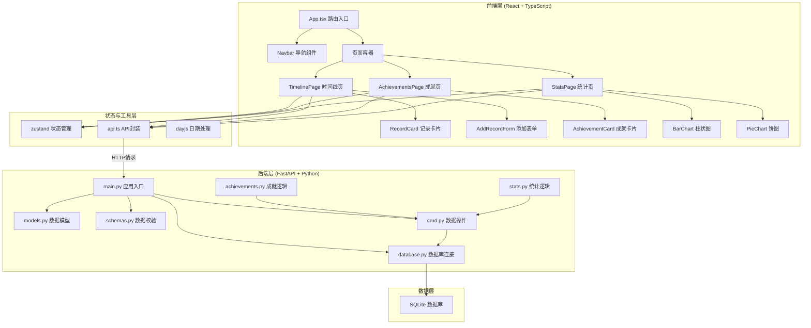
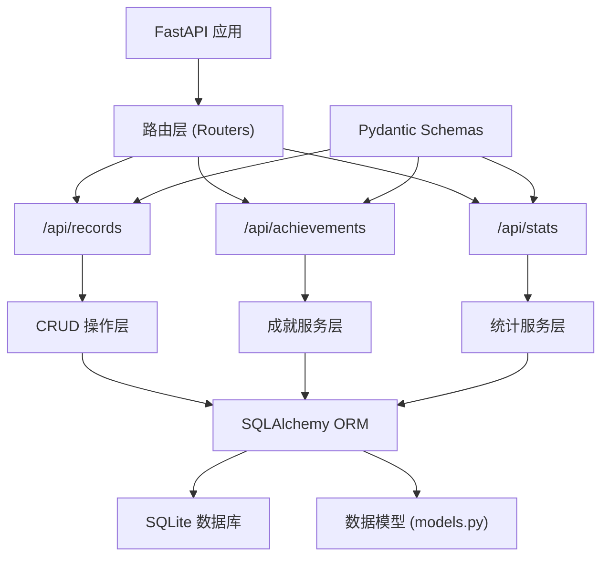
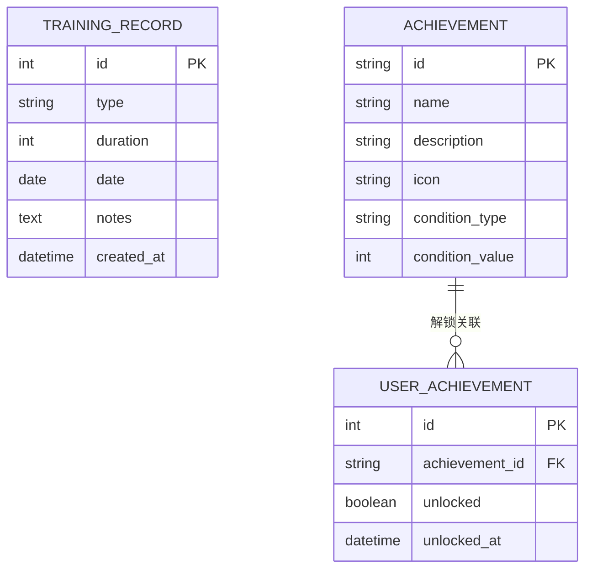

## 1. 架构设计



## 2. 技术描述

- **前端**：React@18 + TypeScript + Vite + react-router-dom + zustand + recharts + dayjs + axios
- **构建工具**：Vite (代码分割，按需加载charts库)
- **后端**：FastAPI@0.100+ + Python 3.10+ + SQLAlchemy + Pydantic
- **数据库**：SQLite (轻量级，本地存储)
- **状态管理**：zustand (轻量级状态管理)
- **样式方案**：原生CSS + CSS变量，实现深色运动主题

## 3. 路由定义

| 前端路由 | 页面组件 | 后端API | 用途 |
|---------|----------|---------|------|
| / | TimelinePage | GET /api/records | 时间线首页 |
| /achievements | AchievementsPage | GET /api/achievements | 成就展示页 |
| /stats | StatsPage | GET /api/stats?month=YYYY-MM | 统计仪表盘页 |

## 4. API 定义

### 4.1 TypeScript 类型定义

```typescript
// 训练类型
type TrainingType = 'strength' | 'cardio' | 'yoga' | 'other';

// 训练记录
interface TrainingRecord {
  id: number;
  type: TrainingType;
  duration: number;
  date: string;
  notes: string;
  createdAt: string;
}

// 成就
interface Achievement {
  id: string;
  name: string;
  description: string;
  icon: string;
  unlocked: boolean;
  unlockedAt?: string;
  condition: string;
  progress?: number;
}

// 统计数据
interface MonthlyStats {
  month: string;
  totalMinutes: number;
  dailyData: { date: string; minutes: number }[];
  typeDistribution: { type: TrainingType; minutes: number; percentage: number }[];
}
```

### 4.2 API 接口定义

| 方法 | 路径 | 请求体 | 响应 | 说明 |
|------|------|--------|------|------|
| GET | /api/records | - | `TrainingRecord[]` | 获取所有训练记录，按日期倒序 |
| POST | /api/records | `{ type: TrainingType; duration: number; date: string; notes: string }` | `TrainingRecord` | 添加新训练记录 |
| GET | /api/achievements | - | `Achievement[]` | 获取所有成就及解锁状态 |
| GET | /api/stats | query: `month=YYYY-MM` | `MonthlyStats` | 获取指定月份统计数据 |

## 5. 服务器架构图



## 6. 数据模型

### 6.1 ER 图



### 6.2 DDL 语句

```sql
-- 训练记录表
CREATE TABLE IF NOT EXISTS training_records (
    id INTEGER PRIMARY KEY AUTOINCREMENT,
    type VARCHAR(20) NOT NULL,
    duration INTEGER NOT NULL,
    date DATE NOT NULL,
    notes TEXT,
    created_at DATETIME DEFAULT CURRENT_TIMESTAMP
);

CREATE INDEX idx_training_records_date ON training_records(date);

-- 成就定义表
CREATE TABLE IF NOT EXISTS achievements (
    id VARCHAR(50) PRIMARY KEY,
    name VARCHAR(100) NOT NULL,
    description TEXT NOT NULL,
    icon VARCHAR(10) NOT NULL,
    condition_type VARCHAR(50) NOT NULL,
    condition_value INTEGER NOT NULL,
    created_at DATETIME DEFAULT CURRENT_TIMESTAMP
);

-- 用户成就表
CREATE TABLE IF NOT EXISTS user_achievements (
    id INTEGER PRIMARY KEY AUTOINCREMENT,
    achievement_id VARCHAR(50) REFERENCES achievements(id),
    unlocked BOOLEAN DEFAULT 0,
    unlocked_at DATETIME,
    created_at DATETIME DEFAULT CURRENT_TIMESTAMP,
    UNIQUE(achievement_id)
);

-- 初始化成就数据
INSERT OR IGNORE INTO achievements (id, name, description, icon, condition_type, condition_value) VALUES
('streak_7', '坚持不懈', '连续7天训练', '🔥', 'consecutive_days', 7),
('all_rounder', '全能选手', '完成5种不同类型训练', '🏆', 'unique_types', 5),
('total_1000', '百炼成钢', '累计训练1000分钟', '💪', 'total_minutes', 1000),
('first_workout', '初出茅庐', '完成第一次训练', '🌟', 'total_records', 1),
('ten_workouts', '训练达人', '完成10次训练', '🎯', 'total_records', 10),
('cardio_master', '有氧之王', '累计有氧训练500分钟', '🏃', 'type_minutes', 500),
('strength_master', '力量王者', '累计力量训练500分钟', '🏋️', 'type_minutes_strength', 500),
('yoga_lover', '瑜伽爱好者', '累计瑜伽训练200分钟', '🧘', 'type_minutes_yoga', 200);
```

## 7. 项目文件结构与调用关系

```
auto132/
├── frontend/                          # 前端项目
│   ├── package.json                   # 依赖配置
│   ├── vite.config.js                 # Vite配置 + API代理
│   ├── tsconfig.json                  # TypeScript配置(严格模式)
│   ├── index.html                     # 入口HTML
│   └── src/
│       ├── App.tsx                    # 路由入口 → 调用 Navbar + 页面组件
│       ├── main.tsx                   # React入口 → 渲染 App
│       ├── components/
│       │   └── Navbar.tsx             # 导航组件 → 接收路由高亮
│       ├── pages/
│       │   ├── TimelinePage.tsx       # 时间线页 → 调用 api.ts + RecordCard + AddRecordForm
│       │   ├── AchievementsPage.tsx   # 成就页 → 调用 api.ts + AchievementCard
│       │   └── StatsPage.tsx          # 统计页 → 调用 api.ts + 动态导入recharts
│       ├── components/
│       │   ├── RecordCard.tsx         # 记录卡片组件
│       │   ├── AddRecordForm.tsx      # 添加表单组件
│       │   └── AchievementCard.tsx    # 成就卡片组件
│       ├── store/
│       │   └── useStore.ts            # zustand状态管理
│       ├── utils/
│       │   └── api.ts                 # API封装 → axios请求 + 错误处理
│       ├── types/
│       │   └── index.ts               # TypeScript类型定义
│       └── styles/
│           └── global.css             # 全局样式 + CSS变量
│
└── backend/                           # 后端项目
    ├── main.py                        # FastAPI入口 → 注册路由 + CORS
    ├── database.py                    # 数据库连接 → SQLAlchemy engine
    ├── models.py                      # SQLAlchemy模型
    ├── schemas.py                     # Pydantic数据校验
    ├── crud.py                        # CRUD操作 → 数据库读写
    ├── achievements.py                # 成就逻辑 → 检查解锁条件
    ├── stats.py                       # 统计逻辑 → 聚合计算
    └── requirements.txt               # Python依赖
```

### 数据流向说明

1. **添加训练记录**：
   - `AddRecordForm.tsx` → `api.ts:POST /api/records` → `main.py` → `crud.py:create_record()` → `achievements.py:check_achievements()` → 更新数据库 → 返回新记录
   - 页面状态更新 → `TimelinePage.tsx` 重新渲染时间线

2. **获取成就列表**：
   - `AchievementsPage.tsx` → `api.ts:GET /api/achievements` → `main.py` → `crud.py:get_achievements_with_status()` → 返回成就列表及解锁状态

3. **获取统计数据**：
   - `StatsPage.tsx` → `api.ts:GET /api/stats?month=YYYY-MM` → `main.py` → `stats.py:calculate_monthly_stats()` → `crud.py:get_records_by_month()` → 聚合计算 → 返回统计数据

## 8. 性能优化策略

| 优化点 | 实现方式 | 目标 |
|--------|----------|------|
| 代码分割 | 使用 React.lazy 动态导入 recharts 图表库 | 首屏加载 < 1.5s |
| API代理 | Vite devServer 代理到后端 8000 端口 | 避免跨域问题 |
| 数据缓存 | zustand 缓存已加载数据，避免重复请求 | API响应 < 500ms |
| 数据库索引 | date 字段添加索引 | 查询优化 |
| 动画优化 | CSS transform 实现卡片悬停，GPU加速 | 图表帧率 ≥ 30fps |
| 按需渲染 | 时间线卡片交错延迟加载，减少首屏压力 | 提升感知性能 |
