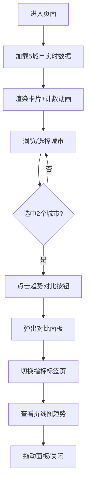

## 1. 产品概述

城市空气质量在线监测平台，为用户提供北京、上海、广州、深圳、成都五大城市的实时空气质量数据和历史趋势对比分析，帮助公众直观了解空气质量状况及其变化规律。

- 核心价值：以可视化的方式呈现多维度空气质量指标，支持跨城市历史趋势对比
- 目标用户：关注环境健康的普通市民、环境研究人员、数据爱好者

## 2. 核心功能

### 2.1 功能模块

1. **仪表盘首页**：顶部导航栏、城市卡片列表、趋势对比浮动按钮
2. **城市实时数据卡片**：AQI 指数、PM2.5、PM10、臭氧、二氧化氮指标展示
3. **历史趋势对比面板**：双城市、多指标的折线图对比分析
4. **城市快速定位**：导航栏城市选择器，支持滚动定位

### 2.2 页面详情

| 页面名称 | 模块名称 | 功能描述 |
|-----------|-------------|---------------------|
| 仪表盘 | 顶部导航栏 | 应用名称+动态粒子图标、城市下拉选择器、毛玻璃半透明效果 |
| 仪表盘 | 城市卡片网格 | 5个城市卡片，展示实时AQI及各项污染物浓度，带进度条动画 |
| 仪表盘 | 趋势对比按钮 | 浮动圆形按钮，选择两个城市后可点击打开对比面板 |
| 趋势对比面板 | 指标标签页 | 切换PM2.5/PM10/臭氧/二氧化氮四种指标 |
| 趋势对比面板 | 双折线图 | 两城市7天历史数据叠加展示，平滑曲线+发光效果+悬停提示 |
| 趋势对比面板 | 可拖动标题栏 | 支持拖动面板位置，非模态弹窗 |

## 3. 核心流程

用户进入页面 → 自动加载所有城市实时数据（含计数动画）→ 浏览各城市空气质量卡片 → 通过顶部选择器快速定位城市 → 选择两个城市 → 点击"趋势对比"按钮 → 弹出对比面板 → 切换不同指标查看趋势 → 拖动面板调整位置

## 4. 用户界面设计

### 4.1 设计风格

- **主色调**：深蓝渐变背景 #0a1628 → #1a2a4a，科技感深色主题
- **强调色**：青色 #00b4d8、珊瑚粉 #ff6b6b、AQI等级色（优绿/良黄/轻度橙/中度红/重度紫）
- **按钮样式**：圆形浮动按钮，青色到蓝色渐变，hover放大1.1倍
- **字体**：现代无衬线字体，白色为主，层次分明
- **布局风格**：毛玻璃卡片式布局（rgba(255,255,255,0.05) + 15px模糊），圆角20px，半透明边框
- **视觉特效**：动态粒子图标、发光分割线、进度条计数动画、折线发光效果、平滑曲线

### 4.2 页面设计概述

| 页面名称 | 模块名称 | UI 元素 |
|-----------|-------------|-------------|
| 仪表盘 | 顶部导航栏 | 固定定位、半透明深色背景、10px模糊、底部发光分割线、粒子动画圆点 |
| 仪表盘 | 城市卡片 | 圆角20px毛玻璃卡片、AQI大号彩色数值、4个微型进度条信息块、1秒easeOut计数动画 |
| 仪表盘 | 浮动按钮 | 圆形、青蓝渐变、浮动阴影、hover:scale(1.1)、固定左下角 |
| 趋势对比面板 | 面板容器 | 900x600、圆角24px、毛玻璃背景、半透明边框、可拖动标题栏 |
| 趋势对比面板 | 折线图 | 平滑曲线、数据点悬停放大、青色/珊瑚粉双色、微发光效果、30fps+动画 |

### 4.3 响应式设计

- 桌面端优先设计（≥1280px）
- 平板端：卡片自适应2列布局，对比面板宽度调整为90%
- 移动端：卡片单列布局，对比面板全屏展示
- 触控优化：按钮最小44x44px触控区域
