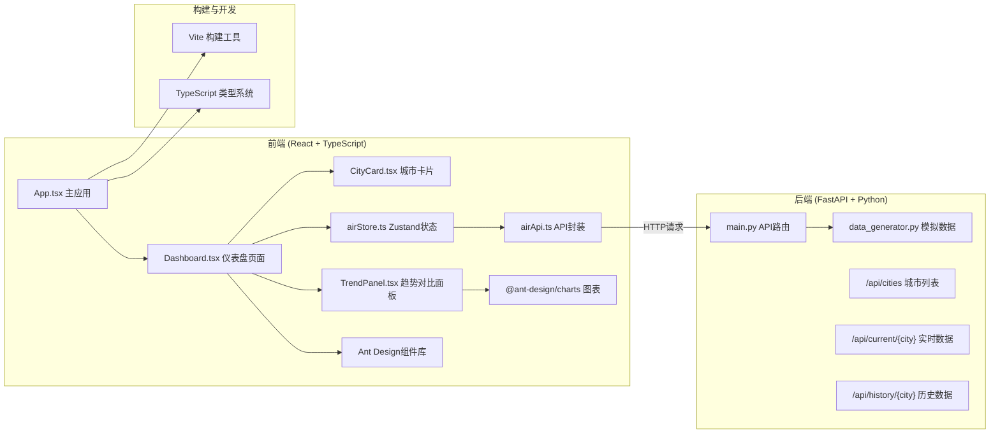
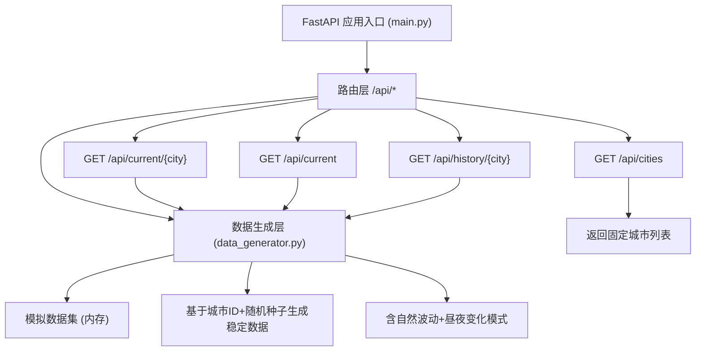
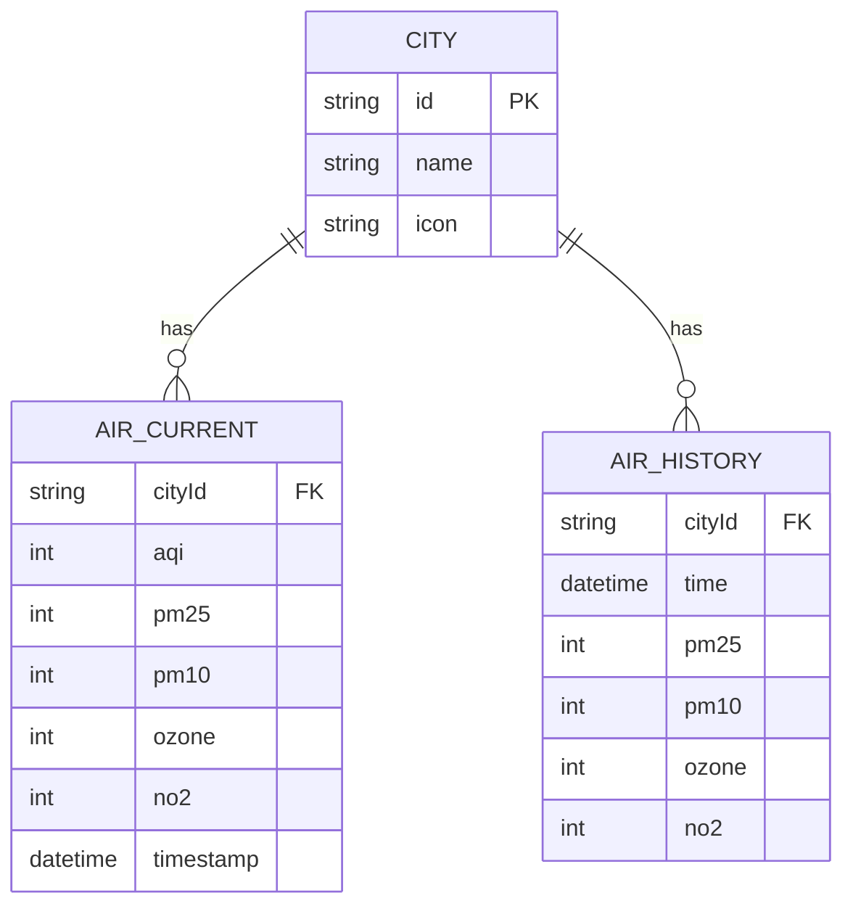

## 1. 架构设计



## 2. 技术描述

- **前端框架**：React 18 + TypeScript 5
- **构建工具**：Vite 5（含路径别名 `@` 指向 `src`，代理 `/api` 到后端）
- **UI组件库**：Ant Design 5
- **图表库**：@ant-design/charts
- **状态管理**：Zustand 4
- **HTTP客户端**：Axios
- **日期处理**：dayjs
- **后端框架**：FastAPI（Python 3.9+）
- **ASGI服务器**：uvicorn
- **数据处理**：pandas（生成模拟数据）
- **数据源**：模拟数据生成器（生成过去7天每小时空气质量数据）

## 3. 路由定义

| 路由 | 用途 |
|-------|---------|
| / | 仪表盘首页，展示所有城市卡片和对比入口 |

## 4. API 定义

### 4.1 TypeScript 类型定义

```typescript
interface City {
  id: string;
  name: string;
  icon: string;
}

interface AirQualityCurrent {
  cityId: string;
  aqi: number;
  pm25: number;
  pm10: number;
  ozone: number;
  no2: number;
  timestamp: string;
}

interface AirQualityHourly {
  time: string;
  pm25: number;
  pm10: number;
  ozone: number;
  no2: number;
}

interface AirQualityHistory {
  cityId: string;
  data: AirQualityHourly[];
}
```

### 4.2 RESTful API 接口

| 方法 | 路径 | 描述 | 请求参数 | 响应格式 |
|------|------|------|----------|----------|
| GET | /api/cities | 获取城市列表 | 无 | `{ cities: City[] }` |
| GET | /api/current/{city_id} | 获取指定城市实时数据 | city_id: string | `AirQualityCurrent` |
| GET | /api/current | 获取所有城市实时数据 | 无 | `{ data: AirQualityCurrent[] }` |
| GET | /api/history/{city_id} | 获取指定城市7天历史数据 | city_id: string | `AirQualityHistory` |

## 5. 后端架构



## 6. 数据模型

### 6.1 数据模型定义



### 6.2 AQI 等级标准

| AQI 范围 | 等级 | 颜色 |
|-----------|------|------|
| 0-50 | 优 | #00e400 |
| 51-100 | 良 | #ffff00 |
| 101-150 | 轻度污染 | #ff7e00 |
| 151-200 | 中度污染 | #ff0000 |
| 201-300 | 重度污染 | #99004c |
| >300 | 严重污染 | #7e0023 |

### 6.3 污染物浓度范围（用于进度条）

| 指标 | 单位 | 最小值 | 最大值 |
|------|------|--------|--------|
| PM2.5 | μg/m³ | 0 | 250 |
| PM10 | μg/m³ | 0 | 350 |
| 臭氧 O₃ | μg/m³ | 0 | 300 |
| 二氧化氮 NO₂ | μg/m³ | 0 | 200 |
