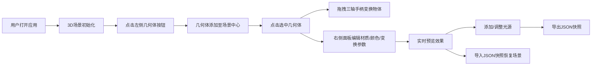

## 1. 产品概述

3D抽象几何雕塑编辑器是一款面向设计师和艺术爱好者的浏览器端3D建模工具，帮助用户快速在三维空间中组合五种基本几何体（立方体、球体、圆柱、圆环、圆锥）并自由调节其位置、旋转、缩放与颜色，直观预览不同光照和材质组合效果。

- 目标用户：3D设计师、数字艺术家、艺术爱好者
- 市场价值：填补浏览器端轻量级3D几何雕塑快速原型工具的空白，提供直观的3D创作体验

## 2. 核心功能

### 2.1 功能模块

1. **3D场景编辑器：核心3D渲染画布，支持摄像机控制
2. **几何体面板**：左侧几何体添加与光源管理
3. **属性面板**：右侧选中物体属性编辑与快照导出导入

### 2.2 功能详情

| 功能模块 | 子功能 | 功能描述 |
|-----------|---------|-----------|
| 3D场景编辑器 | 几何体添加 | 支持添加立方体、球体、圆柱、圆环、圆锥五种基本几何体 |
| 3D场景编辑器 | 变换控制 | 三轴拖拽手柄（红X、绿Y、蓝Z），支持平移和旋转模式切换（T/R键） |
| 3D场景编辑器 | 摄像机控制 | 轨道控制器，右键平移、滚轮缩放、左键旋转视角 |
| 3D场景编辑器 | 实时阴影 | 场景物体实时阴影投射 |
| 几何体面板 | 几何体按钮 | 五个64x64大号圆角图标按钮，点击添加到场景中心 |
| 几何体面板 | 光源管理 | 最多3个点光源，折叠卡片展示参数 |
| 属性面板 | 变换属性 | position/rotation/scale实时显示与编辑，步进0.1拖拽调节 |
| 属性面板 | 材质编辑器 | 四种材质类型（漫反射、金属、光泽、半透明），动态参数组 |
| 属性面板 | 颜色拾取器 | 色相环+饱和度/亮度滑块 |
| 属性面板 | 快照导出 | 导出场景完整状态为JSON文件 |
| 属性面板 | 快照导入 | 上传JSON文件恢复场景 |

## 3. 核心流程

## 4. 用户界面设计

### 4.1 设计风格

- **主色调**：深空灰渐变背景（#1a1a2e → #16213e）
- **强调色**：#6c63ff（紫色高亮）
- **面板背景**：rgba(30,30,50,0.9)，8px模糊
- **按钮风格**：圆角设计，悬停高亮
- **布局**：三栏布局（左面板220px + 中央画布 + 右面板280px）

### 4.2 页面设计

| 区域 | 模块 | UI元素 |
|------|------|--------|
| 左侧面板 | 几何体按钮区 | 5个64x64圆角按钮（立方体、球体、圆柱、圆环、圆锥） |
| 左侧面板 | 光源管理区 | 折叠卡片（每个光源：颜色点+强度值，展开显示参数） |
| 左侧面板 | 添加光源按钮 | 48x48圆角按钮 |
| 中央画布 | 3D渲染区 | Three.js Canvas，轨道控制 |
| 中央画布 | 变换手柄 | 红X/绿Y/蓝Z三轴，末端锥形 |
| 右侧面板 | 物体信息 | 选中物体名称和类型 |
| 右侧面板 | 变换参数 | position/rotation/scale输入框 |
| 右侧面板 | 材质参数 | 动态参数滑块组，颜色拾取器 |
| 右侧面板 | 导出导入 | 导出快照/导入快照按钮 |

### 4.3 响应式

桌面端优先设计，暂不考虑移动端适配

### 4.4 3D场景指导

- **环境**：深空灰渐变背景，无HDRI环境
- **光照设置**：默认环境光强度0.3 + 平行光强度1.0（方向5,10,7）
- **摄像机**：PerspectiveCamera，fov 50，近裁剪面0.1，远裁剪面1000
- **阴影**：PCFSoftShadowMap，实时阴影计算
- **交互**：OrbitControls + TransformControls
- **性能要求**：8几何体+3点光源场景帧率≥55FPS，参数调整响应≤50ms
