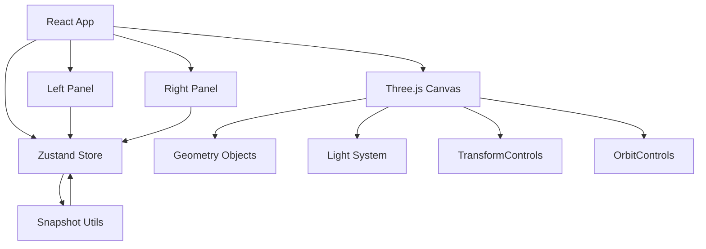

## 1. 架构设计



## 2. 技术说明

- **前端框架**：React 18 + TypeScript
- **3D渲染引擎**：Three.js + @react-three/fiber + @react-three/drei
- **状态管理**：zustand
- **构建工具**：Vite
- **图标库**：lucide-react
- **唯一ID**：uuid
- **快照序列化**：json-stable-stringify

## 3. 文件结构

```
d:\P\tasks\auto134/
├── package.json
├── vite.config.js
├── tsconfig.json
├── index.html
└── src/
│   ├── main.tsx
│   ├── App.tsx
│   ├── store/
│   │   └── editorStore.ts
│   ├── components/
│   │   ├── SceneCanvas.tsx
│   │   ├── GeometryPanel.tsx
│   │   └── PropertyPanel.tsx
│   └── utils/
│       └── snapshot.ts
```

## 4. 数据模型

### 4.1 几何体数据结构

```typescript
type GeometryType = 'box' | 'sphere' | 'cylinder' | 'torus' | 'cone';

type MaterialType = 'diffuse' | 'metal' | 'glossy' | 'transparent';

interface MaterialParams {
  color: string;
  ambientIntensity: number;
  roughness?: number;
  metalness?: number;
  specularIntensity?: number;
  specularSharpness?: number;
  opacity?: number;
  ior?: number;
}

interface GeometryItem {
  id: string;
  type: GeometryType;
  position: [number, number, number];
  rotation: [number, number, number];
  scale: number;
  material: {
    type: MaterialType;
    params: MaterialParams;
  };
}
```

### 4.2 光源数据结构

```typescript
interface LightItem {
  id: string;
  position: [number, number, number];
  color: string;
  intensity: number;
  decay: number;
}
```

### 4.3 Store状态

```typescript
interface EditorState {
  geometryList: GeometryItem[];
  lightList: LightItem[];
  selectedId: string | null;
  transformMode: 'translate' | 'rotate';
  addGeometry: (type: GeometryType) => void;
  updateTransform: (id: string, transform: Partial<Pick<GeometryItem, 'position' | 'rotation' | 'scale'>>) => void;
  updateMaterial: (id: string, material: GeometryItem['material']) => void;
  addLight: () => void;
  updateLight: (id: string, updates: Partial<LightItem>) => void;
  removeLight: (id: string) => void;
  setSelectedId: (id: string | null) => void;
  setTransformMode: (mode: 'translate' | 'rotate') => void;
  saveSnapshot: () => SnapshotData;
  loadSnapshot: (data: SnapshotData) => void;
}
```

## 5. 技术要点

1. 使用@react-three/drei的TransformControls实现三轴变换手柄
2. 使用OrbitControls实现摄像机控制
3. 使用zustand管理全局场景状态
4. 所有UI组件采用深色主题，CSS自定义属性管理颜色
5. 快照使用json-stable-stringify保证序列化键顺序一致
6. 实时阴影使用PCFSoftShadowMap保证阴影质量
7. 材质参数变更时50ms内响应更新
