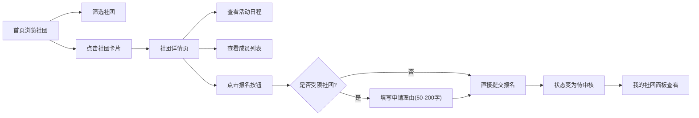

## 1. 产品概述

校园社团管理与活动招募平台，解决学生社团信息分散、活动通知滞后的痛点，为学生提供集中浏览、了解和报名社团的一站式服务。
- 主要目的：整合校园社团资源，提升社团招募效率和学生参与体验
- 目标用户：在校学生（社团浏览者/报名者）、社团管理者

## 2. 核心功能

### 2.1 用户角色
| 角色 | 注册方式 | 核心权限 |
|------|----------|----------|
| 学生用户 | 模拟登录（前端内置） | 浏览社团、查看详情、报名社团、管理我的社团 |

### 2.2 功能模块
1. **社团探索首页**：筛选器、社团卡片网格、响应式布局
2. **社团详情页**：封面展示、社团介绍、活动日程、成员列表、报名功能
3. **我的社团面板**：待审核/已通过/未通过分类折叠列表
4. **导航系统**：顶部毛玻璃导航栏、侧边栏菜单

### 2.3 页面详情
| 页面名称 | 模块名称 | 功能描述 |
|----------|----------|----------|
| 首页 | 筛选栏 | 按类别（学术/体育/文艺/公益）和活动频次（每周/每两周/每月）筛选 |
| 首页 | 社团卡片网格 | Logo、名称、简介、活动频次、成员数展示，悬停动画，点击跳转 |
| 详情页 | 封面与介绍 | 渐变色封面大图、完整社团介绍 |
| 详情页 | 活动日程 | 名称、日期、地点、报名按钮，分页展示，时间倒序 |
| 详情页 | 成员列表 | 前8个头像展示，点击展开全部 |
| 详情页 | 报名按钮 | 状态反馈（已报名/已满/待审核），受限社团需填写申请理由 |
| 我的社团 | 分类折叠面板 | 待审核/已通过/未通过三类，显示报名时间和成员数 |

## 3. 核心流程

用户进入首页 → 浏览/筛选社团卡片 → 点击进入社团详情 → 查看活动和成员信息 → 点击报名（受限社团填写申请理由） → 提交后状态变为"待审核" → 用户在"我的社团"中查看各状态的报名记录

## 4. 用户界面设计

### 4.1 设计风格
- 主色调：#667eea → #764ba2 渐变紫
- 背景色：#f5f6fa 灰白色
- 卡片圆角：12px，底部渐变浅紫色装饰条(#667eea33)
- 导航栏：半透明毛玻璃 rgba(255,255,255,0.85)，8px模糊，底部1px #e8e8e8 分割线
- 按钮风格：圆角8px，主色渐变背景
- 字体：系统默认无衬线字体
- 布局：顶部固定导航栏 + 居中内容区（最大1200px）
- 图标风格：Ant Design 图标

### 4.2 页面设计概览
| 页面名称 | 模块名称 | UI 元素 |
|----------|----------|----------|
| 首页 | 筛选栏 | 分类标签、频次选择器、水平排列 |
| 首页 | 社团卡片 | 圆角12px、间距24px、3-4列自适应、悬停上移8px+阴影加深、渐变装饰条 |
| 详情页 | 封面区 | 渐变色块、社团名称叠加、圆角8px |
| 详情页 | 活动列表 | 时间倒序、分页器、报名按钮状态 |
| 详情页 | 成员头像 | 圆形头像、8个一行、展开按钮 |
| 我的社团 | 折叠面板 | 三类折叠、卡片式内容、跳转链接 |

### 4.3 响应式
- 桌面端：3-4列卡片网格
- 平板端（<768px）：2列
- 移动端（<480px）：1列
- 导航栏始终顶部固定，内容区自适应宽度
