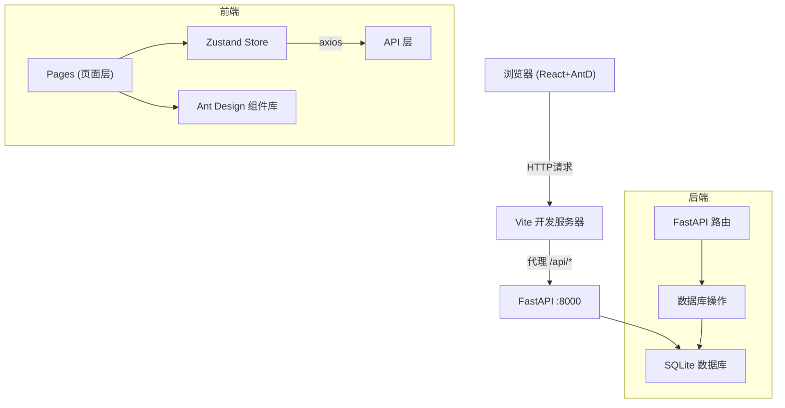
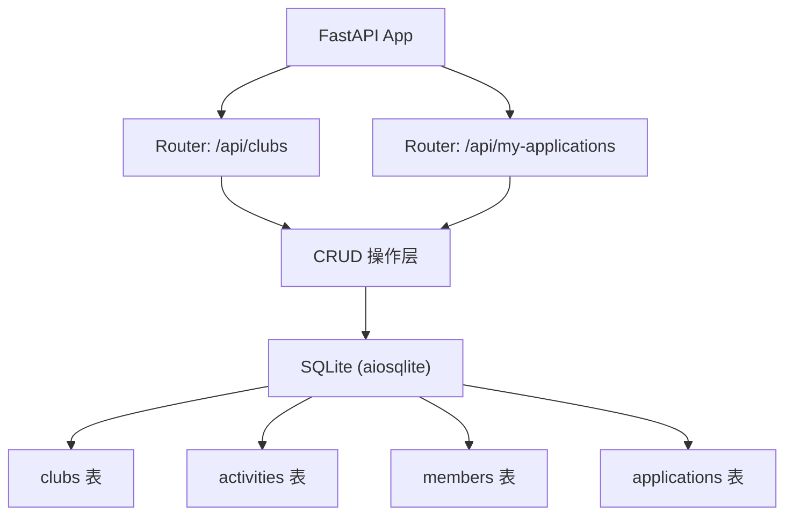
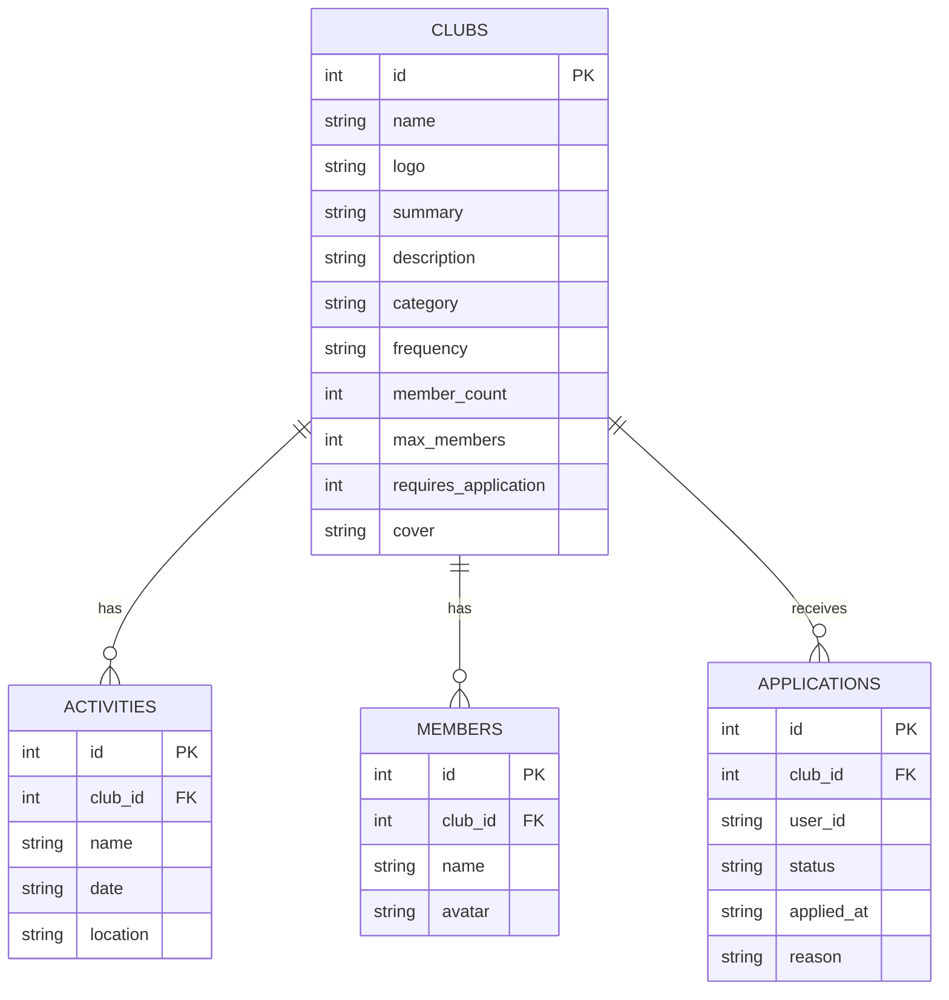

## 1. 架构设计



## 2. 技术说明

- **前端框架**：React 18 + TypeScript
- **UI 组件库**：Ant Design 5.x
- **路由管理**：react-router-dom 6.x
- **状态管理**：zustand 4.x
- **HTTP 客户端**：axios
- **日期处理**：dayjs
- **构建工具**：Vite 5.x
- **后端框架**：FastAPI（Python 3.10+）
- **数据库**：SQLite（通过 aiosqlite / sqlalchemy 操作）
- **前后端通信**：Vite 代理 `/api/*` → `http://localhost:8000`

## 3. 路由定义

| 路由 | 用途 |
|------|------|
| `/` | 社团探索首页 |
| `/clubs/:id` | 社团详情页 |
| `/my-clubs` | 我的社团面板 |

## 4. API 定义

### 4.1 类型定义（TypeScript）
```typescript
interface Club {
  id: number;
  name: string;
  logo: string;
  summary: string;
  description: string;
  category: 'academic' | 'sports' | 'art' | 'public';
  frequency: 'weekly' | 'biweekly' | 'monthly';
  memberCount: number;
  maxMembers: number;
  requiresApplication: boolean;
  cover: string;
}

interface Activity {
  id: number;
  clubId: number;
  name: string;
  date: string;
  location: string;
}

interface Member {
  id: number;
  name: string;
  avatar: string;
}

interface Application {
  id: number;
  clubId: number;
  status: 'pending' | 'approved' | 'rejected';
  appliedAt: string;
  reason?: string;
}
```

### 4.2 API 端点
| 方法 | 路径 | 描述 |
|------|------|------|
| GET | `/api/clubs` | 获取社团列表（支持 category、frequency 过滤） |
| GET | `/api/clubs/{id}` | 获取社团详情 |
| GET | `/api/clubs/{id}/activities` | 获取社团活动日程（分页） |
| GET | `/api/clubs/{id}/members` | 获取社团成员列表 |
| POST | `/api/clubs/{id}/apply` | 提交社团报名申请 |
| GET | `/api/my-applications` | 获取当前用户的报名记录 |

## 5. 服务端架构图



## 6. 数据模型

### 6.1 ER 图



### 6.2 初始化数据（DDL + 种子数据）

```sql
CREATE TABLE IF NOT EXISTS clubs (
    id INTEGER PRIMARY KEY AUTOINCREMENT,
    name TEXT NOT NULL,
    logo TEXT NOT NULL,
    summary TEXT NOT NULL,
    description TEXT NOT NULL,
    category TEXT NOT NULL,
    frequency TEXT NOT NULL,
    member_count INTEGER NOT NULL DEFAULT 0,
    max_members INTEGER NOT NULL DEFAULT 100,
    requires_application INTEGER NOT NULL DEFAULT 0,
    cover TEXT NOT NULL
);

CREATE TABLE IF NOT EXISTS activities (
    id INTEGER PRIMARY KEY AUTOINCREMENT,
    club_id INTEGER NOT NULL,
    name TEXT NOT NULL,
    date TEXT NOT NULL,
    location TEXT NOT NULL,
    FOREIGN KEY (club_id) REFERENCES clubs(id)
);

CREATE TABLE IF NOT EXISTS members (
    id INTEGER PRIMARY KEY AUTOINCREMENT,
    club_id INTEGER NOT NULL,
    name TEXT NOT NULL,
    avatar TEXT NOT NULL,
    FOREIGN KEY (club_id) REFERENCES clubs(id)
);

CREATE TABLE IF NOT EXISTS applications (
    id INTEGER PRIMARY KEY AUTOINCREMENT,
    club_id INTEGER NOT NULL,
    user_id TEXT NOT NULL,
    status TEXT NOT NULL DEFAULT 'pending',
    applied_at TEXT NOT NULL,
    reason TEXT,
    FOREIGN KEY (club_id) REFERENCES clubs(id)
);
```

种子数据包含：8-10个示例社团（覆盖4个类别），每个社团3-5个活动日程，8-12个成员头像。
