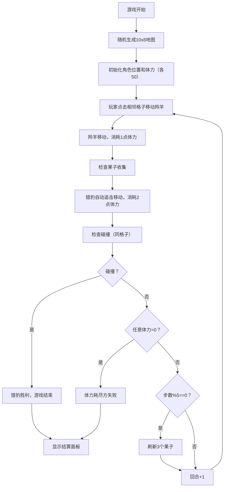

## 1. 产品概述
丛林追逐是一款基于网格的策略小游戏，玩家操控羚羊在随机生成的丛林地图中躲避猎豹的追捕，同时收集果子恢复体力。
- 目标用户：休闲游戏玩家，喜欢策略类小游戏的用户
- 市场价值：轻量级、易上手的小游戏，适合快速体验和重复游玩

## 2. 核心功能

### 2.1 功能模块
1. **游戏主界面**：网格地图、角色显示、果子显示、状态栏
2. **游戏逻辑系统**：地形生成、移动规则、体力计算、碰撞检测、果子刷新
3. **结算系统**：胜负判定、结算面板、再来一局功能
4. **UI交互**：格子选中高亮、角色移动动画、残影效果、重置功能

### 2.2 页面详情
| 页面名称 | 模块名称 | 功能描述 |
|-----------|-------------|---------------------|
| 游戏主界面 | 状态栏 | 显示游戏名称、回合数、双方体力圆形进度条 |
| 游戏主界面 | 网格地图 | 10x8随机地形，不同颜色区分，点击可移动 |
| 游戏主界面 | 角色显示 | 猎豹（橘色斑点圆形）、羚羊（棕色白点三角形） |
| 游戏主界面 | 果子系统 | 每5步刷新3个红色果子，收集恢复体力 |
| 游戏主界面 | 重置按钮 | 右下角浮动按钮，重置当前游戏 |
| 结算面板 | 胜负信息 | 金色胜者文字、灰色败者文字、剩余体力、总步数 |
| 结算面板 | 再来一局 | 渐变按钮，悬停缩放效果 |

## 3. 核心流程
游戏开始后，系统随机生成地形，双方各50点体力。玩家点击相邻可通行格子移动羚羊（消耗1点体力），猎豹自动追击（每步消耗2点体力）。每5步刷新3个果子。当任意一方体力归零或猎豹追上羚羊时游戏结束，显示结算面板。

## 4. 用户界面设计

### 4.1 设计风格
- **主色调**：深绿色渐变背景 (#0f3b0f → #1b5e1b)
- **地形颜色**：草地(#7ec850)、灌木(#3a7d2c)、泥潭(#8b5a2b)、河流(#3b82f6)
- **角色颜色**：猎豹橘色、羚羊棕色、果子红色
- **强调色**：金色(#fbbf24)用于高亮和胜者文字
- **按钮风格**：圆角，绿色到青色渐变，悬停缩放0.95倍
- **字体**：现代无衬线字体，游戏标题加粗
- **布局风格**：居中显示，顶部状态栏，主游戏区域居中，右下角浮动按钮
- **特效**：毛玻璃效果、脉动光圈、残影、发光果子

### 4.2 页面设计概览
| 页面名称 | 模块名称 | UI元素 |
|-----------|-------------|-------------|
| 游戏主界面 | 状态栏 | 毛玻璃背景(rgba(255,255,255,0.15), blur10px)，1px边框，游戏名称、回合数、圆形进度条(橙红渐变暖色猎豹/绿青渐变暖色羚羊) |
| 游戏主界面 | 网格地图 | 10x8格子，不同地形颜色，1px半透明白色边框，选中金色脉动光圈 |
| 游戏主界面 | 角色 | 猎豹圆形(70%格子直径)带斑点，羚羊三角形带白点，0.3秒平滑移动+残影 |
| 游戏主界面 | 果子 | 红色小圆点+微弱发光 |
| 游戏主界面 | 重置按钮 | 深色圆形(rgba(0,0,0,0.6))，重新加载图标，点击旋转 |
| 结算面板 | 面板 | 圆角矩形，rgba(0,0,0,0.75)毛玻璃，blur16px |
| 结算面板 | 文字 | 胜者金色#fbbf24加粗，败者灰色#9ca3af |
| 结算面板 | 按钮 | 绿→青渐变，悬停缩放0.95倍加深阴影 |

### 4.3 响应式
- 桌面端优先，自适应不同屏幕尺寸
- 游戏区域保持固定比例，居中显示
- 触摸设备优化（点击格子移动）
