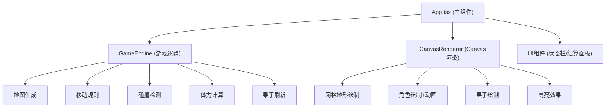

## 1. 架构设计



## 2. 技术描述
- **前端**：React 18 + TypeScript + Vite
- **初始化工具**：Vite (react-ts模板)
- **渲染**：HTML5 Canvas 2D API
- **后端**：无（纯前端游戏）
- **数据库**：无

## 3. 目录结构
```
.
├── index.html
├── package.json
├── tsconfig.json
├── vite.config.js
└── src/
    ├── main.tsx
    ├── App.tsx
    ├── game/
    │   └── GameEngine.ts
    └── renderer/
        └── CanvasRenderer.ts
```

## 4. 核心类型定义

```typescript
// 地形类型
enum TerrainType {
  GRASS = 'grass',      // 草地，消耗1
  BUSH = 'bush',        // 灌木，消耗2
  MUD = 'mud',          // 泥潭，消耗3
  RIVER = 'river',      // 河流，不可通行
}

// 格子
interface Cell {
  x: number;
  y: number;
  terrain: TerrainType;
}

// 角色
interface Entity {
  x: number;
  y: number;
  stamina: number;
  maxStamina: number;
}

// 果子
interface Fruit {
  x: number;
  y: number;
}

// 动画状态
interface AnimationState {
  isAnimating: boolean;
  fromX: number;
  fromY: number;
  toX: number;
  toY: number;
  progress: number;
  entity: 'cheetah' | 'antelope';
}

// 游戏状态
interface GameState {
  grid: Cell[][];
  cheetah: Entity;
  antelope: Entity;
  fruits: Fruit[];
  turn: number;
  isGameOver: boolean;
  winner: 'cheetah' | 'antelope' | null;
  selectedCell: { x: number; y: number } | null;
  animation: AnimationState | null;
}
```

## 5. 模块职责

### GameEngine (src/game/GameEngine.ts)
- `generateGrid(width, height)`: 随机生成地形网格
- `canMoveTo(x, y)`: 判断格子是否可通行
- `getMoveCost(x, y)`: 获取移动到该格子的体力消耗
- `moveAntelope(targetX, targetY)`: 移动羚羊
- `moveCheetah()`: 猎豹AI自动追击（BFS寻路）
- `checkCollision()`: 检查是否碰撞
- `checkGameOver()`: 检查游戏是否结束
- `spawnFruits(count)`: 刷新果子
- `collectFruit()`: 羚羊收集果子

### CanvasRenderer (src/renderer/CanvasRenderer.ts)
- `render(state)`: 主渲染方法，每帧调用
- `drawGrid()`: 绘制地形网格
- `drawCell(x, y, terrain)`: 绘制单个格子
- `drawCheetah(x, y)`: 绘制猎豹（橘色斑点圆形）
- `drawAntelope(x, y)`: 绘制羚羊（棕色白点三角形）
- `drawFruit(x, y)`: 绘制果子（红色发光圆点）
- `drawHighlight(x, y)`: 绘制选中格子金色脉动光圈
- `drawAfterimage(entity, progress)`: 绘制移动残影效果
- `interpolatePosition(from, to, progress)`: 插值计算动画位置
