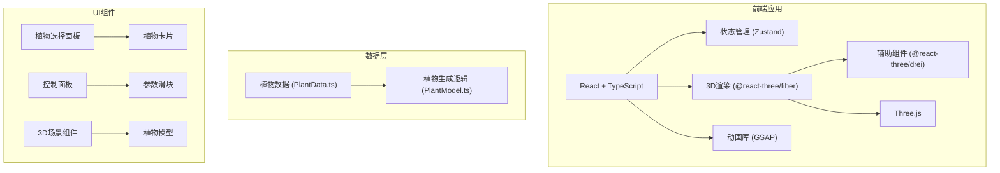

## 1. 架构设计



## 2. 技术描述

- **前端框架**：React 18 + TypeScript
- **构建工具**：Vite
- **3D渲染**：Three.js + @react-three/fiber + @react-three/drei
- **状态管理**：Zustand
- **动画库**：GSAP
- **样式方案**：原生CSS（CSS Modules / styled-components，根据项目需要）

## 3. 文件结构

```
├── package.json
├── vite.config.js
├── tsconfig.json
├── index.html
└── src/
    ├── PlantScene.tsx       # 主3D场景组件
    ├── PlantModel.ts        # 植物生成逻辑
    ├── ControlPanel.tsx     # 控制面板组件
    ├── PlantData.ts         # 植物种类数据
    ├── store.ts             # Zustand状态管理
    ├── App.tsx              # 主应用组件
    ├── main.tsx             # 入口文件
    └── index.css            # 全局样式
```

## 4. 状态管理设计

使用 Zustand 管理全局状态：

```typescript
interface PlantState {
  selectedPlant: string;       // 当前选中的植物ID
  light: number;               // 光照 0-100
  water: number;               // 水分 0-100
  temperature: number;         // 温度 10-40
  growthStage: number;         // 生长阶段 0-1
  isSimulating: boolean;       // 是否正在模拟生长
  setSelectedPlant: (id: string) => void;
  setLight: (value: number) => void;
  setWater: (value: number) => void;
  setTemperature: (value: number) => void;
  startGrowthSimulation: () => void;
  resetEnvironment: () => void;
}
```

## 5. 数据模型

### 5.1 植物数据定义

```typescript
interface PlantSpecies {
  id: string;
  name: string;
  description: string;
  stemHeight: number;
  stemRadius: number;
  leafCount: number;
  leafSize: number;
  hasFlower: boolean;
  flowerSize: number;
  colorPalette: {
    stemBottom: string;
    stemTop: string;
    leaves: string;
    flower: string;
  };
}
```

### 5.2 环境参数对植物形态的影响

- **光照 (0-100)**：影响叶片张开角度（0%下垂，100%伸展）、颜色饱和度（0%变黄，100%翠绿）
- **水分 (0-100)**：影响茎干挺拔程度（0%弯曲变褐，100%挺直饱满）
- **温度 (10-40°C)**：影响动画播放速度（10°C极慢，40°C高速）

## 6. 性能优化

- 使用 InstancedMesh 渲染叶片（如数量较多）
- 合理设置像素比和阴影质量
- 动画使用 requestAnimationFrame 节流
- 滑块更新使用 useMemo/useCallback 优化重渲染
- 目标帧率：稳定55FPS以上
- 参数响应延迟：低于100ms
