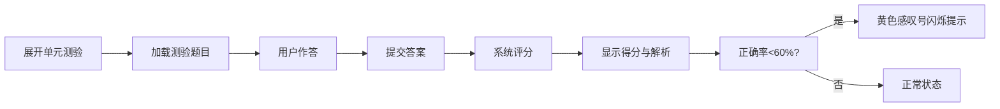

## 1. 产品概述

自适应学习路径生成器是一款面向在线教育场景的智能学习规划工具，帮助教师为不同水平的学生快速生成个性化学习路径，大幅减少手动调整内容和难度的时间成本。

- 核心价值：基于能力评估自动编排学习单元与测验难度，实现千人千面的学习体验
- 目标用户：教师、学生、课程设计师
- 应用场景：课前能力诊断、学习路径规划、自适应难度调整

## 2. 核心功能

### 2.1 用户角色

| 角色 | 使用方式 | 核心功能 |
|------|----------|----------|
| 学生用户 | 直接使用 | 选择学科与水平、生成学习路径、完成测验、自我评估 |

### 2.2 功能模块

1. **路径生成模块**：学科选择、水平选择、一键生成、时间线展示
2. **自适应调整模块**：能力雷达图、自我评估滑块、实时路径重排
3. **测验引擎模块**：题目加载、答案提交、即时评分、解析展示
4. **学习追踪模块**：学习速度折线图、得分率色阶、工具提示

### 2.3 页面详情

| 页面名称 | 模块名称 | 功能描述 |
|-----------|-------------|---------------------|
| 首页/主页面 | 学科选择器 | 下拉选择学科（数学、英语等） |
| 首页/主页面 | 水平选择器 | 入门/初级/中级/高级 四档选择 |
| 首页/主页面 | 生成按钮 | 触发路径生成API调用 |
| 首页/主页面 | 路径时间线 | 水平展示5-8个学习单元卡片，带箭头连接动画 |
| 首页/主页面 | 单元卡片 | 显示标题、简介、进度、状态标识 |
| 首页/主页面 | 测验面板 | 单元展开后显示选择题，提交评分 |
| 首页/主页面 | 能力雷达图 | 五维能力可视化展示 |
| 首页/主页面 | 自我评估面板 | 拖拽滑块调整各维度能力值 |
| 首页/主页面 | 学习速度图表 | 折线图展示学习时间与得分率 |

## 3. 核心流程

### 3.1 学习路径生成流程

用户选择学科和初始水平后，点击生成按钮，系统调用后端API从题库中编排5-8个学习单元，每个单元包含知识点标题、简介和3-5道测验题，以水平时间线形式展示。

### 3.2 自适应调整流程

用户在自我评估面板拖拽滑块调整能力维度，系统实时重排后续单元顺序和测验难度，路径时间线自动更新并伴有淡入过渡效果。

### 3.3 测验与反馈流程

用户展开单元测验，完成选择题后提交，系统立即评分并显示解析，正确率低于60%的单元标记警告。

## 4. 用户界面设计

### 4.1 设计风格

- **主色调**：深蓝 #1a365d（标题、导航），暖橙 #ed8936（按钮、高亮）
- **背景色**：浅米色 #fefcbf（减少视觉疲劳）
- **卡片风格**：圆角16px，悬停上浮+阴影加深（transition: all 0.3s ease）
- **毛玻璃效果**：自我评估面板使用 backdrop-filter: blur(10px)
- **字体风格**：大字体、高对比度的教育风格，清晰易读
- **交互反馈**：按钮波纹扩散、滑块弹性跟随、卡片边框高亮

### 4.2 页面设计概览

| 页面名称 | 模块名称 | UI元素 |
|-----------|-------------|-------------|
| 主页面 | 顶部导航 | 深蓝色背景、大标题、副标题 |
| 主页面 | 选择区域 | 学科下拉、水平选项卡、生成按钮（橙色） |
| 主页面 | 路径时间线 | 水平滚动、单元卡片（180px宽）、连接箭头动画 |
| 主页面 | 单元卡片 | 标题、简介、进度条、状态图标、悬停效果 |
| 主页面 | 测验面板 | 题目列表、选项按钮、提交按钮、解析折叠面板 |
| 主页面 | 雷达图区域 | 五维雷达图、能力标签 |
| 主页面 | 自我评估面板 | 滑块组（蓝橙渐变轨道、白色圆点手柄） |
| 主页面 | 学习速度图 | 折线图（平滑曲线、色阶点、工具提示） |

### 4.3 响应式设计

- **桌面端**：路径时间线水平布局，三栏式布局（左侧雷达图、中间路径、右侧速度图）
- **平板端**：自适应宽度，图表可缩放
- **移动端**：路径时间线变为垂直布局，单元卡片宽度自适应，雷达图横向滚动

### 4.4 动画与微交互

- 页面加载：元素渐入+位移动画（staggered reveal）
- 路径生成：单元卡片逐个滑入，箭头连线绘制动画
- 卡片悬停：上浮+阴影加深（0.3s ease）
- 按钮点击：波纹扩散效果
- 滑块拖拽：弹性跟随动画
- 路径更新：淡入淡出过渡效果
- 警告闪烁：黄色感叹号呼吸灯动画
- 图表加载：折线绘制动画

## 5. 性能要求

- API请求响应时间：≤500ms
- 雷达图重渲染：≤100ms
- 自适应路径重排：≤200ms
- 页面首次加载：≤2s
- 动画帧率：≥60fps
