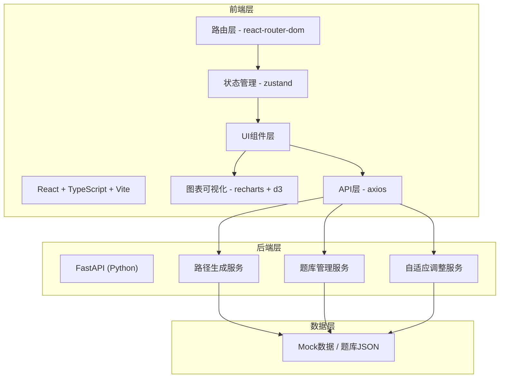
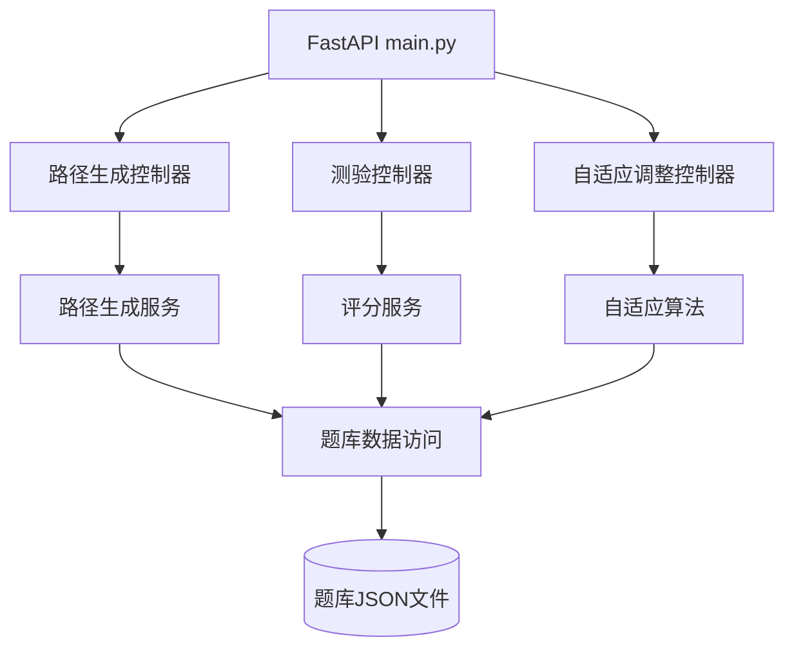

## 1. 架构设计



## 2. 技术描述

- **前端**：React 18 + TypeScript + Vite
- **路由**：react-router-dom
- **状态管理**：zustand
- **HTTP客户端**：axios
- **图表库**：recharts（主） + d3（辅助计算）
- **样式方案**：CSS Modules + 自定义CSS变量
- **后端**：FastAPI (Python)
- **构建工具**：Vite
- **包管理器**：npm

## 3. 目录结构

```
auto14/
├── .trae/
│   └── documents/
│       ├── PRD.md
│       └── tech-architecture.md
├── frontend/               # 前端项目
│   ├── index.html
│   ├── package.json
│   ├── vite.config.js
│   ├── tsconfig.json
│   └── src/
│       ├── App.tsx         # 主组件，路由分发
│       ├── main.tsx        # 入口文件
│       ├── index.css       # 全局样式
│       ├── path/           # 路径模块
│       │   ├── PathGenerator.tsx   # 路径生成核心组件
│       │   └── UnitCard.tsx        # 学习单元卡片
│       ├── assessment/     # 评估模块
│       │   ├── QuizEngine.tsx      # 测验引擎
│       │   └── SelfEvalPanel.tsx   # 自我评估面板
│       ├── charts/         # 图表模块
│       │   ├── RadarChart.tsx      # 能力雷达图
│       │   └── SpeedChart.tsx      # 学习速度折线图
│       ├── store/          # 状态管理
│       │   └── useLearningStore.ts # 学习状态store
│       └── utils/
│           └── api.ts      # API封装
└── backend/                # 后端项目
    ├── main.py             # FastAPI入口
    ├── requirements.txt
    └── data/
        └── question_bank.json  # 题库数据
```

## 4. 数据流向

### 4.1 路径生成数据流

```
用户选择(学科+水平) 
    → PathGenerator组件 
    → api.generatePath() 
    → 后端 /api/path/generate
    → 返回学习单元数组
    → zustand store 更新
    → UnitCard 列表渲染
    → 时间线动画展示
```

### 4.2 自适应调整数据流

```
拖拽滑块(SelfEvalPanel)
    → 更新能力维度值
    → zustand store 更新
    → 触发 RadarChart 重绘
    → api.adjustPath()
    → 后端 /api/path/adjust
    → 返回重排后的单元
    → PathGenerator 更新
    → 淡入过渡动画
```

### 4.3 测验数据流

```
展开单元(UnitCard)
    → QuizEngine加载题目
    → 用户选择答案
    → 本地暂存答案
    → 提交答案
    → api.submitQuiz()
    → 后端 /api/quiz/submit
    → 返回得分+解析
    → 更新单元状态
    → 正确率<60%触发警告
    → 更新学习速度数据
    → SpeedChart 重绘
```

## 5. 模块调用关系

| 模块 | 依赖模块 | 调用方式 |
|------|----------|----------|
| App.tsx | PathGenerator, QuizEngine, SelfEvalPanel | 组件组合 |
| PathGenerator.tsx | api.ts, UnitCard.tsx, useLearningStore | hooks调用 + 组件渲染 |
| UnitCard.tsx | QuizEngine.tsx | 条件渲染 |
| QuizEngine.tsx | api.ts, useLearningStore | API调用 + 状态更新 |
| SelfEvalPanel.tsx | useLearningStore, api.ts | 状态更新 + API调用 |
| RadarChart.tsx | useLearningStore, recharts | 订阅状态 + 图表渲染 |
| SpeedChart.tsx | useLearningStore, recharts | 订阅状态 + 图表渲染 |
| api.ts | axios | HTTP请求封装 |
| useLearningStore.ts | zustand | 全局状态管理 |

## 6. 状态管理

### 6.1 Zustand Store 结构

```typescript
interface LearningState {
  // 选择参数
  subject: string;
  level: string;
  
  // 学习路径
  units: Unit[];
  isGenerating: boolean;
  
  // 能力评估
  abilities: {
    basicKnowledge: number;     // 基础知识 1-10
    problemSpeed: number;       // 解题速度 1-10
    reasoning: number;          // 推理能力 1-10
    memory: number;             // 记忆力 1-10
    comprehensive: number;      // 综合运用 1-10
  };
  
  // 学习记录
  learningRecords: LearningRecord[];
  
  // Actions
  setSubject: (s: string) => void;
  setLevel: (l: string) => void;
  generatePath: () => Promise<void>;
  adjustPath: () => Promise<void>;
  updateAbility: (key: string, value: number) => void;
  submitQuiz: (unitId: string, answers: Record<string, string>) => Promise<QuizResult>;
  toggleUnitExpand: (unitId: string) => void;
}
```

### 6.2 数据模型

```typescript
interface Unit {
  id: string;
  title: string;
  description: string;
  difficulty: number; // 1-5
  order: number;
  status: 'pending' | 'in-progress' | 'completed' | 'warning';
  quiz: QuizQuestion[];
  score?: number;
  timeSpent?: number; // 分钟
  isExpanded?: boolean;
}

interface QuizQuestion {
  id: string;
  question: string;
  options: string[];
  correctAnswer: number; // index
  explanation: string;
}

interface QuizResult {
  score: number; // 0-100
  correctCount: number;
  totalCount: number;
  details: QuestionDetail[];
}

interface QuestionDetail {
  questionId: string;
  isCorrect: boolean;
  userAnswer: number;
  correctAnswer: number;
  explanation: string;
}
```

## 7. API 接口定义

### 7.1 路径生成

```
POST /api/path/generate
请求: { subject: string, level: string, abilities: Abilities }
响应: { units: Unit[] }
```

### 7.2 路径调整

```
POST /api/path/adjust
请求: { subject: string, abilities: Abilities, currentUnits: Unit[] }
响应: { units: Unit[] }
```

### 7.3 测验提交

```
POST /api/quiz/submit
请求: { unitId: string, answers: Record<string, number> }
响应: { 
  score: number, 
  correctCount: number, 
  totalCount: number,
  details: QuestionDetail[] 
}
```

## 8. 后端架构



## 9. 性能优化策略

- **API响应**：后端使用内存缓存题库数据，确保 <500ms 响应
- **图表渲染**：使用 React.memo 优化图表组件重渲染
- **状态更新**：zustand 选择性订阅避免不必要重渲染
- **动画性能**：使用 CSS transform + opacity 实现硬件加速动画
- **数据预加载**：路径生成时预加载相邻单元题目
- **防抖优化**：滑块调整使用 debounce 减少 API 调用频率
