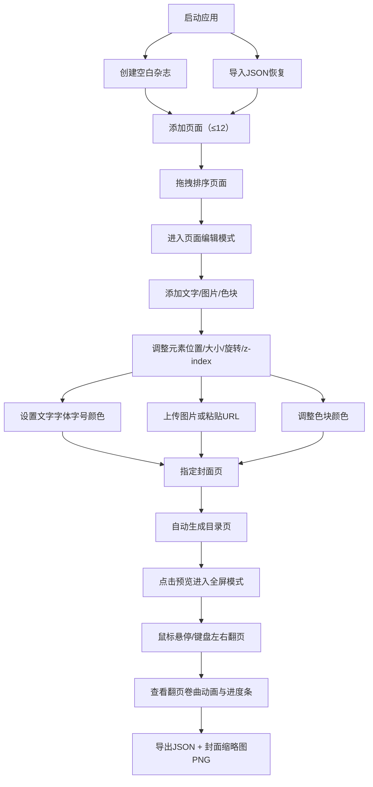

## 1. 产品概述

多页电子杂志编辑器是一款面向博客作者和小团队的在线创作工具，旨在降低将图文内容编排为具有纸质阅读体验的交互式杂志的成本。用户可在浏览器中快速完成杂志制作、预览翻页效果，并导出分享。

- **目标用户**：博客作者、独立创作者、小型内容团队
- **核心价值**：零成本、极简操作、专业阅读体验、即时预览

## 2. 核心功能

### 2.1 用户角色

| 角色 | 注册方式 | 核心权限 |
|------|----------|----------|
| 普通用户 | 无需注册，直接使用 | 创建、编辑、预览、导入、导出杂志 |

### 2.2 功能模块

1. **页面编辑器**：页面管理（增删排序，最多12页）、画布编辑（A4比例）、元素操作（文字/图片/色块的拖拽、缩放、旋转、层级）
2. **封面与目录生成**：封面指定与自动样式、目录页自动生成与跳转
3. **翻页预览与播放**：全屏翻页模式、纸张卷曲动画、键盘/鼠标翻页、进度条
4. **数据导入导出**：JSON格式导入导出、封面缩略图PNG导出

### 2.3 页面详情

| 页面名称 | 模块名称 | 功能描述 |
|----------|----------|----------|
| 编辑主页面 | 顶部工具栏 | 杂志名称/作者输入、预览按钮、导入导出按钮、添加元素按钮 |
| 编辑主页面 | 左侧页面面板 | 页面列表（卡片式）、拖拽排序、增删页面、封面标记、选中高亮 |
| 编辑主页面 | 中央画布区 | A4比例画布、元素渲染与交互、选中态与调节手柄 |
| 编辑主页面 | 元素属性面板 | 文字编辑（字体/字号/颜色）、图片设置（上传/URL）、色块颜色、z-index、旋转角度 |
| 全屏预览页 | 翻页区域 | 左右翻页热区、鼠标悬停提示 |
| 全屏预览页 | 翻页动画 | CSS 3D透视卷曲效果、0.5s ease-in-out |
| 全屏预览页 | 底部进度条 | 页码显示与进度指示、目录跳转入口 |

## 3. 核心流程

用户从创建新杂志开始，依次添加页面、在每页画布上布置元素，设置封面后生成目录，通过预览模式确认翻页效果，最终导出JSON与缩略图。导入则从已保存的JSON恢复全部状态。

## 4. 用户界面设计

### 4.1 设计风格

- **主色调**：墨水蓝 `#2c3e50`（按钮、主交互）
- **背景色**：暖灰 `#f8f5f0`（编辑区背景）、纯白 `#ffffff`（面板、画布）
- **高亮色**：暖橙 `#e67e22`（当前选中页页码）
- **辅助色**：选中蓝 `#3498db`（元素选中边框与手柄）、深灰 `#2a2a2a`（预览背景）
- **按钮样式**：圆角8px胶囊、墨水蓝填充、悬停 `#1a252f` 加深，0.3s过渡
- **字体**：正文默认系统无衬线，画布文字支持5种Google Fonts（Noto Serif SC、ZCOOL QingKe HuangYou、Ma Shan Zheng、ZCOOL XiaoWei、Dancing Script）
- **布局**：顶部毛玻璃工具栏 + 左侧320px页面面板 + 右侧自适应编辑区
- **动效**：元素增删0.3s透明度过渡、翻页0.5s CSS 3D perspective + rotateY

### 4.2 页面设计概览

| 页面名称 | 模块名称 | UI元素 |
|----------|----------|--------|
| 编辑主页面 | 顶部工具栏 | 毛玻璃半透明背景 rgba(255,255,255,0.75) blur(10px)，圆角按钮胶囊样式 |
| 编辑主页面 | 左侧页面面板 | 白色卡片圆角、页码暖橙标记、拖拽排序虚线提示 |
| 编辑主页面 | 中央画布 | A4比例(1:1.414)白色卡片、阴影、1.5px虚线#3498db选中边框、8px圆形手柄、旋转圆角旋钮 |
| 全屏预览页 | 翻页区域 | 深灰背景#2a2a2a、左右半透明水印翻页提示、页面3D卷曲动画 |
| 全屏预览页 | 进度条 | 底部水平进度、当前页/总页数、暖橙主色 |

### 4.3 响应式

- **桌面端（≥768px）**：左侧320px固定面板 + 右侧编辑区自适应
- **移动端（<768px）**：左侧面板折叠为顶部可展开托盘，编辑区占满剩余高度；保留核心编辑与预览功能

### 4.4 性能要求

- 翻页动画保持60fps（CSS硬件加速，transform + will-change）
- 元素拖动延迟≤50ms（requestAnimationFrame节流、避免layout thrash）
- 画布元素使用transform定位而非top/left

