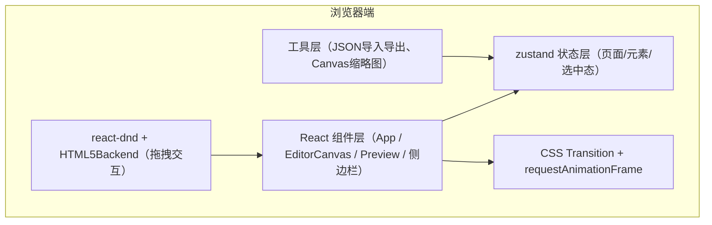
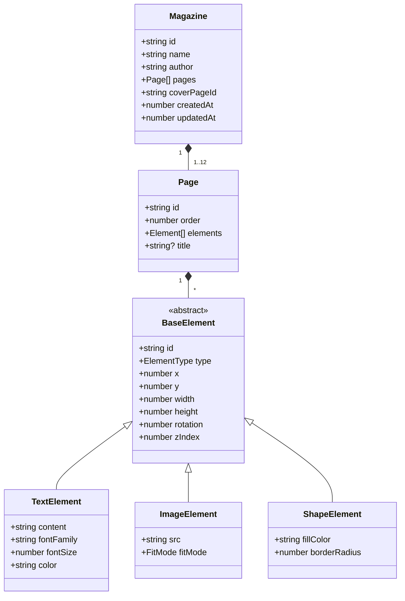

## 1. 架构设计



## 2. 技术栈说明

- **前端框架**：React 18 + TypeScript（严格模式）
- **构建工具**：Vite 5
- **状态管理**：zustand（轻量、无Provider嵌套）
- **UI组件库**：Ant Design 5（仅使用 Button、Modal、Slider 三个组件）
- **拖拽交互**：react-dnd 16 + react-dnd-html5-backend 16
- **唯一ID**：uuid
- **动画**：CSS transitions + perspective/rotateY 实现翻页，requestAnimationFrame 辅助拖动节流
- **Canvas绘制**：原生HTML5 Canvas API（封面缩略图生成）
- **字体**：Google Fonts（Noto Serif SC、ZCOOL QingKe HuangYou、Ma Shan Zheng、ZCOOL XiaoWei、Dancing Script）

## 3. 目录结构与文件职责

| 路径 | 职责 |
|------|------|
| `package.json` | 项目依赖与脚本（dev、build、preview） |
| `index.html` | Vite入口HTML，引入Google Fonts |
| `vite.config.ts` | Vite构建配置（React插件、路径别名） |
| `tsconfig.json` | TypeScript严格模式配置 |
| `src/types.ts` | Magazine / Page / Element / 字体枚举等核心类型 |
| `src/store.ts` | zustand store：页面CRUD、选中态、元素更新、封面/目录逻辑 |
| `src/App.tsx` | 主布局：DndProvider、顶部工具栏、左侧页面面板、中央编辑区、响应式布局 |
| `src/EditorCanvas.tsx` | A4画布：元素渲染、点击选中、拖拽移动、8向缩放手柄、旋转旋钮、z-index层级 |
| `src/Preview.tsx` | 全屏预览：3D翻页容器、左右悬停热区、键盘事件、进度条、目录跳转模态 |
| `src/utils.ts` | exportMagazine / importMagazine / generateCoverThumbnail 工具函数 |

## 4. 数据模型定义



### 关键类型定义（types.ts 中实现）

```typescript
export type ElementType = 'text' | 'image' | 'shape';
export type FontFamily = 'Noto Serif SC' | 'ZCOOL QingKe HuangYou' | 'Ma Shan Zheng' | 'ZCOOL XiaoWei' | 'Dancing Script';
export type FitMode = 'cover' | 'contain';

export interface BaseElement {
  id: string;
  type: ElementType;
  x: number;
  y: number;
  width: number;
  height: number;
  rotation: number;
  zIndex: number;
}

export interface TextElement extends BaseElement {
  type: 'text';
  content: string;
  fontFamily: FontFamily;
  fontSize: number;
  color: string;
}

export interface ImageElement extends BaseElement {
  type: 'image';
  src: string;
  fitMode: FitMode;
}

export interface ShapeElement extends BaseElement {
  type: 'shape';
  fillColor: string;
  borderRadius: number;
}

export type Element = TextElement | ImageElement | ShapeElement;

export interface Page {
  id: string;
  order: number;
  elements: Element[];
}

export interface Magazine {
  id: string;
  name: string;
  author: string;
  pages: Page[];
  coverPageId: string | null;
}
```

## 5. 状态管理设计（store.ts）

zustand store 暴露的核心 action：

| Action | 参数 | 作用 |
|--------|------|------|
| `setMagazineName` | name: string | 设置杂志名称 |
| `setMagazineAuthor` | author: string | 设置作者名 |
| `addPage` | — | 在末尾新增一页（≤12） |
| `deletePage` | pageId: string | 删除指定页（保留至少1页） |
| `reorderPages` | from: number, to: number | 拖拽重排页面order |
| `selectPage` | pageId: string | 设置当前编辑页 |
| `setCoverPage` | pageId: string \| null | 指定/取消封面页 |
| `addElement` | pageId, element | 页面新增元素（自动zIndex最大） |
| `updateElement` | pageId, elementId, patch | 部分更新元素（位置/大小/旋转/样式） |
| `deleteElement` | pageId, elementId | 删除元素 |
| `selectElement` | elementId \| null | 设置当前选中元素 |
| `bringElementForward` / `sendElementBackward` | pageId, elementId | 调整z-index层级 |
| `generateTocPage` | — | 自动插入目录页（非封面、非已有目录） |
| `importMagazine` | data: Magazine | 全量覆盖导入 |
| `reset` | — | 重置为空白杂志 |

## 6. 关键交互实现方案

### 6.1 元素拖拽、缩放、旋转（EditorCanvas.tsx）

- **移动**：mousedown 记录起始坐标与元素 x/y，mousemove 用 requestAnimationFrame 节流更新，mouseup 结束；使用 transform: translate3d(x, y, 0) 渲染。
- **缩放**：四角与四边共8个 `resize-handle`（8px圆，#3498db），根据拖拽方向（如右下角为 SE，增加 width/height；左上角为 NW，同时调整 x/y 与宽高）；按住 Shift 等比缩放。
- **旋转**：元素顶部外一根连接线 + 旋钮，拖拽时计算元素中心与鼠标向量夹角（Math.atan2），将角度转为度并四舍五入到 1°；按住 Shift 每 15° 吸附。
- **选中态**：1.5px 虚线 border `#3498db`，z-index 始终高于非选中元素（独立渲染层）。

### 6.2 翻页动画（Preview.tsx）

- 两层叠加：`page-current` 与 `page-next`，容器 `perspective: 2000px`，`transform-style: preserve-3d`。
- 向前翻页：current 页从 `rotateY(0deg)` 过渡到 `rotateY(-180deg)`，`transform-origin: right center`；同时 next 页从背面进入（`backface-visibility: hidden` 与初始 `rotateY(180deg)` → `0deg`）。
- 动画总时长 0.5s，`ease-in-out`，配合 `will-change: transform` 开启GPU加速。
- 热区：左右各 15% 宽度半透明遮罩，mouseenter 显示箭头；keydown 监听 ArrowLeft / ArrowRight，ESC 退出预览。

### 6.3 导入导出与缩略图（utils.ts）

- **导出**：`JSON.stringify(store.getState().magazine, null, 2)` 触发 Blob 下载（`.magazine.json`）；同时调用 `generateCoverThumbnail` 在离屏 canvas 400x566 上绘制封面：清底色、按比例重绘元素、文字按字体字号重排、图片 drawImage，`canvas.toBlob` 导出 PNG。
- **导入**：FileReader 读取 JSON，解析后校验类型结构（zod 或手工判断），通过 `importMagazine` 写入 store；非法数据 Modal 提示。

## 7. 性能与优化策略

- **60fps 翻页**：纯 CSS transform + opacity 变换，不触发 layout/paint；容器 `will-change: transform`；页面背面 `backface-visibility: hidden`。
- **拖动低延迟**：mousemove 事件使用 requestAnimationFrame 批量更新；避免 setState 直接触发大组件重渲染——元素位置写入 ref，下一帧再同步 zustand 快照。
- **内存与重绘**：A4 画布宽高使用固定 px（如宽 680px，高 961px），内部坐标百分比化，避免 resize 时频繁重排；预览模式仅渲染当前页 + 前后各一页。

## 8. 依赖清单（package.json）

- `react` ^18.2.0
- `react-dom` ^18.2.0
- `antd` ^5.12.0
- `zustand` ^4.4.0
- `react-dnd` ^16.0.1
- `react-dnd-html5-backend` ^16.0.1
- `uuid` ^9.0.0
- `@types/react` ^18.2.0
- `@types/react-dom` ^18.2.0
- `@types/uuid` ^9.0.0
- `typescript` ^5.3.0
- `vite` ^5.0.0
- `@vitejs/plugin-react` ^4.2.0

启动：`npm install && npm run dev`

