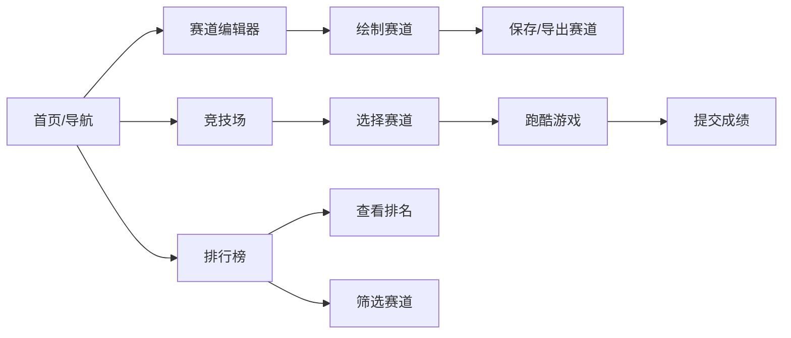

## 1. 产品概述

赛博朋克风格霓虹跑酷游戏编辑器与实时竞技平台，用户可在浏览器中自定义跑酷赛道并实时竞技挑战。

- 核心价值：提供赛道创作工具 + 跑酷竞技体验，支持玩家自定义内容与异步挑战
- 目标用户：休闲游戏玩家、赛道创作者、像素风格游戏爱好者

## 2. 核心功能

### 2.1 功能模块

1. **赛道编辑器页**：网格画布绘制赛道，参数面板调整元素属性，保存/导出/导入赛道数据
2. **竞技场页**：实时跑酷游戏，角色自动奔跑，跳跃/加速机制，计时与成绩提交
3. **排行榜页**：展示所有玩家成绩，按赛道筛选，排名高亮，总挑战次数统计

### 2.2 页面详情

| 页面名称 | 模块名称 | 功能描述 |
|-----------|-------------|---------------------|
| 编辑器页 | 网格画布 | 20x10网格，点击切换元素类型（空白/障碍物/加速带/跳跃平台） |
| 编辑器页 | 参数面板 | 显示选中格子信息，调整障碍物高度、加速带倍率 |
| 编辑器页 | 工具栏 | 保存赛道、导出JSON、导入JSON、清空画布 |
| 竞技场页 | 游戏画布 | 等距视角跑酷渲染，角色、障碍物、加速带可视化 |
| 竞技场页 | HUD面板 | 计时器（0.01s精度）、当前速度、赛道选择 |
| 竞技场页 | 游戏控制 | 空格键跳跃、开始/重置按钮、成绩提交 |
| 排行榜页 | 成绩列表 | 按完成时间升序排列，金银铜高亮前三名 |
| 排行榜页 | 筛选器 | 按赛道名称过滤，显示玩家总挑战次数 |
| 排行榜页 | 皮肤设置 | 16色调色板选色，配饰选择（眼镜/头盔/披风） |

## 3. 核心流程

用户进入应用 → 导航至编辑器创建赛道 → 保存赛道 → 进入竞技场选择赛道 → 控制角色跑酷 → 完成后提交成绩 → 排行榜查看排名

## 4. 用户界面设计

### 4.1 设计风格

- **主色调**：深黑蓝背景 (#0a0f24 → #1a0033 径向渐变)
- **霓虹色**：青色 #00f5d4、玫红 #ff006e、紫色 #b5179e、亮蓝 #00d9ff
- **字体**：现代科技感无衬线字体，数字使用等宽字体
- **布局**：深色玻璃拟态风格，霓虹边框发光效果
- **动画**：扫描线动画、脉冲光效、粒子背景、平滑过渡

### 4.2 页面设计概览

| 页面名称 | 模块名称 | UI元素 |
|-----------|-------------|-------------|
| 全局 | 导航栏 | 半透明玻璃效果，霓虹发光分割线，渐变按钮 |
| 全局 | 粒子背景 | 缓慢上升光点，2-4px大小，透明度0.3-0.7 |
| 编辑器 | 网格画布 | 深蓝色网格线，霓虹边框，扫描线动画 |
| 编辑器 | 参数面板 | 深色卡片，滑块控件，保存按钮渐变霓虹色 |
| 竞技场 | 游戏画布 | 等距视角渲染，像素风格角色，残影效果 |
| 竞技场 | HUD | 右上角计时器，速度显示，玻璃拟态面板 |
| 排行榜 | 成绩列表 | 卡片式布局，前三名金银铜背景高亮 |
| 排行榜 | 皮肤面板 | 16色调色板网格，配饰选择按钮 |

### 4.3 响应式

- 桌面端优先设计，画布区域固定尺寸
- 控制面板自适应宽度
- 移动端简化布局，保持核心功能可用

### 4.4 视觉特效

- 霓虹边框发光（box-shadow + 动画）
- 扫描线动画（CSS linear-gradient 横向移动）
- 角色脉冲光效（opacity 呼吸动画）
- 加速带残影（Canvas trail effect）
- 按钮悬停放大发光
- 粒子背景Canvas动画
