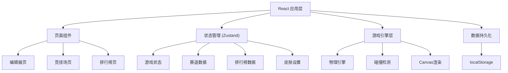

## 1. 架构设计



## 2. 技术描述

- **前端框架**：React 18 + TypeScript
- **构建工具**：Vite 5
- **状态管理**：Zustand
- **路由**：react-router-dom v6
- **渲染**：Canvas 2D API
- **样式**：原生CSS + CSS变量
- **数据存储**：localStorage（模拟后端）
- **图标**：lucide-react

## 3. 路由定义

| 路由 | 页面 | 用途 |
|-------|------|-------|
| /editor | 编辑器页 | 赛道创建与编辑 |
| /arena | 竞技场页 | 跑酷游戏与竞技 |
| /leaderboard | 排行榜页 | 成绩展示与皮肤设置 |
| * | 重定向到 /editor | 默认入口 |

## 4. 数据模型

### 4.1 赛道数据 (TrackData)

```typescript
interface TrackCell {
  x: number;
  y: number;
  type: 'empty' | 'obstacle' | 'boost' | 'platform';
  height?: number;      // 障碍物高度 1-3
  multiplier?: number;  // 加速带倍率 1.5-3
}

interface TrackData {
  id: string;
  name: string;
  width: number;   // 20
  height: number;  // 10
  cells: TrackCell[];
  createdAt: number;
}
```

### 4.2 游戏状态 (GameState)

```typescript
interface PlayerState {
  x: number;
  y: number;
  velocityY: number;
  speed: number;
  isJumping: boolean;
  isOnGround: boolean;
  jumpHoldTime: number;
}

interface GameState {
  status: 'idle' | 'playing' | 'paused' | 'finished';
  player: PlayerState;
  currentTrack: TrackData | null;
  elapsedTime: number;
  currentSpeed: number;
}
```

### 4.3 排行榜记录 (LeaderboardEntry)

```typescript
interface LeaderboardEntry {
  id: string;
  trackId: string;
  trackName: string;
  playerName: string;
  time: number;
  timestamp: number;
  skin: SkinData;
}
```

### 4.4 皮肤数据 (SkinData)

```typescript
interface SkinData {
  color: string;
  accessory: {
    glasses: string | null;
    helmet: string | null;
    cape: string | null;
  };
}
```

## 5. 核心模块

### 5.1 GameEngine (游戏引擎)

- 帧循环管理 (requestAnimationFrame)
- 物理模拟（重力、跳跃、加速）
- 碰撞检测
- Canvas渲染
- 计时器管理

### 5.2 TrackEditor (赛道编辑器)

- 网格渲染
- 格子交互（点击切换类型）
- 参数面板
- 数据序列化/反序列化

### 5.3 状态管理

- useGameStore：游戏运行时状态
- useTrackStore：赛道数据管理
- useLeaderboardStore：排行榜数据
- useSkinStore：皮肤设置

## 6. 性能优化

- Canvas分层渲染
- requestAnimationFrame 60FPS
- 编辑器仅重绘变化区域
- 排行榜数据本地缓存
- 粒子系统对象池
