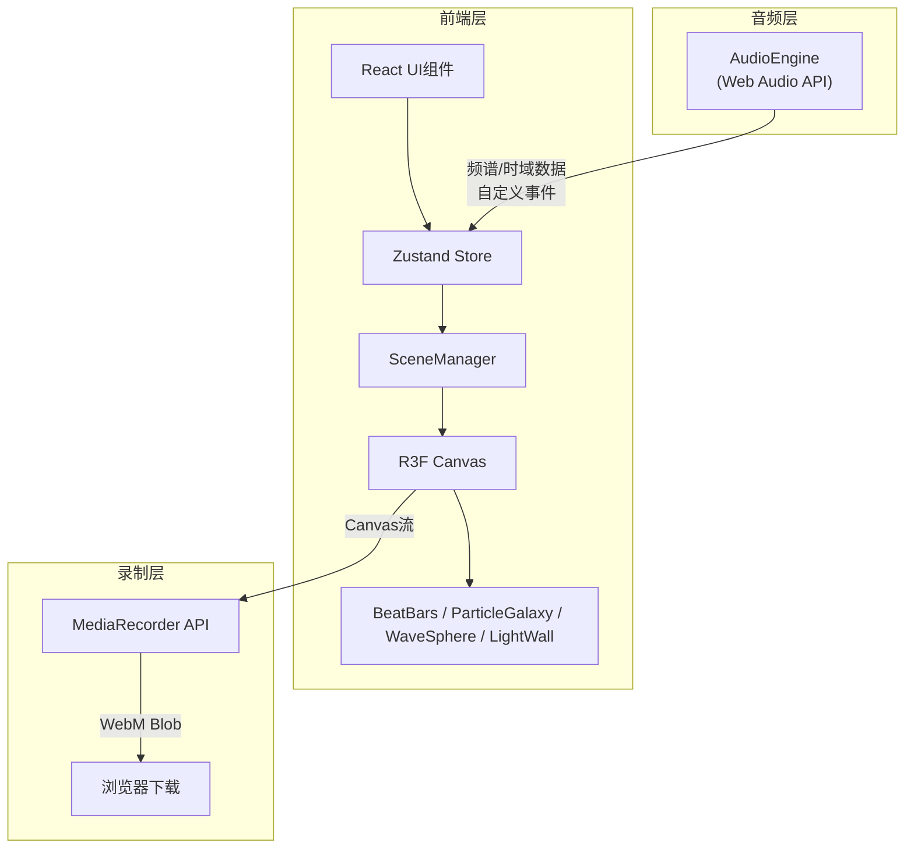

## 1. 架构设计



## 2. 技术说明

- 前端：React 18 + TypeScript + Three.js + @react-three/fiber + @react-three/drei + Zustand
- 初始化工具：vite-init（react-ts模板）
- 后端：无
- 数据库：无

### 依赖列表

| 包名 | 用途 |
|------|------|
| react | UI框架 |
| react-dom | DOM渲染 |
| three | 3D引擎 |
| @react-three/fiber | React Three.js绑定 |
| @react-three/drei | R3F辅助组件 |
| zustand | 状态管理 |
| typescript | 类型安全 |
| vite | 构建工具 |
| @types/react | React类型 |
| @types/react-dom | ReactDOM类型 |
| @types/three | Three.js类型 |

## 3. 路由定义

| 路由 | 用途 |
|------|------|
| / | 主场景页面（唯一页面） |

## 4. 文件结构

```
├── package.json
├── vite.config.js
├── tsconfig.json
├── index.html
├── src/
│   ├── main.tsx          # React入口
│   ├── App.tsx           # 主应用组件
│   ├── audioEngine.ts    # 音频解析模块
│   ├── store.ts          # Zustand全局状态
│   ├── sceneManager.tsx  # 3D场景管理
│   └── elements/
│       ├── BeatBars.tsx       # 跳动柱体
│       ├── ParticleGalaxy.tsx # 旋转粒子星系
│       ├── WaveSphere.tsx     # 起伏波形球体
│       └── LightWall.tsx     # 闪烁光墙
```

### 核心模块职责

| 模块 | 职责 |
|------|------|
| audioEngine.ts | 解析MP3/WAV，提取频谱/时域数据，暴露start/stop/getFrequencyData/getTimeData |
| store.ts | Zustand store：元素列表、元素属性、音乐状态、选中元素、主题、录制状态 |
| sceneManager.tsx | 3D场景初始化、添加/移除元素、更新属性、音乐同步、灯光/星空管理 |
| BeatBars.tsx | 跳动柱体：低频鼓点驱动高度(0.5~2单位)、颜色映射 |
| ParticleGalaxy.tsx | 粒子星系：中高频驱动颜色和旋转速度 |
| WaveSphere.tsx | 波形球体：整体音量驱动顶点起伏 |
| LightWall.tsx | 闪烁光墙：节拍触发RGB色彩渐变 |

### 数据流

1. 用户上传音频 → AudioEngine解析 → 自定义事件通知Store
2. Store更新频谱数据 → SceneManager读取 → 传递给各元素组件
3. 用户拖拽元素 → Store添加元素 → SceneManager渲染新元素
4. 用户调整属性 → Store更新 → 元素组件响应式更新
5. 用户切换主题 → Store更新主题 → 所有元素颜色映射同步更新
6. 用户录制 → MediaRecorder捕获Canvas流 → WebM下载

## 5. API定义（无后端）

### AudioEngine接口

```typescript
interface AudioEngine {
  loadFile(file: File): Promise<void>
  start(): void
  stop(): void
  getFrequencyData(): Uint8Array
  getTimeData(): Uint8Array
  isPlaying(): boolean
  getCurrentTime(): number
  getDuration(): number
  seek(time: number): void
}
```

### Zustand Store接口

```typescript
interface VisualElement {
  id: string
  type: 'beatBars' | 'particleGalaxy' | 'waveSphere' | 'lightWall'
  position: [number, number, number]
  rotation: [number, number, number]
  scale: number
  colorTheme: 'cyber' | 'aurora' | 'lava'
  sensitivity: number
  rotationSpeed: number
  params: Record<string, number>
}

interface Store {
  elements: VisualElement[]
  selectedId: string | null
  theme: 'cyber' | 'aurora' | 'lava'
  frequencyData: Uint8Array
  timeData: Uint8Array
  isPlaying: boolean
  currentTime: number
  duration: number
  isRecording: boolean
  addElement: (type: VisualElement['type']) => void
  removeElement: (id: string) => void
  updateElement: (id: string, updates: Partial<VisualElement>) => void
  setSelectedId: (id: string | null) => void
  setTheme: (theme: Store['theme']) => void
  setFrequencyData: (data: Uint8Array) => void
  setTimeData: (data: Uint8Array) => void
  setPlaying: (playing: boolean) => void
  setCurrentTime: (time: number) => void
  setDuration: (duration: number) => void
  setRecording: (recording: boolean) => void
  syncAllElements: () => void
}
```
