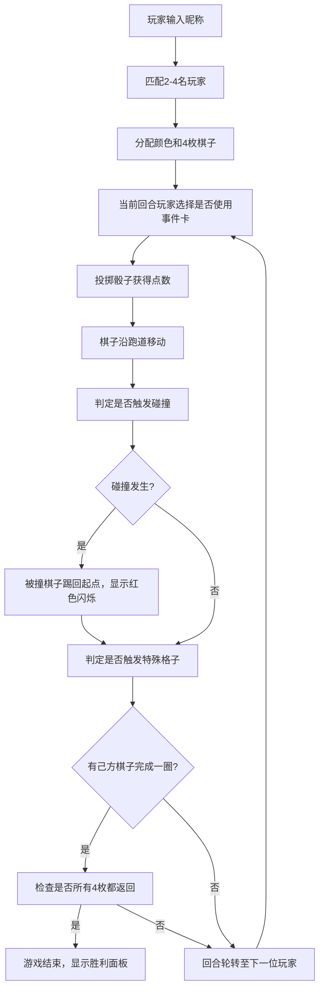

## 1. 产品概述

多人实时桌面飞行棋对战游戏，解决传统桌游在线体验缺失的问题，提供2-4名玩家实时对战，融合棋子碰撞、随机事件卡等互动机制，带来沉浸式的线上派对游戏体验。

- **核心问题**：传统桌游规则固定，缺乏实时物理互动反馈，线上体验差
- **目标用户**：派对游戏爱好者、朋友聚会在线娱乐群体
- **产品价值**：还原桌游互动感，增加随机事件和碰撞机制，提升游戏趣味性和社交属性

## 2. 核心功能

### 2.1 用户角色

| 角色 | 注册方式 | 核心权限 |
|------|----------|----------|
| 玩家 | 无需注册，输入昵称即可开始 | 加入游戏、投掷骰子、使用事件卡、查看排行榜 |

### 2.2 功能模块

1. **游戏大厅**：玩家昵称输入、2-4人匹配、游戏开始
2. **主游戏界面**：4x7回形棋盘渲染、棋子移动动画、骰子3D动画
3. **事件卡系统**：事件卡抽取、效果触发、动画展示
4. **碰撞系统**：棋子碰撞判定、踢回起点机制、多棋子处理
5. **回合管理**：玩家回合轮转、超时自动跳过、胜负判定
6. **排行榜面板**：实时玩家状态、棋子进度展示

### 2.3 页面详情

| 页面名称 | 模块名称 | 功能描述 |
|-----------|-------------|---------------------|
| 游戏大厅 | 玩家登录 | 输入昵称、选择颜色、匹配其他玩家 |
| 游戏主界面 | 棋盘渲染 | 28格回形跑道，分区颜色区分，特殊标记显示 |
| 游戏主界面 | 骰子组件 | 3D旋转动画，点击投掷，点数1-6随机 |
| 游戏主界面 | 棋子移动 | 路径插值动画，跳跃效果，碰撞反馈 |
| 游戏主界面 | 事件卡 | 卡片翻转动画，效果文字说明，3种事件类型 |
| 游戏主界面 | 排行榜 | 右侧半透明面板，玩家状态实时更新 |
| 胜利面板 | 结果展示 | 金色背景，玩家头像名次，重新开始选项 |

## 3. 核心流程

## 4. 用户界面设计

### 4.1 设计风格
- **主色调**：深木色背景(#5a3d2b)，金色边框(#d4af37)
- **分区颜色**：红区#e74c3c(0.7透明度)、蓝区#3498db、黄区#f1c40f、绿区#2ecc71
- **棋子样式**：平面圆形，径向渐变毛绒边缘效果，24px
- **骰子样式**：白色正方体，3D透视变换，投掷时绕X/Y轴旋转
- **字体**：标题使用加粗衬线字体，正文使用清晰易读的无衬线字体
- **动效**：棋子跳跃动画0.3秒、骰子旋转1秒内、碰撞闪烁0.5秒

### 4.2 页面设计概述

| 页面名称 | 模块名称 | UI元素 |
|-----------|-------------|-------------|
| 游戏主界面 | 棋盘 | 深木色纹理背景，28格彩色分区，金色边框，格子编号和特殊标记 |
| 游戏主界面 | 棋子 | 四种颜色圆形棋子，径向渐变毛绒边缘，跳跃移动动画 |
| 游戏主界面 | 骰子 | 白色3D正方体，点击挤压反弹，投掷旋转动画 |
| 游戏主界面 | 事件卡 | 卡片翻转动画，金色文字说明，悬浮在棋盘上方 |
| 游戏主界面 | 排行榜 | 右侧35%高度，半透明黑色背景(rgba(0,0,0,0.6))，模糊8px |
| 游戏主界面 | 玩家头像 | 当前玩家金色边框脉动动画，显示颜色圆点和棋子数 |
| 胜利面板 | 结果 | 金色渐变背景，玩家头像放大，名次排名，重新开始按钮 |

### 4.3 响应式
- **桌面端**：Flex布局，棋盘居中，排行榜贴右侧
- **移动端(<768px)**：排行榜折叠到底部，棋盘自适应宽度

### 4.4 动效设计指导
- **棋子移动**：沿格子中心跳跃，贝塞尔曲线插值，0.3秒完成
- **骰子投掷**：挤压反弹(scaleY 0.8→1.2→1)，然后绕X/Y轴随机旋转2-4圈后停止
- **碰撞反馈**：被撞棋子红色闪烁0.5秒，快速回弹至起点
- **事件触发**：卡片从底部滑入，3D翻转展示效果文字，停留2秒后滑出
- **回合切换**：当前玩家头像金色边框脉动(box-shadow 0→10px→0循环)

## 5. 性能约束
- 棋盘状态更新频率≥30帧/秒
- 碰撞判定响应时间<100ms
- 骰子动画播放时长≤1秒
- 单帧渲染耗时≤16ms
