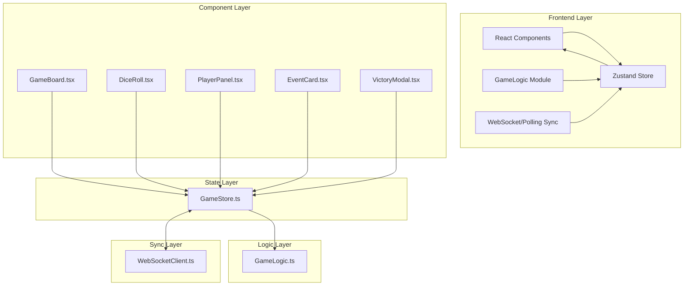

## 1. 架构设计



## 2. 技术描述

- **前端框架**: React@18 + TypeScript@5 + Vite@5
- **状态管理**: zustand@4
- **构建工具**: Vite@5
- **样式方案**: CSS Modules + CSS Variables
- **实时同步**: 原生 WebSocket (fallback 到轮询)
- **唯一标识**: uuid@9
- **类型定义**: @types/react@18, @types/react-dom@18

**文件调用关系**:
- `DiceRoll.tsx` → `GameStore.ts` (投掷骰子动作)
- `GameBoard.tsx` → `GameStore.ts` (订阅状态，渲染棋盘)
- `GameStore.ts` → `GameLogic.ts` (调用纯函数计算新状态)
- `GameStore.ts` → `WebSocketClient.ts` (广播状态变更)
- `WebSocketClient.ts` → `GameStore.ts` (接收远程状态更新)

**数据流向**:
1. 用户交互 (DiceRoll点击) → Store Action
2. Store 调用 GameLogic 计算新状态
3. Store 更新本地状态 → 触发组件重渲染
4. Store 通过 WebSocket 广播状态到其他客户端
5. 其他客户端接收状态 → 插值补偿 → 更新本地 Store

## 3. 核心数据结构

```typescript
// 玩家颜色
type PlayerColor = 'red' | 'blue' | 'yellow' | 'green';

// 棋子状态
interface Piece {
  id: string;
  playerId: string;
  position: number; // 0-27 格子位置, -1 表示在起点
  isFinished: boolean;
}

// 玩家状态
interface Player {
  id: string;
  name: string;
  color: PlayerColor;
  pieces: Piece[];
  eventCards: number; // 剩余事件卡数量
  isCurrentTurn: boolean;
  turnStartTime: number;
}

// 事件卡类型
type EventCardType = 'advance_clear' | 'back_collision' | 'teleport_teammate';

// 事件卡效果
interface EventCard {
  type: EventCardType;
  name: string;
  description: string;
}

// 棋盘格子
interface Cell {
  id: number;
  position: number;
  zone: 'red' | 'blue' | 'yellow' | 'green' | 'center';
  isStart: boolean;
  isEvent: boolean;
  specialMark?: 'arrow' | 'star';
}

// 游戏状态
interface GameState {
  players: Player[];
  cells: Cell[];
  currentPlayerIndex: number;
  diceValue: number | null;
  isRolling: boolean;
  eventQueue: EventCard[];
  activeEvent: EventCard | null;
  gamePhase: 'waiting' | 'playing' | 'finished';
  winner: Player | null;
  lastStateTimestamp: number;
  collidedPieces: string[]; // 被碰撞闪烁的棋子ID
}
```

## 4. 目录结构

```
d:\P\tasks\auto144/
├── package.json
├── vite.config.js
├── tsconfig.json
├── index.html
└── src/
    ├── main.tsx              # 入口文件
    ├── App.tsx               # 根组件
    ├── types/
    │   └── game.ts           # 类型定义
    ├── GameBoard.tsx         # 主游戏棋盘组件
    ├── GameLogic.ts          # 游戏逻辑纯函数
    ├── GameStore.ts          # Zustand 状态管理
    ├── DiceRoll.tsx          # 骰子组件
    ├── components/
    │   ├── Piece.tsx         # 棋子组件
    │   ├── Cell.tsx          # 格子组件
    │   ├── PlayerPanel.tsx   # 玩家面板
    │   ├── EventCard.tsx     # 事件卡组件
    │   ├── VictoryModal.tsx  # 胜利面板
    │   └── Leaderboard.tsx   # 排行榜
    ├── hooks/
    │   └── useAnimation.ts   # 动画自定义Hook
    ├── utils/
    │   ├── sync.ts           # WebSocket/轮询同步
    │   └── interpolation.ts  # 状态插值补偿
    └── styles/
        ├── variables.css     # CSS变量
        └── global.css        # 全局样式
```

## 5. 核心模块说明

### 5.1 GameLogic.ts - 纯函数模块

```typescript
// 计算新位置
export function calculateNewPosition(
  currentPos: number,
  diceValue: number,
  totalCells: number
): number;

// 碰撞检测
export function checkCollision(
  newPosition: number,
  currentPieceId: string,
  playerId: string,
  players: Player[]
): {
  collided: boolean;
  collidedPieceId: string | null;
  targetPieces: Piece[];
};

// 处理碰撞结果
export function resolveCollision(
  targetPieces: Piece[],
  currentPlayerId: string,
  pieceId: string
): {
  updatedPieces: Piece[];
  kickedPieceIds: string[];
  warning: string | null;
};

// 事件卡效果应用
export function applyEventCard(
  eventType: EventCardType,
  player: Player,
  allPlayers: Player[],
  targetPieceId?: string
): {
  updatedPlayers: Player[];
  message: string;
};

// 胜负判定
export function checkWinCondition(player: Player): boolean;

// 计算下一个玩家
export function getNextPlayer(
  currentIndex: number,
  totalPlayers: number
): number;
```

### 5.2 GameStore.ts - Zustand Store

```typescript
interface GameActions {
  // 初始化游戏
  initGame: (playerNames: string[]) => void;
  // 投掷骰子
  rollDice: () => void;
  // 使用事件卡
  useEventCard: (eventType: EventCardType) => void;
  // 移动棋子
  movePiece: (pieceId: string) => void;
  // 跳过回合
  skipTurn: () => void;
  // 同步远程状态
  syncState: (remoteState: GameState, remoteTimestamp: number) => void;
  // 重置游戏
  resetGame: () => void;
}

type GameStore = GameState & GameActions;
```

### 5.3 WebSocket 同步协议

```typescript
// 客户端发送消息
interface ClientMessage {
  type: 'roll_dice' | 'use_event' | 'move_piece' | 'skip_turn';
  payload: any;
  timestamp: number;
}

// 服务器广播消息
interface ServerMessage {
  type: 'state_update' | 'player_joined' | 'player_left';
  state: GameState;
  timestamp: number;
}

// 丢包补偿策略
// 1. 时间戳差 < 200ms: 渐进插值调整
// 2. 时间戳差 >= 200ms: 直接跳转
// 3. 本地操作优先: 乐观更新 + 冲突检测
```

## 6. 性能优化策略

1. **状态分片**: 使用 zustand 的 `shallow` 选择器，避免不必要的重渲染
2. **动画优化**: 使用 `requestAnimationFrame` + CSS transform，避免布局抖动
3. **碰撞检测优化**: 空间哈希 + 预计算格子占用表
4. **虚拟渲染**: 棋盘只有28格，直接渲染无需虚拟化
5. **防抖节流**: 骰子点击防抖，状态更新节流到30fps
