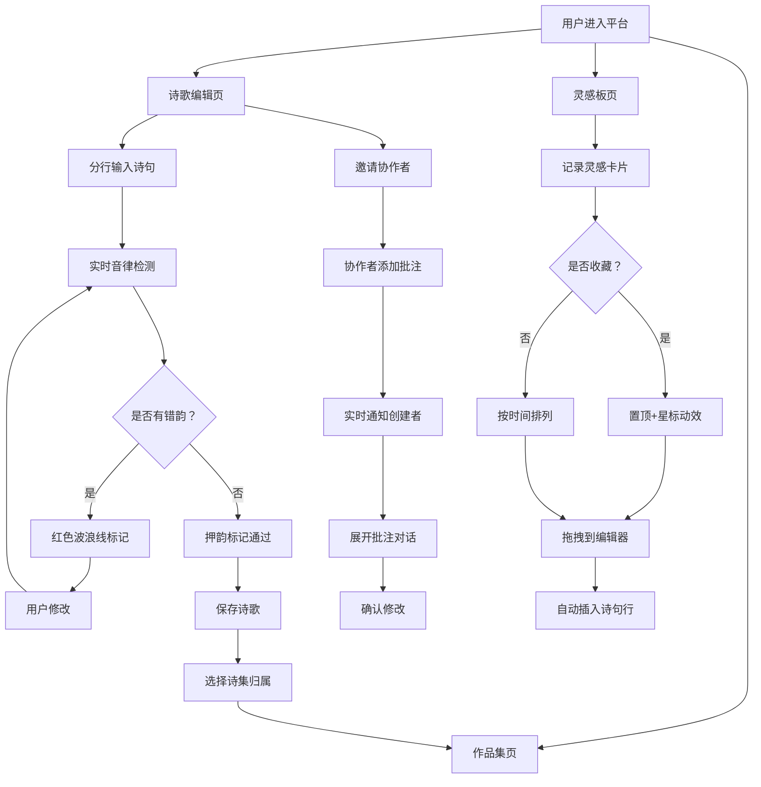

## 1. 产品概述

诗韵坊——在线诗歌创作与协作平台，为诗友社区提供实时协作推敲诗句、整理作品和激发灵感的在线创作空间。
- 解决诗友社区难以实时协作推敲诗句、整理作品和激发灵感的痛点
- 面向热爱古典诗词与现代诗歌创作的用户群体，目标成为最具文化气质的在线诗歌共创平台

## 2. 核心功能

### 2.1 用户角色

| 角色 | 注册方式 | 核心权限 |
|------|----------|----------|
| 诗人用户 | 邮箱注册 | 创建诗歌、邀请协作者、管理灵感卡片、维护作品集 |
| 协作者 | 链接邀请 | 对被邀请诗歌添加批注、查看内容 |
| 访客 | 无需注册 | 浏览公开作品集、点赞与评论 |

### 2.2 功能模块

1. **诗歌编辑页**：分行输入编辑器、押韵标记、音律检测、协作批注气泡
2. **灵感板页**：灵感卡片墙、拖拽插入、收藏置顶
3. **作品集页**：诗集管理、时间线展示、点赞评论
4. **个人主页**：创作历程时间线、诗集列表、年份分隔

### 2.3 页面详情

| 页面名称 | 模块名称 | 功能描述 |
|----------|----------|----------|
| 诗歌编辑页 | 诗歌编辑器 | 分行输入，每行独立押韵标记与字数统计，实时音律检测（平仄搭配），错韵行红色波浪线标出 |
| 诗歌编辑页 | 协作批注 | 邀请最多5名协作者，在高亮文本上添加批注（建议修改语词、更换意象），半透明淡黄色气泡悬浮行右侧，点击展开对话 |
| 灵感板页 | 灵感卡片墙 | 每位用户拥有灵感卡片板，卡片记录一闪而过的诗句或词语，支持拖拽到编辑器直接插入，按创建时间排列，收藏置顶带星标动效 |
| 作品集页 | 诗集管理 | 创建多个诗集（如五言集、现代诗卷），每首诗指定所属诗集 |
| 作品集页 | 时间线展示 | 个人主页以时间线形式展示创作历程，诗集中间有年份分隔线，点击诗歌卡片展开完整内容和点赞评论数 |

## 3. 核心流程

### 3.1 诗歌创作流程

用户进入编辑页 → 逐行输入诗句 → 系统实时检测字数与音律 → 错韵行显示红色波浪线提示 → 用户调整修改 → 保存诗歌 → 选择归属诗集 → 作品集时间线更新

### 3.2 协作批注流程

创建者邀请协作者 → 协作者通过链接进入 → 选中高亮文本 → 添加批注气泡 → 创建者收到实时通知 → 点击气泡展开完整对话 → 讨论后确认修改

### 3.3 灵感卡片流程

用户记录灵感词语/诗句 → 卡片出现在灵感板 → 可收藏置顶 → 创作时拖拽卡片到编辑器 → 自动插入诗句行 → WebSocket通知协作者

## 4. 用户界面设计

### 4.1 设计风格

- **主色调**：宣纸米色底（#F5F0E8），墨色文字（#2C2C2C）
- **辅助色**：深棕色导航（#5C3A21），淡雅蓝绿色灵感卡片（#7BAEA1），淡黄色批注气泡（#FFF8DC）
- **按钮风格**：圆角矩形，深棕色底配米色文字，悬停时微弱光影浮动
- **字体**：标题使用「霞鹜文楷」或「LXGW WenKai」，正文使用「Noto Serif SC」
- **布局风格**：左侧留白模拟传统书卷，居中内容区域，右侧批注气泡
- **图标风格**：使用 lucide-react 图标库，线条风格配以毛笔笔触质感

### 4.2 页面设计概览

| 页面名称 | 模块名称 | UI元素 |
|----------|----------|--------|
| 诗歌编辑页 | 诗歌编辑器 | 宣纸米色背景，左侧留白书卷感，分行输入框每行带字数统计与押韵标记，光标悬停行有阴影浮动，错韵行红色波浪线下划线 |
| 诗歌编辑页 | 协作批注 | 半透明淡黄色毛玻璃气泡悬浮行右侧，点击气泡展开完整对话面板，协作者头像小圆标 |
| 灵感板页 | 灵感卡片墙 | 淡雅蓝绿色卡片网格排列，收藏卡片置顶带星标闪烁动效，悬停卡片轻微上浮动画，拖拽时卡片半透明跟随鼠标 |
| 作品集页 | 时间线 | 纵向时间线，诗歌卡片沿时间线左右交替排列，年份分隔线，卡片点击展开显示完整内容和点赞评论数 |
| 个人主页 | 诗集列表 | 卡片式诗集展示，每个诗集封面显示标题和诗歌数量，点击进入诗集详情 |

### 4.3 响应式设计

- **桌面端优先**：编辑器左侧留白，批注气泡右侧悬浮，灵感卡片多列网格
- **移动端适配**：编辑器区域全宽，批注气泡改为底部弹出式面板，灵感卡片单列排列，时间线改为单列纵向
- **触摸优化**：拖拽操作支持触摸手势，批注气泡点击区域放大，按钮间距增大

### 4.4 动效设计

- **光标行阴影浮动**：鼠标悬停诗句行时，该行产生微弱的阴影浮动效果
- **灵感卡片上浮**：悬停时 translateY(-4px) 配合 shadow 增大
- **收藏星标动效**：收藏时星标闪烁旋转放大再缩小的关键帧动画
- **批注气泡展开**：从气泡尺寸平滑过渡到对话面板尺寸
- **时间线滚动揭示**：诗歌卡片进入视口时淡入上滑
- **确认音效**：所有操作（保存、邀请、拖拽）通过 Web Audio API 播放清脆确认音

### 4.5 性能要求

- 编辑器输入响应延迟低于 50ms
- 协作批注实时同步延迟控制在 500ms 以内
- WebSocket 心跳保活与断线重连机制
