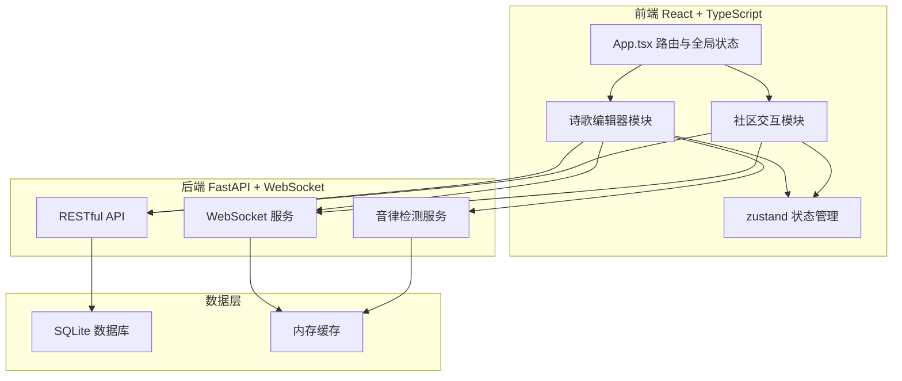
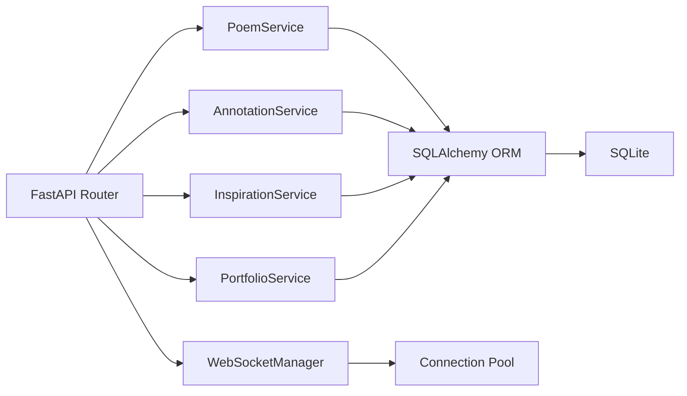
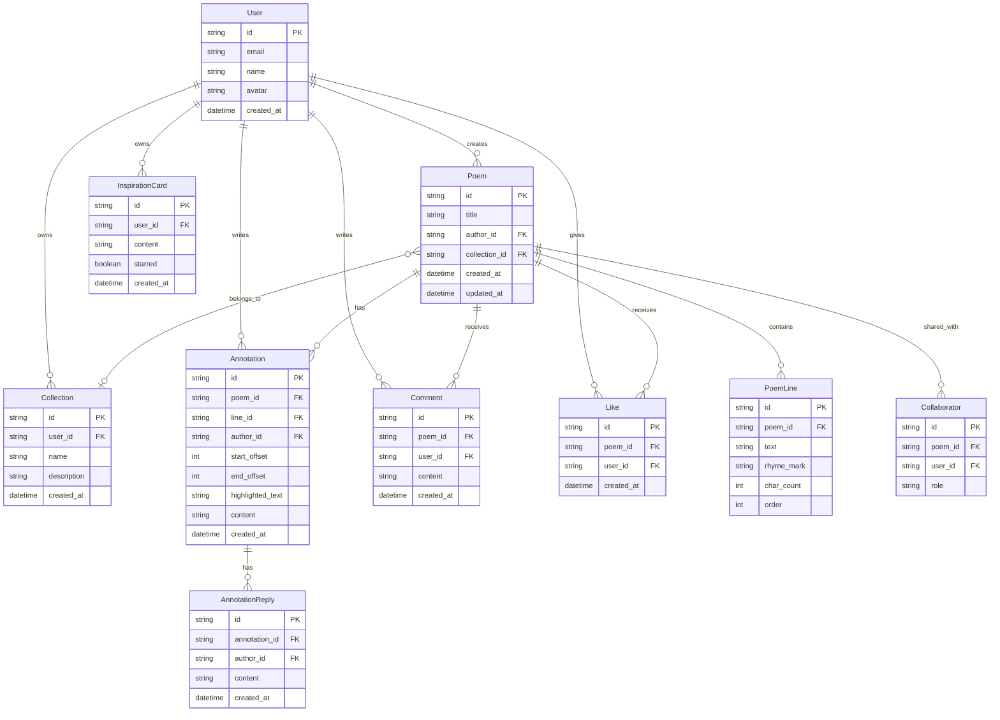

## 1. 架构设计



## 2. 技术说明

- **前端**：React@18 + TypeScript + Vite + Tailwind CSS@3 + zustand
- **初始化工具**：vite-init（react-ts 模板）
- **后端**：FastAPI（Python），提供 RESTful API 和 WebSocket 服务
- **数据库**：SQLite（轻量级，无需额外服务），使用 SQLAlchemy ORM
- **实时通信**：WebSocket（FastAPI 内置支持），socket.io-client 前端连接
- **拖拽库**：react-beautiful-dnd
- **音效**：Web Audio API
- **ID生成**：uuid

## 3. 路由定义

| 路由 | 用途 |
|------|------|
| `/` | 首页/个人主页，展示创作历程时间线 |
| `/editor/:poemId` | 诗歌编辑页，包含分行编辑器和协作批注 |
| `/inspiration` | 灵感卡片墙页面 |
| `/portfolio` | 作品集页面，展示诗集列表和时间线 |
| `/portfolio/:collectionId` | 单个诗集详情页 |

## 4. API 定义

### 4.1 诗歌编辑相关

```typescript
interface PoemLine {
  id: string;
  text: string;
  rhymeMark: string;
  charCount: number;
  order: number;
}

interface Poem {
  id: string;
  title: string;
  authorId: string;
  collectionId: string | null;
  lines: PoemLine[];
  createdAt: string;
  updatedAt: string;
}

interface TonalResult {
  lineId: string;
  score: number;
  errors: TonalError[];
}

interface TonalError {
  position: number;
  char: string;
  expected: string;
  actual: string;
  message: string;
}

// POST /api/poems - 创建诗歌
// GET /api/poems/:id - 获取诗歌
// PUT /api/poems/:id - 更新诗歌
// DELETE /api/poems/:id - 删除诗歌
// POST /api/poems/:id/check-tonal - 音律检测
```

### 4.2 协作批注相关

```typescript
interface Annotation {
  id: string;
  poemId: string;
  lineId: string;
  authorId: string;
  authorName: string;
  startOffset: number;
  endOffset: number;
  highlightedText: string;
  content: string;
  replies: AnnotationReply[];
  createdAt: string;
}

interface AnnotationReply {
  id: string;
  authorId: string;
  authorName: string;
  content: string;
  createdAt: string;
}

interface CollaborationInvite {
  poemId: string;
  inviteeEmail: string;
  role: 'collaborator';
}

// POST /api/poems/:id/annotations - 创建批注
// GET /api/poems/:id/annotations - 获取诗歌批注列表
// POST /api/poems/:id/annotations/:annotationId/replies - 回复批注
// POST /api/poems/:id/invite - 邀请协作者
// GET /api/poems/:id/collaborators - 获取协作者列表
```

### 4.3 灵感卡片相关

```typescript
interface InspirationCard {
  id: string;
  userId: string;
  content: string;
  starred: boolean;
  createdAt: string;
}

// GET /api/inspirations - 获取用户灵感卡片列表
// POST /api/inspirations - 创建灵感卡片
// PUT /api/inspirations/:id - 更新灵感卡片（收藏/取消收藏）
// DELETE /api/inspirations/:id - 删除灵感卡片
```

### 4.4 作品集相关

```typescript
interface Collection {
  id: string;
  userId: string;
  name: string;
  description: string;
  poemCount: number;
  createdAt: string;
}

interface PortfolioTimeline {
  years: {
    year: number;
    poems: Poem[];
  }[];
}

// GET /api/collections - 获取用户诗集列表
// POST /api/collections - 创建诗集
// PUT /api/collections/:id - 更新诗集
// DELETE /api/collections/:id - 删除诗集
// GET /api/portfolio/:userId - 获取用户作品时间线
// POST /api/poems/:id/like - 点赞诗歌
// GET /api/poems/:id/comments - 获取诗歌评论
// POST /api/poems/:id/comments - 添加评论
```

### 4.5 WebSocket 事件

```typescript
// 客户端发送
interface WSClientMessage {
  type: 'annotation_add' | 'annotation_reply' | 'line_update' | 'card_drag' | 'join_poem' | 'leave_poem';
  poemId: string;
  payload: any;
}

// 服务端广播
interface WSServerMessage {
  type: 'annotation_added' | 'annotation_replied' | 'line_updated' | 'card_dragged' | 'collaborator_joined' | 'collaborator_left';
  poemId: string;
  payload: any;
  fromUserId: string;
}
```

## 5. 服务端架构图



## 6. 数据模型

### 6.1 数据模型定义



### 6.2 数据定义语言

```sql
CREATE TABLE user (
    id TEXT PRIMARY KEY,
    email TEXT UNIQUE NOT NULL,
    name TEXT NOT NULL,
    avatar TEXT,
    created_at TIMESTAMP DEFAULT CURRENT_TIMESTAMP
);

CREATE TABLE poem (
    id TEXT PRIMARY KEY,
    title TEXT NOT NULL,
    author_id TEXT NOT NULL REFERENCES user(id),
    collection_id TEXT REFERENCES collection(id),
    created_at TIMESTAMP DEFAULT CURRENT_TIMESTAMP,
    updated_at TIMESTAMP DEFAULT CURRENT_TIMESTAMP
);

CREATE TABLE poem_line (
    id TEXT PRIMARY KEY,
    poem_id TEXT NOT NULL REFERENCES poem(id) ON DELETE CASCADE,
    text TEXT NOT NULL,
    rhyme_mark TEXT DEFAULT '',
    char_count INTEGER DEFAULT 0,
    "order" INTEGER NOT NULL
);

CREATE TABLE annotation (
    id TEXT PRIMARY KEY,
    poem_id TEXT NOT NULL REFERENCES poem(id) ON DELETE CASCADE,
    line_id TEXT NOT NULL REFERENCES poem_line(id) ON DELETE CASCADE,
    author_id TEXT NOT NULL REFERENCES user(id),
    start_offset INTEGER DEFAULT 0,
    end_offset INTEGER DEFAULT 0,
    highlighted_text TEXT DEFAULT '',
    content TEXT NOT NULL,
    created_at TIMESTAMP DEFAULT CURRENT_TIMESTAMP
);

CREATE TABLE annotation_reply (
    id TEXT PRIMARY KEY,
    annotation_id TEXT NOT NULL REFERENCES annotation(id) ON DELETE CASCADE,
    author_id TEXT NOT NULL REFERENCES user(id),
    content TEXT NOT NULL,
    created_at TIMESTAMP DEFAULT CURRENT_TIMESTAMP
);

CREATE TABLE inspiration_card (
    id TEXT PRIMARY KEY,
    user_id TEXT NOT NULL REFERENCES user(id) ON DELETE CASCADE,
    content TEXT NOT NULL,
    starred BOOLEAN DEFAULT FALSE,
    created_at TIMESTAMP DEFAULT CURRENT_TIMESTAMP
);

CREATE TABLE collection (
    id TEXT PRIMARY KEY,
    user_id TEXT NOT NULL REFERENCES user(id) ON DELETE CASCADE,
    name TEXT NOT NULL,
    description TEXT DEFAULT '',
    created_at TIMESTAMP DEFAULT CURRENT_TIMESTAMP
);

CREATE TABLE collaborator (
    id TEXT PRIMARY KEY,
    poem_id TEXT NOT NULL REFERENCES poem(id) ON DELETE CASCADE,
    user_id TEXT NOT NULL REFERENCES user(id),
    role TEXT DEFAULT 'collaborator'
);

CREATE TABLE comment (
    id TEXT PRIMARY KEY,
    poem_id TEXT NOT NULL REFERENCES poem(id) ON DELETE CASCADE,
    user_id TEXT NOT NULL REFERENCES user(id),
    content TEXT NOT NULL,
    created_at TIMESTAMP DEFAULT CURRENT_TIMESTAMP
);

CREATE TABLE "like" (
    id TEXT PRIMARY KEY,
    poem_id TEXT NOT NULL REFERENCES poem(id) ON DELETE CASCADE,
    user_id TEXT NOT NULL REFERENCES user(id),
    created_at TIMESTAMP DEFAULT CURRENT_TIMESTAMP,
    UNIQUE(poem_id, user_id)
);

CREATE INDEX idx_poem_author ON poem(author_id);
CREATE INDEX idx_poem_collection ON poem(collection_id);
CREATE INDEX idx_poem_line_poem ON poem_line(poem_id);
CREATE INDEX idx_annotation_poem ON annotation(poem_id);
CREATE INDEX idx_inspiration_user ON inspiration_card(user_id);
CREATE INDEX idx_collection_user ON collection(user_id);
```
