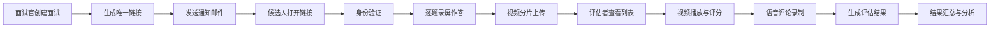

## 1. 产品概述

在线异步面试评估系统，支持面试官创建面试问题集、候选人录屏作答、评估者观看打分并留下语音评论。系统解决了传统线下面试时间协调困难、评估标准不统一、面试记录难以留存等问题。

## 2. 核心功能

### 2.1 用户角色

| 角色 | 注册方式 | 核心权限 |
|------|---------|---------|
| 面试官 | 系统录入 | 创建面试、管理问题集、查看评估结果 |
| 候选人 | 邀请链接 | 身份验证、录制视频回答 |
| 评估者 | 系统录入 | 观看视频、打分评价、录制语音评论 |

### 2.2 功能模块

1. **面试创建页**：面试官创建面试，添加问题，设置作答时间，录入候选人信息
2. **候选人录屏页**：候选人身份验证，按题目依次录制作答
3. **评估仪表盘**：评估者查看待评估列表，进入评估页面
4. **评估详情页**：视频播放、评分面板、语音评论录制
5. **结果汇总页**：评估结果展示，雷达图分析，柱状图对比

### 2.3 页面详情

| 页面名称 | 模块名称 | 功能描述 |
|---------|---------|---------|
| 面试创建页 | 问题表单 | 添加3-5个自定义问题，设置每题作答时间(30秒-5分钟) |
| 面试创建页 | 候选人信息 | 录入候选人邮箱，生成唯一面试链接 |
| 面试创建页 | 邮件通知 | 模拟发送通知邮件，后端返回成功响应 |
| 候选人录屏页 | 身份验证 | 输入姓名和邮箱完成验证 |
| 候选人录屏页 | 准备页面 | 3秒准备时间，显示题目预览和"准备作答"按钮 |
| 候选人录屏页 | 录制界面 | 显示当前问题文本和剩余时间，倒计时自动切换下一题 |
| 候选人录屏页 | 视频上传 | 分片传输(每片5MB)，实时上传进度 |
| 评估仪表盘 | 待评估列表 | 卡片式展示待评估面试，显示候选人信息和状态 |
| 评估详情页 | 视频播放器 | 支持倍速播放(1x/1.5x/2x)，控制栏自动隐藏 |
| 评估详情页 | 评分面板 | 每题打分1-10分，可填写文字评语 |
| 评估详情页 | 语音评论 | 长按录音，松手上传，波形条展示语音列表 |
| 结果汇总页 | 雷达图 | 五维度分析，渐变色填充，入场动画 |
| 结果汇总页 | 柱状图 | 各评估者评分对比，点击查看详情 |
| 结果汇总页 | 语音回放 | 语音评论列表，支持播放 |

## 3. 核心流程

### 3.1 面试创建流程
面试官登录 → 创建面试 → 添加问题(3-5个) → 设置每题时间 → 录入候选人邮箱 → 生成链接 → 发送通知邮件

### 3.2 候选人作答流程
收到邮件链接 → 打开链接 → 身份验证(姓名+邮箱) → 准备页面(3秒) → 阅读题目 → 开始录制 → 倒计时结束自动下一题 → 全部完成 → 上传视频 → 提交

### 3.3 评估流程
评估者登录 → 查看待评估列表 → 选择面试 → 播放视频 → 每题评分 → 录制语音评论 → 提交评估 → 生成结果

## 4. 用户界面设计

### 4.1 设计风格
- **主色调**：深蓝灰 (#1a2332) 作为背景主色
- **强调色**：亮蓝 (#3b82f6) 用于主按钮和高亮；暖橙 (#f59e0b) 用于警告和进度
- **卡片式布局**：所有内容模块采用圆角卡片设计，带微妙阴影
- **字体**：现代无衬线字体，标题加粗，正文清晰易读
- **交互动效**：按钮悬停微缩放，点击涟漪效果
- **深色模式**：录制和播放界面为全黑背景，减少视觉干扰

### 4.2 页面设计概览

| 页面名称 | 模块名称 | UI 元素 |
|---------|---------|---------|
| 面试创建页 | 问题表单 | 卡片式问题列表，动态增删，时间选择器 |
| 候选人录屏页 | 录制界面 | 全黑背景，问题悬浮显示，倒计时圆环，控制栏自动隐藏 |
| 评估详情页 | 视频播放器 | 左侧视频区，右侧评分面板，底部语音按钮 |
| 评估详情页 | 语音波形条 | 渐变色绘制，播放时动态闪烁 |
| 结果汇总页 | 雷达图 | SVG渲染，渐变色填充，入场动画 |
| 结果汇总页 | 柱状图 | 交互式对比图，点击显示详情 |

### 4.3 响应式设计
- **桌面端**：评估页面左右布局，视频在左，评分面板在右
- **平板/手机**：评估页面上下布局，视频在上，评分面板在下
- **移动端**：支持全屏录制，触控优化
- **自适应**：所有布局基于 flex/grid，断点适配多种屏幕尺寸

### 4.4 动画与微交互
- 页面加载：元素渐入 + 轻微上移动画
- 按钮悬停：scale(1.03) 缩放 + 阴影加深
- 按钮点击：涟漪扩散效果
- 评分提交：成功提示滑入动画
- 雷达图：从中心向外扩散的入场动画
- 语音波形：播放时条形高度动态变化
