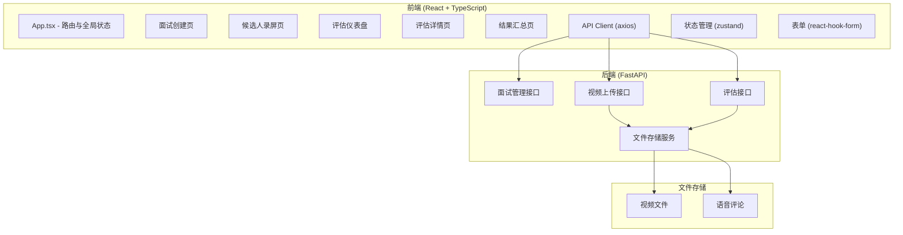
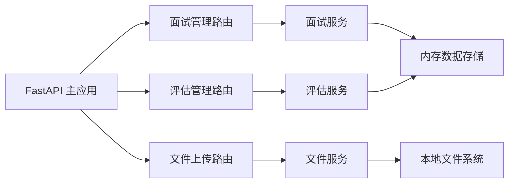
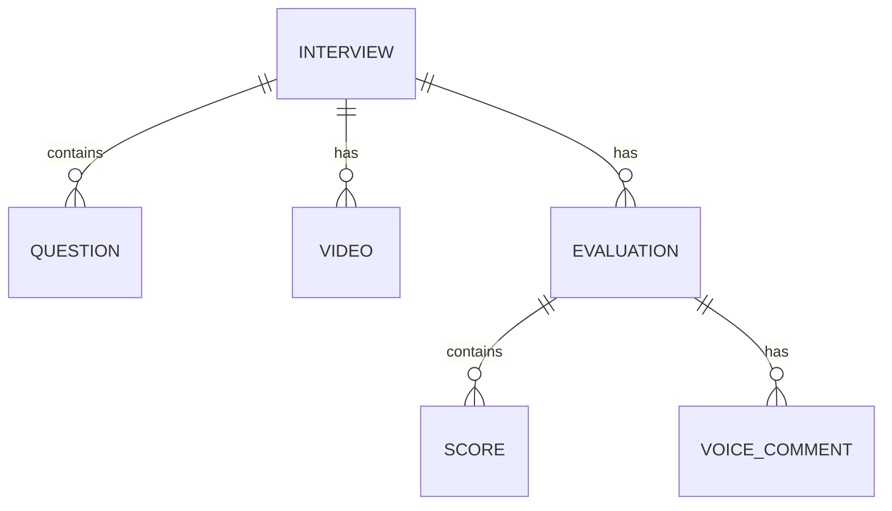

## 1. 架构设计



## 2. 技术描述

- **前端框架**：React 18 + TypeScript
- **构建工具**：Vite 5
- **路由管理**：react-router-dom v6
- **状态管理**：zustand
- **表单处理**：react-hook-form
- **HTTP 客户端**：axios
- **日期处理**：dayjs
- **唯一ID**：uuid
- **后端框架**：FastAPI (Python)
- **文件上传**：分片上传，每片 5MB
- **样式方案**：CSS Modules / 内联样式（不使用 Tailwind）

## 3. 路由定义

| 路由路径 | 页面组件 | 用途说明 |
|---------|---------|---------|
| `/` | 首页/导航 | 系统入口，角色选择 |
| `/interview/setup` | InterviewSetup | 面试官创建面试 |
| `/interview/:id/record` | RecordingPortal | 候选人录屏作答 |
| `/evaluation` | EvaluationDashboard | 评估者仪表盘 |
| `/evaluation/:id` | EvaluationDetail | 评估详情页 |
| `/results/:id` | ResultsPage | 结果汇总页 |

## 4. API 定义

### 4.1 面试管理接口

```typescript
// 面试问题
interface InterviewQuestion {
  id: string;
  text: string;
  duration: number; // 秒
}

// 面试信息
interface Interview {
  id: string;
  title: string;
  questions: InterviewQuestion[];
  candidateEmail: string;
  candidateName?: string;
  status: 'pending' | 'in_progress' | 'completed' | 'evaluated';
  createdAt: string;
  inviteLink: string;
}

// 创建面试请求
interface CreateInterviewRequest {
  title: string;
  questions: Omit<InterviewQuestion, 'id'>[];
  candidateEmail: string;
}

// 创建面试响应
interface CreateInterviewResponse {
  success: boolean;
  interview: Interview;
  inviteLink: string;
  emailSent: boolean;
}
```

### 4.2 候选人验证接口

```typescript
// 验证请求
interface VerifyCandidateRequest {
  interviewId: string;
  name: string;
  email: string;
}

// 验证响应
interface VerifyCandidateResponse {
  success: boolean;
  interview: Interview;
  token: string;
}
```

### 4.3 视频上传接口

```typescript
// 分片上传请求
interface UploadChunkRequest {
  interviewId: string;
  questionId: string;
  chunkIndex: number;
  totalChunks: number;
  fileName: string;
}

// 分片上传响应
interface UploadChunkResponse {
  success: boolean;
  chunkIndex: number;
  uploaded: boolean;
}

// 完成上传请求
interface CompleteUploadRequest {
  interviewId: string;
  questionId: string;
  fileName: string;
  totalChunks: number;
}

// 完成上传响应
interface CompleteUploadResponse {
  success: boolean;
  videoUrl: string;
}
```

### 4.4 评估接口

```typescript
// 评分项
interface ScoreItem {
  questionId: string;
  score: number; // 1-10
  comment?: string;
}

// 语音评论
interface VoiceComment {
  id: string;
  evaluatorId: string;
  evaluatorName: string;
  audioUrl: string;
  duration: number;
  createdAt: string;
  waveformData: number[];
}

// 评估提交请求
interface SubmitEvaluationRequest {
  interviewId: string;
  scores: ScoreItem[];
  voiceComments?: VoiceComment[];
}

// 评估提交响应
interface SubmitEvaluationResponse {
  success: boolean;
  evaluationId: string;
}

// 评估结果
interface EvaluationResult {
  id: string;
  interviewId: string;
  evaluatorName: string;
  scores: ScoreItem[];
  averageScore: number;
  totalScore: number;
  voiceComments: VoiceComment[];
  dimensions: {
    expression: number;
    logic: number;
    technicalDepth: number;
    adaptability: number;
    timeManagement: number;
  };
}
```

## 5. 服务器架构图



## 6. 数据模型

### 6.1 数据模型定义



### 6.2 数据定义说明

| 实体 | 字段 | 类型 | 说明 |
|------|------|------|------|
| Interview | id | string | 唯一标识 |
| Interview | title | string | 面试标题 |
| Interview | candidateEmail | string | 候选人邮箱 |
| Interview | candidateName | string | 候选人姓名 |
| Interview | status | enum | 状态：pending/in_progress/completed/evaluated |
| Interview | createdAt | datetime | 创建时间 |
| Question | id | string | 唯一标识 |
| Question | text | string | 问题文本 |
| Question | duration | number | 作答时间(秒) |
| Video | id | string | 唯一标识 |
| Video | questionId | string | 关联问题ID |
| Video | url | string | 视频地址 |
| Evaluation | id | string | 唯一标识 |
| Evaluation | evaluatorName | string | 评估者姓名 |
| Score | questionId | string | 问题ID |
| Score | score | number | 分数1-10 |
| Score | comment | string | 文字评语 |
| VoiceComment | id | string | 唯一标识 |
| VoiceComment | audioUrl | string | 音频地址 |
| VoiceComment | duration | number | 时长(秒) |
| VoiceComment | waveformData | number[] | 波形数据 |
