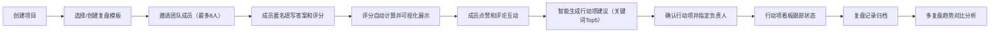

## 1. 产品概述

项目复盘与回顾应用是一款团队协作工具，帮助团队在项目结束后进行系统化复盘，沉淀经验教训，跟踪行动项落地，解决团队缺乏标准化复盘流程、经验难以沉淀、行动项跟踪不力的问题。

- 主要面向项目经理、敏捷教练、研发团队负责人及团队成员
- 提供自定义模板、匿名协作、智能行动项生成、趋势分析等核心能力
- 提升团队复盘效率，促进经验传承，持续改进团队效能

## 2. 核心功能

### 2.1 用户角色

| 角色 | 注册方式 | 核心权限 |
|------|----------|----------|
| 主持人 | 系统默认创建 | 创建复盘会议、管理模板、指定行动项负责人、控制复盘流程 |
| 参与者 | 邀请链接加入 | 填写问题答案和评分、点赞评论、查看复盘结果 |

### 2.2 功能模块

1. **复盘模板管理**：创建自定义模板、阶段拖拽排序、问题管理（开放性/评分项）
2. **协作复盘会议**：邀请成员、匿名填写、评分统计、评论互动
3. **行动项看板**：智能生成建议、手动创建、状态流转、负责人跟踪
4. **历史记录分析**：按项目归档、完整报告查看、雷达图趋势对比

### 2.3 页面详情

| 页面名称 | 模块名称 | 功能描述 |
|---------|---------|----------|
| 项目列表页 | 项目卡片 | 展示项目列表、创建新项目、进入复盘详情 |
| 模板管理页 | 模板编辑器 | 创建/编辑模板、阶段拖拽、问题配置 |
| 复盘编辑页 | 三栏布局 | 阶段导航、问题列表、匿名统计面板 |
| 行动项看板页 | 看板视图 | 待办/进行中/已完成三列、拖拽状态更新 |
| 历史分析页 | 趋势图表 | 雷达图对比、报告详情、项目分组 |

## 3. 核心流程

主持人创建复盘会议，配置模板后邀请团队成员加入。成员独立匿名填写每个问题的答案和评分，系统自动汇总计算平均值并可视化展示。成员可对他人答案点赞或嵌套评论。系统根据高频关键词自动生成行动项建议，主持人确认后分配负责人和截止日期。行动项通过看板跟踪状态流转。所有复盘记录按项目归档，支持多复盘雷达图对比分析。

## 4. 用户界面设计

### 4.1 设计风格

- **主色调**：深灰蓝 #1a2332（深色模式默认背景），青绿 #00bcd4（强调色）
- **配色方案**：深色模式为主，支持一键切换浅色模式；金色渐变用于评分星标（#ffd700 → #ffb347）
- **字体**：显示字体使用 Space Grotesk，正文字体使用 Inter（注：按要求使用非通用字体提升品质）
- **按钮风格**：圆角 8px，悬停时有轻微上浮阴影（hover:shadow-lg），点击缩放 0.98 反馈
- **卡片风格**：半透明毛玻璃背景（backdrop-blur-md），边框 1px 半透明白色/深灰色
- **动画效果**：所有状态变化使用 cubic-bezier(0.4, 0, 0.2, 1) 缓动函数，过渡时长 200ms
- **视觉层次**：通过阴影深度、透明度、字体权重区分信息层级

### 4.2 页面设计概览

| 页面名称 | 模块名称 | UI 元素 |
|---------|---------|---------|
| 复盘编辑页 | 阶段列表 | 左侧窄栏，圆角卡片，当前阶段高亮 + 左侧青绿边界指示条动画 |
| 复盘编辑页 | 问题列表 | 中间宽栏，毛玻璃卡片，金色渐变星标评分（悬停放大 1.1 倍） |
| 复盘编辑页 | 统计面板 | 右侧可折叠，微型柱状图（渐变填充 + 动画），匿名卡片列表 |
| 行动项看板 | 状态列 | 三列布局，卡片拖拽，完成时勾选动画 + 彩纸特效 |
| 历史分析页 | 雷达图 | d3 绘制多组叠加，不同颜色透明度区分，图例可点击切换 |
| 通用组件 | 模态框 | 背景模糊（backdrop-blur-xl），输入框聚焦时青绿流动光效边框 |

### 4.3 响应式设计

采用桌面优先设计，逐级适配：
- **桌面端（>1024px）**：三栏布局（20% / 55% / 25%）
- **平板端（768px - 1024px）**：两栏布局（25% / 75%），右侧统计面板折叠为浮动按钮
- **移动端（<768px）**：单栏滚动布局，阶段导航转为顶部标签页，统计面板转为底部抽屉

触控优化：
- 触摸目标最小 44x44px
- 滑动手势支持阶段切换
- 长按显示快捷操作菜单

### 4.4 动效与微交互

**入场动画**：页面加载时卡片依次淡入上移（staggered reveal，delay 递增 50ms）
**悬停反馈**：所有可交互元素悬停时轻微上浮（translateY(-2px) + 阴影加深）+ 缩放 1.01
**状态过渡**：评分星标悬停时金色流光效果，选中时有脉冲动画
**滚动性能**：使用 `will-change: transform` 和 CSS `contain: layout paint` 优化长列表渲染
