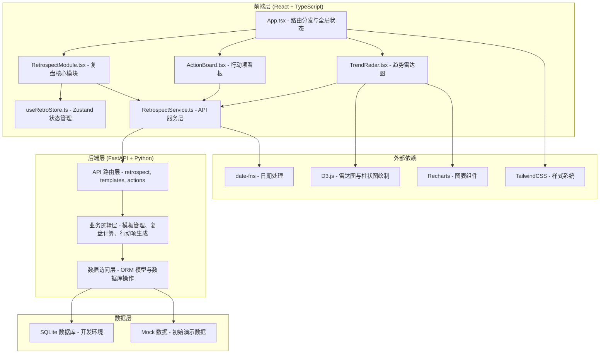
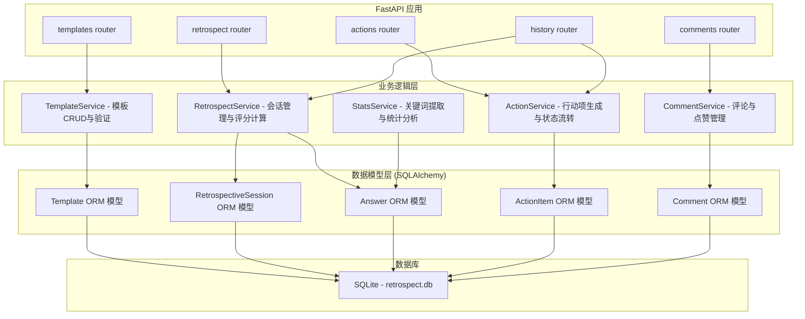
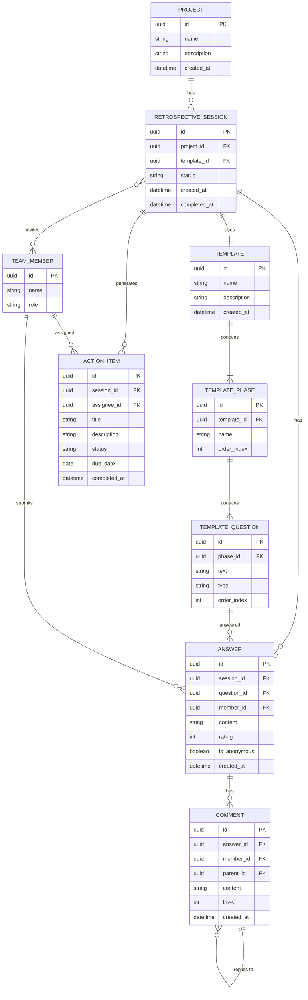

## 1. 架构设计



## 2. 技术描述

- **前端**: React@18 + TypeScript@5 + Vite@5
  - 状态管理: Zustand@4
  - 路由: React Router DOM@6
  - HTTP 客户端: Axios@1
  - 图表: D3@7 + Recharts@2
  - 日期工具: date-fns@3
  - 样式: TailwindCSS@3
- **后端**: FastAPI@0.109 + Python@3.11
  - ORM: SQLAlchemy@2
  - 数据库: SQLite
- **构建工具**: Vite@5 (代理 `/api` 到后端服务)
- **代码规范**: TypeScript 严格模式，ESLint

## 3. 路由定义

| 路由路径 | 页面/组件 | 功能说明 |
|---------|-----------|---------|
| `/` | ProjectList | 项目列表首页 |
| `/templates` | TemplateManager | 复盘模板管理 |
| `/retrospect/:id` | RetrospectModule | 复盘编辑页面（三栏布局） |
| `/retrospect/:id/actions` | ActionBoard | 行动项看板 |
| `/history` | HistoryList | 历史复盘记录列表 |
| `/history/:id` | TrendAnalysis | 趋势分析与雷达图对比 |

## 4. API 接口定义

### TypeScript 类型定义

```typescript
// 复盘模板
interface RetrospectiveTemplate {
  id: string;
  name: string;
  description: string;
  phases: TemplatePhase[];
  createdAt: string;
  updatedAt: string;
}

interface TemplatePhase {
  id: string;
  name: string;
  order: number;
  questions: TemplateQuestion[];
}

interface TemplateQuestion {
  id: string;
  text: string;
  type: 'open' | 'rating';
  order: number;
}

// 复盘会话
interface RetrospectiveSession {
  id: string;
  projectId: string;
  projectName: string;
  templateId: string;
  status: 'draft' | 'active' | 'completed';
  members: TeamMember[];
  createdAt: string;
  completedAt?: string;
}

interface TeamMember {
  id: string;
  name: string;
  role: 'host' | 'participant';
  avatar?: string;
}

// 答案与评分
interface Answer {
  id: string;
  questionId: string;
  memberId: string;
  content: string;
  rating?: number;
  isAnonymous: boolean;
  createdAt: string;
}

interface QuestionStats {
  questionId: string;
  averageRating: number;
  ratingDistribution: number[];
  answerCount: number;
  answers: Answer[];
}

// 行动项
interface ActionItem {
  id: string;
  title: string;
  description: string;
  status: 'todo' | 'in_progress' | 'completed';
  assigneeId: string;
  assigneeName: string;
  dueDate: string;
  createdAt: string;
  completedAt?: string;
}

// 评论
interface Comment {
  id: string;
  answerId: string;
  memberId: string;
  content: string;
  parentId?: string;
  likes: number;
  createdAt: string;
  replies: Comment[];
}

// 趋势数据
interface RadarDataPoint {
  dimension: string;
  value: number;
  sessionId: string;
  sessionName: string;
}
```

### API 接口列表

| 方法 | 路径 | 说明 | 请求体 | 响应体 |
|-----|-----|-----|--------|--------|
| POST | `/api/templates` | 创建复盘模板 | `{name, description, phases}` | `Template` |
| GET | `/api/templates` | 获取模板列表 | - | `Template[]` |
| POST | `/api/retrospect/create` | 创建复盘会话 | `{projectId, templateId, memberIds}` | `RetrospectiveSession` |
| GET | `/api/retrospect/:id/questions` | 获取问题列表及答案 | - | `{phases, stats: QuestionStats[]}` |
| POST | `/api/retrospect/:id/answer` | 提交答案 | `{questionId, content, rating}` | `Answer` |
| GET | `/api/retrospect/:id/stats` | 获取汇总统计 | - | `QuestionStats[]` |
| POST | `/api/retrospect/action/generate` | 生成行动项建议 | `{retrospectId}` | `{suggestions: ActionItem[], topKeywords: string[]}` |
| POST | `/api/actions` | 创建行动项 | `{title, description, assigneeId, dueDate}` | `ActionItem` |
| PUT | `/api/actions/:id` | 更新行动项状态 | `{status}` | `ActionItem` |
| GET | `/api/retrospect/:id/actions` | 获取行动项列表 | - | `ActionItem[]` |
| GET | `/api/history` | 获取历史复盘列表 | - | `RetrospectiveSession[]` |
| GET | `/api/history/:id/radar` | 获取雷达图数据 | - | `RadarDataPoint[]` |
| POST | `/api/comments` | 添加评论 | `{answerId, content, parentId}` | `Comment` |
| POST | `/api/comments/:id/like` | 点赞 | - | `{likes: number}` |

## 5. 后端架构图



## 6. 数据模型

### 6.1 ER 图



### 6.2 DDL 语句

```sql
-- 项目表
CREATE TABLE projects (
    id UUID PRIMARY KEY DEFAULT gen_random_uuid(),
    name VARCHAR(255) NOT NULL,
    description TEXT,
    created_at TIMESTAMP DEFAULT CURRENT_TIMESTAMP
);

-- 复盘模板表
CREATE TABLE templates (
    id UUID PRIMARY KEY DEFAULT gen_random_uuid(),
    name VARCHAR(255) NOT NULL,
    description TEXT,
    created_at TIMESTAMP DEFAULT CURRENT_TIMESTAMP,
    updated_at TIMESTAMP DEFAULT CURRENT_TIMESTAMP
);

-- 模板阶段表
CREATE TABLE template_phases (
    id UUID PRIMARY KEY DEFAULT gen_random_uuid(),
    template_id UUID NOT NULL REFERENCES templates(id) ON DELETE CASCADE,
    name VARCHAR(100) NOT NULL,
    order_index INT NOT NULL,
    created_at TIMESTAMP DEFAULT CURRENT_TIMESTAMP
);

-- 模板问题表
CREATE TABLE template_questions (
    id UUID PRIMARY KEY DEFAULT gen_random_uuid(),
    phase_id UUID NOT NULL REFERENCES template_phases(id) ON DELETE CASCADE,
    text TEXT NOT NULL,
    type VARCHAR(20) NOT NULL CHECK (type IN ('open', 'rating')),
    order_index INT NOT NULL,
    created_at TIMESTAMP DEFAULT CURRENT_TIMESTAMP
);

-- 复盘会话表
CREATE TABLE retrospective_sessions (
    id UUID PRIMARY KEY DEFAULT gen_random_uuid(),
    project_id UUID NOT NULL REFERENCES projects(id) ON DELETE CASCADE,
    template_id UUID NOT NULL REFERENCES templates(id),
    status VARCHAR(20) NOT NULL DEFAULT 'draft' CHECK (status IN ('draft', 'active', 'completed')),
    created_at TIMESTAMP DEFAULT CURRENT_TIMESTAMP,
    completed_at TIMESTAMP
);

-- 团队成员表
CREATE TABLE team_members (
    id UUID PRIMARY KEY DEFAULT gen_random_uuid(),
    name VARCHAR(100) NOT NULL,
    role VARCHAR(20) NOT NULL DEFAULT 'participant' CHECK (role IN ('host', 'participant')),
    avatar_url VARCHAR(255),
    created_at TIMESTAMP DEFAULT CURRENT_TIMESTAMP
);

-- 复盘成员关联表
CREATE TABLE session_members (
    session_id UUID NOT NULL REFERENCES retrospective_sessions(id) ON DELETE CASCADE,
    member_id UUID NOT NULL REFERENCES team_members(id) ON DELETE CASCADE,
    joined_at TIMESTAMP DEFAULT CURRENT_TIMESTAMP,
    PRIMARY KEY (session_id, member_id)
);

-- 答案表
CREATE TABLE answers (
    id UUID PRIMARY KEY DEFAULT gen_random_uuid(),
    session_id UUID NOT NULL REFERENCES retrospective_sessions(id) ON DELETE CASCADE,
    question_id UUID NOT NULL REFERENCES template_questions(id) ON DELETE CASCADE,
    member_id UUID NOT NULL REFERENCES team_members(id) ON DELETE CASCADE,
    content TEXT,
    rating INT CHECK (rating BETWEEN 1 AND 5),
    is_anonymous BOOLEAN DEFAULT true,
    created_at TIMESTAMP DEFAULT CURRENT_TIMESTAMP,
    UNIQUE(session_id, question_id, member_id)
);

-- 评论表
CREATE TABLE comments (
    id UUID PRIMARY KEY DEFAULT gen_random_uuid(),
    answer_id UUID NOT NULL REFERENCES answers(id) ON DELETE CASCADE,
    member_id UUID NOT NULL REFERENCES team_members(id) ON DELETE CASCADE,
    parent_id UUID REFERENCES comments(id) ON DELETE CASCADE,
    content TEXT NOT NULL,
    likes INT DEFAULT 0,
    created_at TIMESTAMP DEFAULT CURRENT_TIMESTAMP
);

-- 行动项表
CREATE TABLE action_items (
    id UUID PRIMARY KEY DEFAULT gen_random_uuid(),
    session_id UUID NOT NULL REFERENCES retrospective_sessions(id) ON DELETE CASCADE,
    assignee_id UUID REFERENCES team_members(id) ON DELETE SET NULL,
    title VARCHAR(255) NOT NULL,
    description TEXT,
    status VARCHAR(20) NOT NULL DEFAULT 'todo' CHECK (status IN ('todo', 'in_progress', 'completed')),
    due_date DATE,
    created_at TIMESTAMP DEFAULT CURRENT_TIMESTAMP,
    completed_at TIMESTAMP
);

-- 初始数据
INSERT INTO team_members (id, name, role) VALUES
    ('host-001', '张经理', 'host'),
    ('user-001', '李工程师', 'participant'),
    ('user-002', '王设计师', 'participant'),
    ('user-003', '赵测试', 'participant'),
    ('user-004', '陈产品', 'participant'),
    ('user-005', '刘运维', 'participant'),
    ('user-006', '周前端', 'participant'),
    ('user-007', '吴后端', 'participant');

INSERT INTO templates (id, name, description) VALUES
    ('template-001', '标准复盘模板', '包含开始/结束/继续/改进四个阶段的经典复盘模板');

INSERT INTO template_phases (id, template_id, name, order_index) VALUES
    ('phase-001', 'template-001', '开始 (Start)', 1),
    ('phase-002', 'template-001', '结束 (Stop)', 2),
    ('phase-003', 'template-001', '继续 (Continue)', 3),
    ('phase-004', 'template-001', '改进 (Improve)', 4);

INSERT INTO template_questions (phase_id, text, type, order_index) VALUES
    ('phase-001', '项目启动阶段哪些做得好？', 'open', 1),
    ('phase-001', '项目目标清晰度评分', 'rating', 2),
    ('phase-002', '哪些流程应该停止？', 'open', 1),
    ('phase-002', '沟通效率评分', 'rating', 2),
    ('phase-003', '哪些好的实践值得继续？', 'open', 1),
    ('phase-003', '团队协作评分', 'rating', 2),
    ('phase-004', '最需要改进的三个方面？', 'open', 1),
    ('phase-004', '整体交付质量评分', 'rating', 2),
    ('phase-004', '时间管理评分', 'rating', 3);
```
