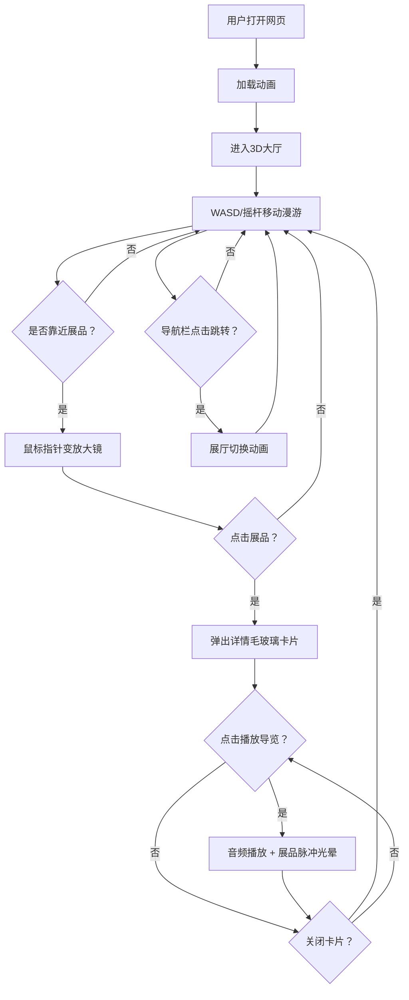

## 1. 产品概述
在线虚拟博物馆项目，以3D展厅形式呈现艺术品展览，用户可在展厅间自由漫游、欣赏藏品并聆听导览讲解。
- 面向艺术爱好者、教育工作者及普通大众，提供沉浸式的虚拟艺术浏览体验
- 目标价值：打破实体博物馆时空限制，让艺术品以低门槛、高互动方式惠及更广泛人群

## 2. 核心特性

### 2.1 功能模块
1. **3D大厅漫游**：入口大厅，多扇门通往不同主题展厅，WASD/方向键自由行走，鼠标视角跟随
2. **主题展厅系统**：油画厅（暖黄色调）、雕塑厅（冷灰色调）、现代艺术厅（纯白色调）
3. **展品展示系统**：高分辨率图片/3D模型展品，悬浮微动画，标签显示作者与年代
4. **展品详情卡片**：毛玻璃半透明效果，展示名称、作者、年代、材质、尺寸、文字描述
5. **音频导览系统**：Web Audio API 生成模拟语音曲调，进度条、播放/暂停/停止控制、脉冲光晕指示
6. **底部导航栏**：半透明悬浮，展厅缩略图圆点，当前展厅高亮，点击跳转
7. **移动端适配**：虚拟摇杆替代键盘，触控交互

### 2.3 页面详情
| 页面名称 | 模块名称 | 功能描述 |
|----------|----------|----------|
| 3D博物馆主界面 | 大厅场景 | 入口3D场景，多扇门通往各展厅，用户可自由移动 |
| 3D博物馆主界面 | 油画厅 | 暖黄墙壁纹理，油画展品，古典艺术氛围 |
| 3D博物馆主界面 | 雕塑厅 | 冷灰墙壁纹理，雕塑展品，沉静庄重氛围 |
| 3D博物馆主界面 | 现代艺术厅 | 纯白墙壁纹理，现代展品，简约未来感氛围 |
| 3D博物馆主界面 | 展品详情弹窗 | 毛玻璃卡片，展品详情信息，音频导览控件 |
| 3D博物馆主界面 | 底部导航栏 | 展厅索引圆点，快速跳转，当前位置高亮 |
| 3D博物馆主界面 | 移动端虚拟摇杆 | 左下角触控摇杆控制移动，点击交互 |

## 3. 核心流程

用户打开网页 → 加载动画 → 进入3D大厅 → WASD/摇杆移动 → 走近展厅门触发切换 → 进入对应主题展厅 → 靠近展品（指针变放大镜）→ 点击展品 → 弹出详情卡片（缩放淡入动画）→ 点击播放导览 → 展品脉冲光晕动画 → 进度条走读 → 关闭卡片（反向动画）→ 继续漫游或通过导航栏跳转其他展厅

## 4. 用户界面设计

### 4.1 设计风格
- **主色调**：深灰背景 `#1a1a1f`，柔和暖色点缀（金铜色 `#c9a962`、暖橙 `#e08a3c`）
- **按钮风格**：圆角 12px，微凹感设计，hover 放大 1.05，点击脉冲涟漪
- **字体**：标题使用 Cinzel（古典衬线），正文使用 Noto Sans SC（现代无衬线）
- **布局风格**：沉浸式全屏3D画布，UI叠加层浮于其上
- **图标风格**：线性简约图标，暖金色描边

### 4.2 页面设计概述
| 页面名称 | 模块名称 | UI元素 |
|----------|----------|--------|
| 主界面 | 3D场景 | Three.js渲染，环境光+聚光灯，阴影投射，雾效营造空间纵深感 |
| 主界面 | 加载动画 | 中央旋转金色博物馆Logo，底部进度条，文字淡入"正在为您开启艺术之门..." |
| 主界面 | 展品详情卡片 | 毛玻璃 `backdrop-filter: blur(20px)`，半透明白色边框，暖金色点缀线，标题衬线字体，正文现代字体，淡入+缩放 300ms 动画 |
| 主界面 | 音频控件 | 圆形播放按钮（三角播放图标），进度条（底灰+金铜色填充），时间文字，按钮hover放大，点击脉冲 |
| 主界面 | 底部导航栏 | 半透明深色毛玻璃，圆形展厅缩略图/圆点，当前展厅金色外圈辉光，hover放大，平滑过渡 200ms |
| 主界面 | 虚拟摇杆 | 左下角半透明圆形底盘+金色摇杆头，跟随触控位移，释放回弹 |

### 4.3 响应式设计
- 桌面优先：全尺寸3D场景，WASD键盘+鼠标交互
- 平板：保持全场景，底部导航栏放大触摸热区
- 手机：3D场景自动适配视口，显示虚拟摇杆，展品点击热区放大，详情卡片占屏70%以上，字号自适应

### 4.4 3D场景指引
- **环境**：各展厅独立色调，油画厅暖黄点光，雕塑厅冷白柔光，现代厅均匀白光，整体暗色系雾效
- **灯光**：环境光 + 展品聚光灯（投射柔和阴影），天花板模拟天光
- **摄像机**：第一人称视角，高度1.6m，FOV 70°，移动平滑插值，碰撞检测限制穿墙
- **构图**：大厅中央空旷引导视线至展厅门，展品沿墙或展台对称/错落分布，留有步行通道
- **交互**：展品点击Raycaster检测，碰撞用AABB包围盒，门触发用距离检测
- **后处理**：Bloom辉光（展品高亮时），轻微色调映射，抗锯齿
- **性能**：帧率目标 ≥50fps，展厅切换动画 ≤300ms，图片纹理使用压缩格式，几何体复用，减少Draw Call
