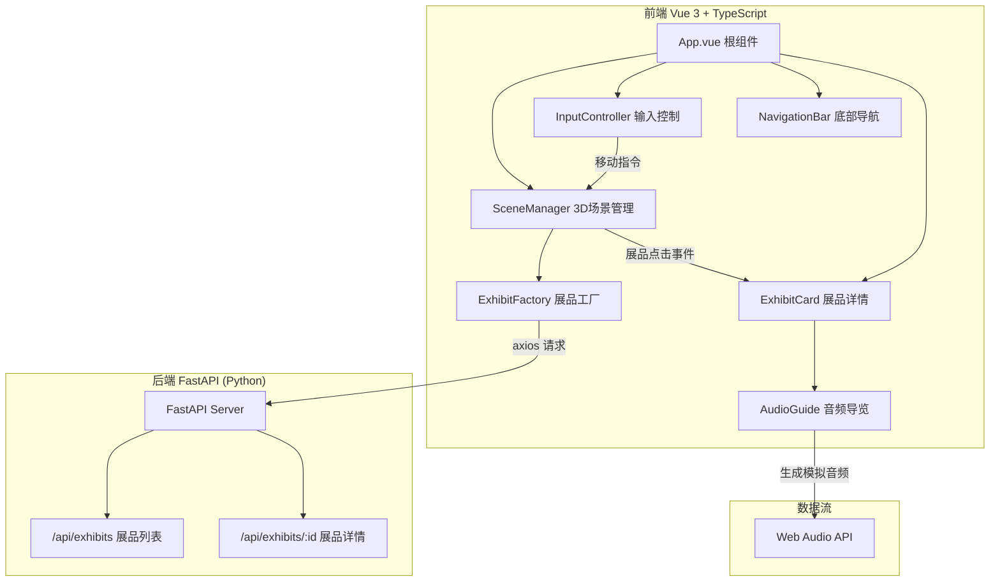
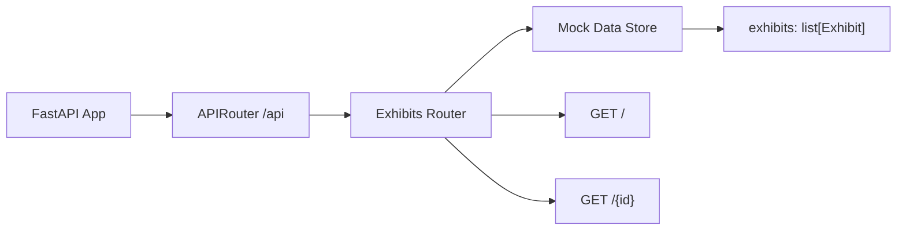
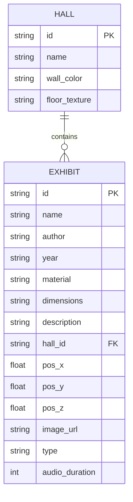

## 1. 架构设计



## 2. 技术选型说明
- **前端框架**：Vue 3 (Composition API) + TypeScript (strict模式) + Vite
- **3D渲染**：Three.js r150+，Raycaster拾取，AABB碰撞
- **状态管理**：Vue 响应式 API + @vueuse/core 工具集
- **网络请求**：axios + 请求重试
- **模糊搜索**：wade（可选用于展品搜索）
- **路由**：vue-router 4.x
- **后端**：FastAPI (Python 3.10+) + Uvicorn
- **音频**：Web Audio API OscillatorNode 合成模拟语音曲调

## 3. 路由定义
| 路由 | 用途 |
|------|------|
| / | 3D博物馆主界面（单页应用，场景切换在前端完成） |

## 4. API 定义

### 类型定义
```typescript
interface Exhibit {
  id: string;
  name: string;
  author: string;
  year: string;
  material: string;
  dimensions: string;
  description: string;
  hallId: 'painting' | 'sculpture' | 'modern';
  position: { x: number; y: number; z: number };
  rotation?: { x: number; y: number; z: number };
  imageUrl: string;
  type: 'painting' | 'sculpture' | 'installation';
  audioDuration: number;
}

interface HallInfo {
  id: string;
  name: string;
  color: string;
  floorTexture: string;
}
```

### RESTful 接口
- `GET /api/exhibits` → 返回 `Exhibit[]`，所有展品列表
- `GET /api/exhibits/{id}` → 返回 `Exhibit`，单个展品详情
- `GET /api/halls` → 返回 `HallInfo[]`，展厅配置信息

## 5. 后端服务架构



## 6. 数据模型

### 6.1 模型定义



### 6.2 模拟数据（后端内置）
后端在内存中维护模拟数据，包含：
- 3个展厅（油画厅、雕塑厅、现代艺术厅）
- 每个展厅3-4件展品
- 每件展品包含完整元数据、3D坐标、图片URL、音频时长

## 7. 前端目录结构
```
src/
├── museum/
│   ├── core/
│   │   ├── SceneManager.ts       # 3D场景、相机、灯光、渲染循环
│   │   └── InputController.ts    # 键盘/鼠标/触控输入处理
│   ├── exhibits/
│   │   └── ExhibitFactory.ts     # 根据数据生成3D展品对象
│   ├── audio/
│   │   └── AudioGuide.ts         # Web Audio API 音频导览管理
│   └── ui/
│       ├── NavigationBar.vue     # 底部导航栏组件
│       └── ExhibitCard.vue       # 展品详情毛玻璃卡片
├── main.ts
└── App.vue
```
