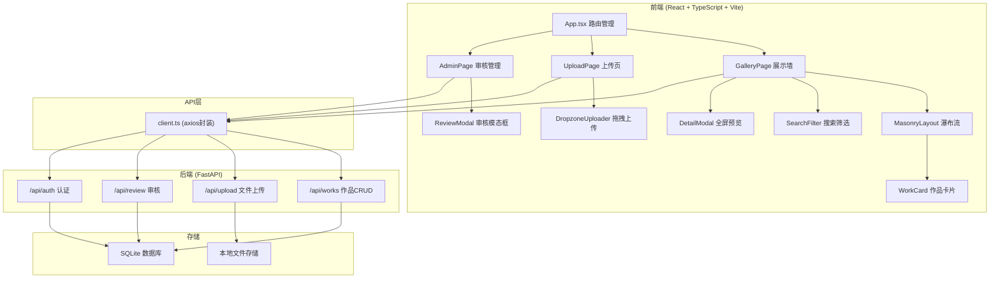
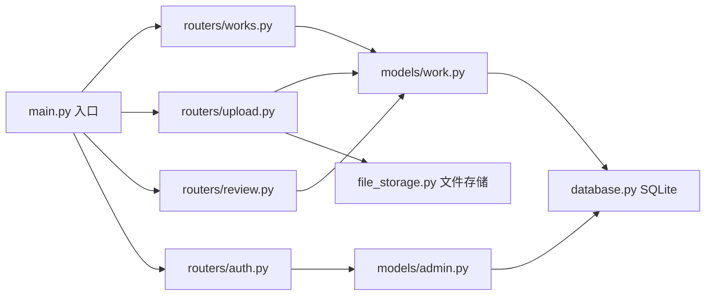
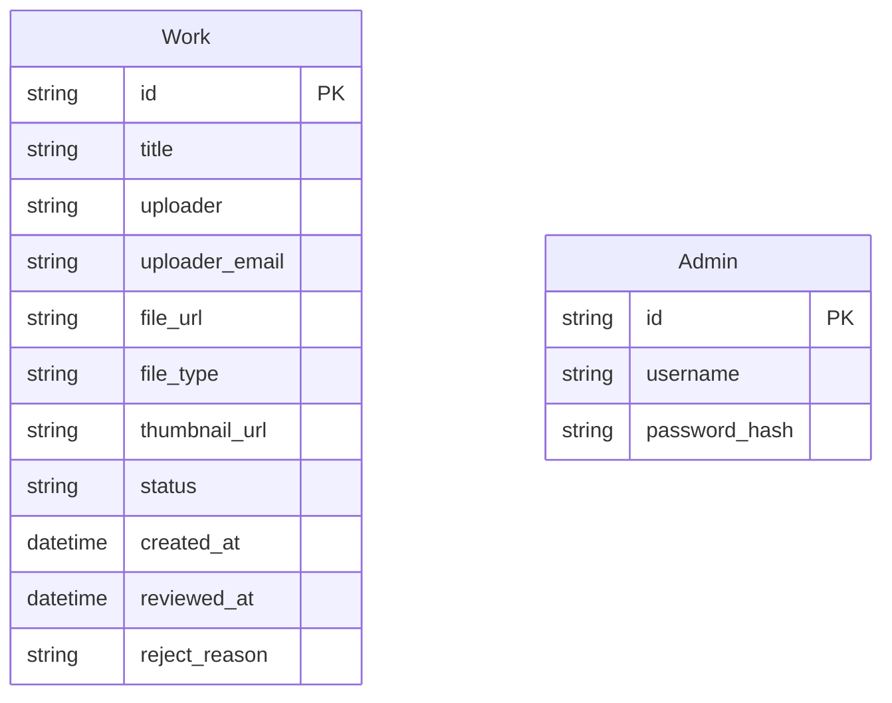

## 1. 架构设计



## 2. 技术说明

- **前端**：React@18 + TypeScript + Vite + TailwindCSS
- **初始化工具**：vite-init (react-ts模板)
- **状态管理**：Zustand
- **路由**：react-router-dom
- **HTTP客户端**：axios
- **文件上传**：react-dropzone
- **瀑布流布局**：masonry-react（或自定义CSS Masonry实现）
- **图片懒加载**：react-lazy-load-image-component
- **后端**：FastAPI (Python)
- **数据库**：SQLite（轻量级，无需额外安装）
- **文件存储**：本地文件系统（uploads目录）

## 3. 路由定义

| 路由 | 用途 |
|------|------|
| `/` | 展示墙主页，瀑布流展示已发布作品 |
| `/upload` | 作品上传页，拖拽/点击上传 |
| `/admin` | 审核管理页，组织者登录后管理作品 |

## 4. API定义

### 4.1 作品相关

```typescript
interface Work {
  id: string;
  title: string;
  uploader: string;
  uploader_email: string;
  file_url: string;
  file_type: "image" | "video";
  thumbnail_url: string;
  status: "pending" | "published" | "rejected";
  created_at: string;
  reviewed_at?: string;
  reject_reason?: string;
}

interface UploadResponse {
  id: string;
  file_url: string;
  thumbnail_url: string;
  status: string;
}

interface ReviewRequest {
  action: "approve" | "reject";
  reject_reason?: string;
}
```

### 4.2 API端点

| 方法 | 路径 | 请求体 | 响应 | 说明 |
|------|------|--------|------|------|
| GET | `/api/works` | query: status, search, date_from, date_to | `Work[]` | 获取作品列表，支持筛选 |
| POST | `/api/upload` | FormData: file, title, uploader, email | `UploadResponse` | 上传作品文件 |
| PUT | `/api/works/:id/review` | `ReviewRequest` | `Work` | 审核作品 |
| GET | `/api/works/:id` | - | `Work` | 获取单个作品详情 |
| POST | `/api/auth/login` | `{password}` | `{token}` | 组织者登录 |
| DELETE | `/api/works/:id` | - | `{success}` | 删除作品 |

## 5. 服务端架构图



## 6. 数据模型

### 6.1 数据模型定义



### 6.2 数据定义语言

```sql
CREATE TABLE works (
    id TEXT PRIMARY KEY,
    title TEXT NOT NULL,
    uploader TEXT NOT NULL,
    uploader_email TEXT NOT NULL,
    file_url TEXT NOT NULL,
    file_type TEXT NOT NULL CHECK(file_type IN ('image', 'video')),
    thumbnail_url TEXT,
    status TEXT NOT NULL DEFAULT 'pending' CHECK(status IN ('pending', 'published', 'rejected')),
    created_at TIMESTAMP DEFAULT CURRENT_TIMESTAMP,
    reviewed_at TIMESTAMP,
    reject_reason TEXT
);

CREATE INDEX idx_works_status ON works(status);
CREATE INDEX idx_works_created_at ON works(created_at);
CREATE INDEX idx_works_uploader ON works(uploader);

CREATE TABLE admins (
    id TEXT PRIMARY KEY,
    username TEXT NOT NULL UNIQUE,
    password_hash TEXT NOT NULL
);

INSERT INTO admins (id, username, password_hash) VALUES ('1', 'admin', '$2b$12$placeholder_hash');
```

## 7. 文件结构与调用关系

```
project/
├── package.json                    # 前端依赖与脚本
├── vite.config.js                  # Vite配置，代理/api到后端
├── tsconfig.json                   # TypeScript严格模式配置
├── index.html                      # 入口页面
├── src/
│   ├── App.tsx                     # 主组件：路由管理+全局状态
│   │   └── 调用 → api/client.ts, stores/*
│   ├── pages/
│   │   ├── GalleryPage.tsx         # 展示墙：接收作品列表→Masonry渲染→卡片交互
│   │   │   └── 调用 → components/WorkCard, SearchFilter, DetailModal, api/client.ts
│   │   ├── UploadPage.tsx          # 上传页：dropzone处理→API上传→状态反馈
│   │   │   └── 调用 → components/DropzoneUploader, ProgressBar, api/client.ts
│   │   └── AdminPage.tsx           # 审核页：待审核列表→审核操作→状态更新
│   │       └── 调用 → components/ReviewModal, api/client.ts
│   ├── components/
│   │   ├── Navbar.tsx              # 导航栏组件
│   │   ├── WorkCard.tsx            # 作品卡片（悬停3D效果+信息浮层）
│   │   ├── SearchFilter.tsx        # 搜索筛选栏
│   │   ├── DetailModal.tsx         # 全屏预览模态框
│   │   ├── DropzoneUploader.tsx    # 拖拽上传区域
│   │   ├── ProgressBar.tsx         # 上传进度条
│   │   ├── ReviewModal.tsx         # 审核操作模态框
│   │   └── EmptyState.tsx          # 空状态占位（纸飞机动效）
│   ├── api/
│   │   └── client.ts              # API客户端：封装所有后端请求
│   │       └── 使用 → axios发送HTTP → 返回Promise<Response>
│   ├── stores/
│   │   └── useWorkStore.ts        # Zustand全局状态：作品列表、筛选条件、审核状态
│   └── types/
│       └── index.ts               # TypeScript类型定义
├── api/                            # FastAPI后端
│   ├── main.py                     # FastAPI入口，挂载路由
│   ├── database.py                 # 数据库连接与初始化
│   ├── models/
│   │   ├── work.py                 # 作品数据模型
│   │   └── admin.py                # 管理员数据模型
│   ├── routers/
│   │   ├── works.py                # 作品CRUD路由
│   │   ├── upload.py               # 文件上传路由
│   │   ├── review.py               # 审核操作路由
│   │   └── auth.py                 # 认证路由
│   └── requirements.txt            # Python依赖
└── uploads/                        # 上传文件存储目录
```

### 数据流向说明

1. **上传流程**：UploadPage → DropzoneUploader(文件选择) → client.ts(POST /api/upload) → FastAPI upload.py → 文件存储+数据库写入 → 返回作品ID与URL → Store更新 → GalleryPage展示新卡片（淡入动画）

2. **展示流程**：GalleryPage挂载 → client.ts(GET /api/works?status=published) → FastAPI works.py → 数据库查询 → 返回Work[] → Store缓存 → Masonry布局渲染 → WorkCard(懒加载+3D悬停) → 点击 → DetailModal(全屏预览)

3. **审核流程**：AdminPage → client.ts(GET /api/works?status=pending) → 展示待审核列表 → 点击审核 → ReviewModal(预览+操作) → client.ts(PUT /api/works/:id/review) → FastAPI review.py → 数据库更新 → 状态变更(published/rejected) → AdminPage刷新

4. **搜索流程**：SearchFilter(输入) → Store更新筛选条件 → client.ts(GET /api/works?search=...&date_from=...&date_to=...) → FastAPI works.py → 数据库查询 → 返回过滤结果 → GalleryPage重新渲染 → 无结果时显示EmptyState
