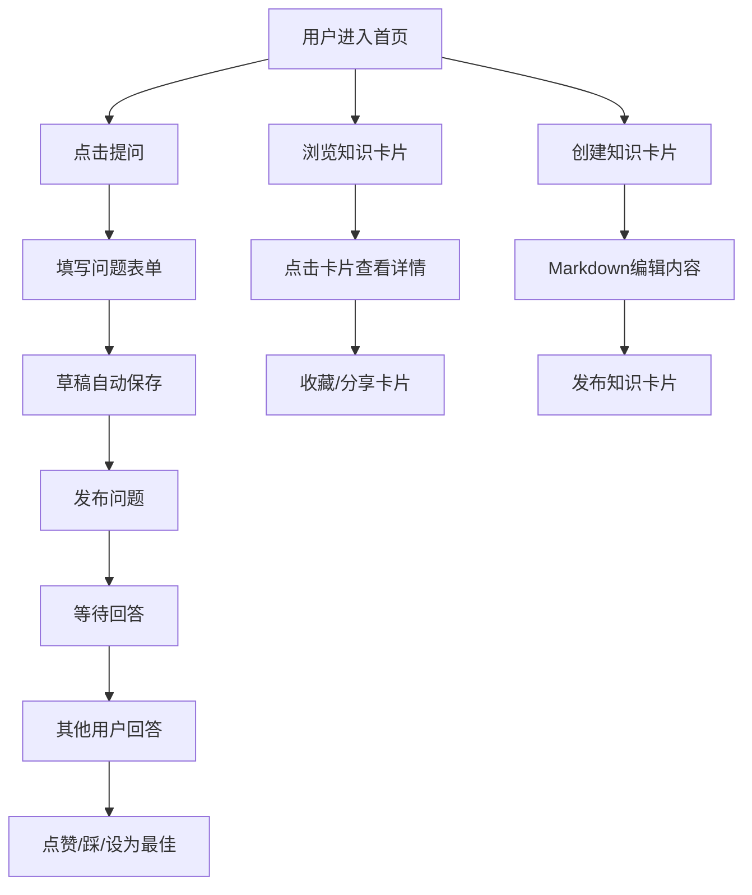

## 1. 产品概述
在线知识共享与问答社区平台，用户可发布问题、分享知识卡片并协作完善答案。
- 核心功能：问题发布与回答、多级嵌套回答、知识卡片共享与收藏
- 目标用户：知识寻求者、内容创作者、学习型社区成员

## 2. 核心功能

### 2.1 功能模块
1. **首页**：导航栏、社区入口、知识卡片瀑布流展示
2. **提问页面**：问题表单、字数统计、草稿自动保存、相似问题推荐侧边栏
3. **问题详情页**：问题展示、多级嵌套回答列表、点赞/踩/最佳答案功能
4. **知识卡片页面**：卡片创建、瀑布流展示、全屏弹窗详情、收藏/分享功能

### 2.2 页面详情
| 页面名称 | 模块名称 | 功能描述 |
|-----------|-------------|---------------------|
| 首页 | 导航栏 | 深橙红固定顶部，毛玻璃半透明效果，滚动时透明度渐变 |
| 首页 | 知识卡片瀑布流 | 网格布局展示知识卡片，包含预览摘要和标签 |
| 提问页面 | 问题表单 | 标题输入、详细描述（支持多行）、标签输入（最多5个） |
| 提问页面 | 字数统计 | 实时显示标题和描述的字数 |
| 提问页面 | 草稿自动保存 | 每30秒或失焦时保存到localStorage，绿色圆圈闪烁动画 |
| 提问页面 | 相似问题推荐 | 基于标签匹配，浅灰背景白色卡片，新标签页打开 |
| 问题详情页 | 问题展示 | 标题、描述、标签完整展示 |
| 问题详情页 | 回答列表 | 多级嵌套结构，最佳答案固定置顶（金色边框+奖杯旋转闪光动效） |
| 问题详情页 | 回答交互 | 点赞（数字递增动画+浅蓝到深蓝背景渐变）、踩、设为最佳答案 |
| 知识卡片页面 | 卡片创建 | 结构化知识点：标题、摘要、分类、关联标签、Markdown内容 |
| 知识卡片页面 | 卡片详情弹窗 | 缩放进入动画（0.8->1倍），背景淡入半透明黑色 |
| 知识卡片页面 | 收藏/分享 | 星标图标，收藏时填充金色+"已收藏"toast提示（2秒自动消失） |

## 3. 核心流程
用户进入首页 → 浏览知识卡片或点击提问 → 创建问题（草稿自动保存）→ 发布后等待回答 → 其他用户回答问题 → 问答互动（点赞/踩/最佳答案）→ 用户创建知识卡片 → 社区成员浏览、收藏、分享知识卡片

## 4. 用户界面设计

### 4.1 设计风格
- **主色**：橙红色 (#E65100)
- **辅色**：淡米黄色 (#FFF8E1)
- **导航栏**：深橙红固定顶部，毛玻璃半透明效果，滚动时从不透明渐变至半透明
- **底部版权区**：浅米色背景，简洁文字
- **圆角**：所有卡片、按钮、输入框统一圆角 8px
- **阴影**：鼠标悬停时阴影从 0px 2px 4px 加深至 0px 4px 12px，过渡时间 0.2s
- **图标风格**：使用 lucide-react 图标库

### 4.2 页面设计概览
| 页面名称 | 模块名称 | UI元素 |
|-----------|-------------|-------------|
| 首页 | 导航栏 | 深橙红背景、毛玻璃效果、滚动透明度渐变、品牌Logo、导航链接 |
| 首页 | 知识卡片瀑布流 | 响应式网格、卡片悬停阴影加深、标签展示 |
| 提问页面 | 表单区域 | 圆角输入框、字数统计、标签输入（最多5个） |
| 提问页面 | 侧边栏 | 浅灰背景、白色推荐卡片、新标签页打开链接 |
| 提问页面 | 保存指示器 | 绿色小圆圈闪烁动画 |
| 问题详情页 | 最佳答案 | 金色边框、奖杯图标旋转闪光动效、固定置顶 |
| 问题详情页 | 点赞按钮 | 数字递增动画、背景色浅蓝到深蓝渐变 |
| 知识卡片页面 | 弹窗 | 缩放进入动画（0.8->1）、背景淡入半透明黑色 |
| 知识卡片页面 | 收藏按钮 | 星标图标、填充金色动效、"已收藏"toast提示 |

### 4.3 响应式设计
- 桌面端（≥768px）：侧边栏固定在提问页右侧
- 移动端（<768px）：侧边栏隐藏为浮动按钮，点击后抽屉从右侧滑出（0.3s动画），关闭时从右滑出屏幕

### 4.4 性能要求
- 页面首次加载到可交互时间 < 2秒
- 长列表使用虚拟滚动（react-window）优化渲染性能
