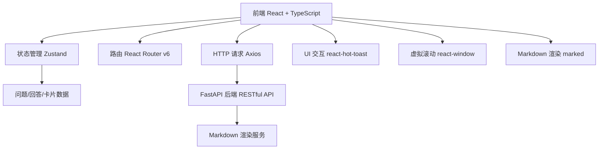
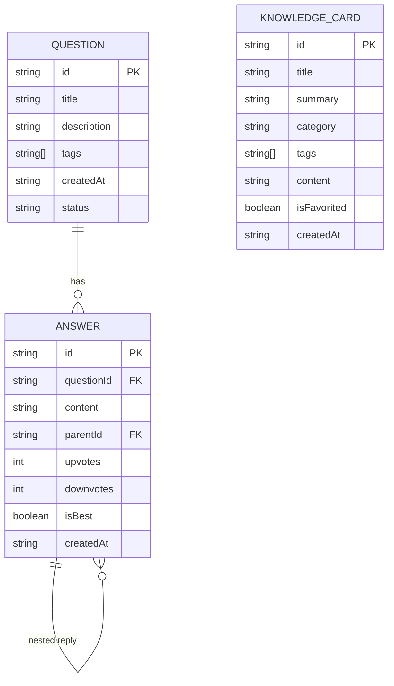

## 1. 架构设计



## 2. 技术说明
- **前端**：React@18 + TypeScript + Vite
- **状态管理**：zustand
- **路由**：react-router-dom v6
- **HTTP客户端**：axios
- **通知提示**：react-hot-toast
- **虚拟滚动**：react-window
- **Markdown渲染**：marked
- **ID生成**：uuid
- **后端**：FastAPI（提供RESTful API和Markdown渲染服务）
- **数据存储**：前端使用 localStorage 存储草稿和收藏状态，mock数据模拟后端

## 3. 路由定义
| 路由 | 用途 |
|-------|---------|
| / | 首页，展示知识卡片瀑布流和社区入口 |
| /ask | 提问页面，包含问题表单和相似推荐 |
| /question/:id | 问题详情页面，展示回答列表和交互功能 |
| /cards | 知识卡片页面，瀑布流展示和创建入口 |

## 4. API 接口定义

### 4.1 问题相关
```typescript
// 获取问题列表
GET /api/questions → Question[]

// 获取单个问题
GET /api/questions/:id → Question

// 创建问题
POST /api/questions → { title: string, description: string, tags: string[] } → Question

// 获取相似问题
GET /api/questions/similar?tags=tag1,tag2 → Question[]
```

### 4.2 回答相关
```typescript
// 获取问题的回答列表
GET /api/questions/:id/answers → Answer[]

// 创建回答
POST /api/questions/:id/answers → { content: string, parentId?: string } → Answer

// 点赞/踩
POST /api/answers/:id/vote → { type: 'up' | 'down' } → Answer

// 设为最佳答案
POST /api/answers/:id/best → Answer
```

### 4.3 知识卡片相关
```typescript
// 获取卡片列表
GET /api/cards → KnowledgeCard[]

// 获取单个卡片
GET /api/cards/:id → KnowledgeCard

// 创建卡片
POST /api/cards → { title: string, summary: string, category: string, tags: string[], content: string } → KnowledgeCard

// Markdown 渲染
POST /api/render-markdown → { content: string } → { html: string }
```

## 5. 数据模型

### 5.1 数据模型定义



### 5.2 TypeScript 类型定义

```typescript
interface Question {
  id: string;
  title: string;
  description: string;
  tags: string[];
  createdAt: string;
  status: 'pending' | 'answered' | 'resolved';
}

interface Answer {
  id: string;
  questionId: string;
  content: string;
  parentId: string | null;
  upvotes: number;
  downvotes: number;
  isBest: boolean;
  createdAt: string;
  replies?: Answer[];
}

interface KnowledgeCard {
  id: string;
  title: string;
  summary: string;
  category: string;
  tags: string[];
  content: string;
  isFavorited: boolean;
  createdAt: string;
}

interface Draft {
  title: string;
  description: string;
  tags: string[];
  savedAt: string;
}
```

## 6. 项目文件结构

```
├── package.json          # 项目依赖配置
├── vite.config.js        # Vite构建配置，代理/api到后端
├── tsconfig.json         # TypeScript配置（严格模式，ES2020）
├── index.html            # 入口HTML页面
├── src/
│   ├── types.ts          # 接口类型定义
│   ├── store.ts          # Zustand全局状态管理
│   ├── App.tsx           # 主路由组件
│   ├── pages/
│   │   ├── AskPage.tsx           # 提问页面
│   │   ├── QuestionDetail.tsx    # 问题详情页
│   │   └── HomePage.tsx          # 首页/知识卡片页
│   ├── components/
│   │   └── KnowledgeCard.tsx     # 知识卡片组件
│   └── utils/
│       └── markdown.ts           # Markdown渲染工具
```
