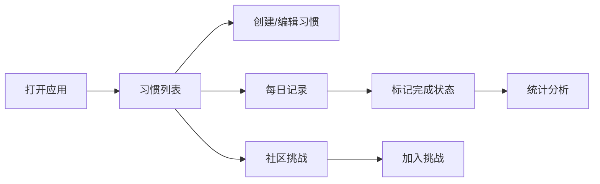

## 1. 产品概述

个人习惯养成与追踪应用，帮助用户建立和维持良好的日常习惯。通过可视化的记录、统计分析和社区挑战功能，激励用户持续坚持。

- 核心价值：让习惯养成可视化、可量化、有趣味
- 目标用户：希望培养良好生活习惯的个人用户

## 2. 核心功能

### 2.1 用户角色
| 角色 | 注册方式 | 核心权限 |
|------|----------|----------|
| 普通用户 | 无需注册（本地演示） | 创建习惯、记录完成、查看统计、参与挑战 |

### 2.2 功能模块
1. **习惯管理**：创建、编辑、删除习惯，设置目标频率和提醒时间
2. **每日记录**：日历视图展示习惯完成情况，快速切换完成状态
3. **统计分析**：完成率折线图、习惯强度热力图、连续天数排名
4. **社区挑战**：挑战列表、加入挑战、个人进度与排名

### 2.3 页面详情
| 页面名称 | 模块名称 | 功能描述 |
|-----------|-------------|---------------------|
| 习惯列表 | HabitList | 展示所有习惯，支持新建、编辑、删除、排序 |
| 每日记录 | RecordPanel | 月日历视图，点击日期标记习惯完成状态 |
| 统计分析 | StatsView | 完成率折线图、热力图、连续天数排名 |
| 社区挑战 | ChallengeBoard | 挑战列表、加入挑战、进度排名 |

## 3. 核心流程

用户打开应用 → 浏览习惯列表 → 创建新习惯 → 在日历中记录完成 → 查看统计分析 → 参与社区挑战

## 4. 用户界面设计

### 4.1 设计风格
- 深色主题：深蓝背景（#1a1a2e）+ 浅紫强调色（#a29bfe）+ 白色文字
- 毛玻璃卡片效果，柔和阴影
- 过渡动画使用缓动函数 ease-out
- 配色方案：完成状态绿、部分完成黄、未完成红

### 4.2 页面设计概览
| 页面名称 | 模块名称 | UI元素 |
|-----------|-------------|-------------|
| 习惯列表 | HabitList | 卡片式列表、新建按钮弹窗、排序下拉、编辑/删除操作 |
| 每日记录 | RecordPanel | 月历网格、状态圆点、颜色渐变过渡、日期切换 |
| 统计分析 | StatsView | 平滑折线图、面积填充、热力图、排名列表 |
| 社区挑战 | ChallengeBoard | 挑战卡片、进度条、参与人数、排名列表 |

### 4.3 响应式
- 桌面端：侧边导航 + 主内容区
- 移动端：顶部汉堡菜单 + 全屏内容
- 触控优化：加大点击区域，手势滑动切换月份

### 4.4 动效
- 圆点颜色渐变过渡（300ms ease-out）
- 热力图单元格悬停放大
- 页面切换淡入淡出
- 卡片悬浮微提升效果
