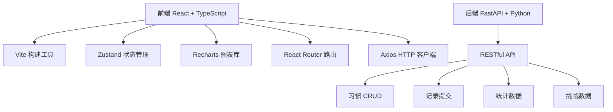
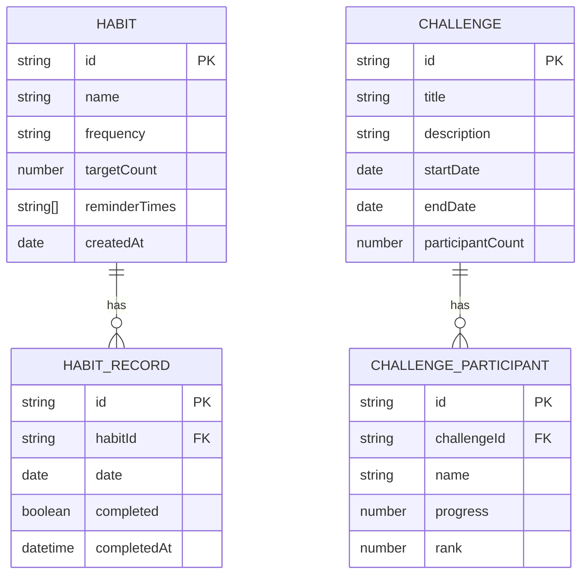

## 1. 架构设计



## 2. 技术描述

- 前端：React 18 + TypeScript + Vite
- 状态管理：Zustand
- 路由：React Router DOM v6
- HTTP 图表：Recharts
- 日期处理：date-fns
- ID生成：uuid
- HTTP客户端：Axios
- 后端：FastAPI (Python)
- 数据：Mock 数据，本地状态管理

## 3. 路由定义

| 路由 | 用途 |
|-------|---------|
| /habits | 习惯列表页面 |
| /record | 每日记录面板 |
| /stats | 统计分析页面 |
| /community | 社区挑战板 |

## 4. API 定义

### 4.1 类型定义

```typescript
interface Habit {
  id: string;
  name: string;
  frequency: 'daily' | 'weekly' | 'custom';
  targetCount: number;
  reminderTimes: string[];
  createdAt: string;
  completionRate: number;
}

interface HabitRecord {
  id: string;
  habitId: string;
  date: string;
  completed: boolean;
  completedAt?: string;
}

interface Challenge {
  id: string;
  title: string;
  description: string;
  startDate: string;
  endDate: string;
  participantCount: number;
  progress: number;
  participants: ChallengeParticipant[];
  joined: boolean;
}

interface ChallengeParticipant {
  id: string;
  name: string;
  progress: number;
  rank: number;
}

interface StatsData {
  completionRateByDay: { date: string; rate: number }[];
  heatmapData: { hour: number; weekday: number; count: number }[];
  streakRanking: { habitName: string; streak: number }[];
}
```

### 4.2 API 端点

| 方法 | 路径 | 描述 |
|------|------|------|
| GET | /api/habits | 获取习惯列表 |
| POST | /api/habits | 创建新习惯 |
| PUT | /api/habits/:id | 更新习惯 |
| DELETE | /api/habits/:id | 删除习惯 |
| GET | /api/records?date=YYYY-MM-DD | 获取指定日期的记录 |
| POST | /api/records | 提交习惯记录 |
| GET | /api/stats | 获取统计数据 |
| GET | /api/challenges | 获取挑战列表 |
| POST | /api/challenges/:id/join | 加入挑战 |
| GET | /api/challenges/:id/ranking | 获取挑战排名 |

## 5. 数据模型

### 5.1 ER图



## 6. 项目结构

```
src/
├── modules/
│   ├── habits/
│   │   ├── types.ts
│   │   ├── HabitList.tsx
│   │   └── RecordPanel.tsx
│   ├── stats/
│   │   └── StatsView.tsx
│   └── community/
│       └── ChallengeBoard.tsx
├── services/
│   └── api.ts
├── App.tsx
├── main.tsx
└── index.css
```
