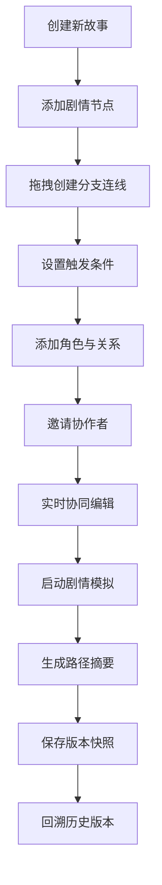

## 1. 产品概述

多人实时叙事创作与分支剧情模拟平台，为编剧团队提供协作式非线性故事编写、角色关系管理和分支逻辑测试的一体化解决方案。
- 解决编剧团队在协作编写非线性故事时难以同步剧情线、管理角色关系和测试分支逻辑的痛点
- 目标用户为游戏编剧、影视剧本创作者、互动叙事设计师等专业内容创作团队

## 2. 核心特性

### 2.1 用户角色
| 角色 | 注册方式 | 核心权限 |
|------|---------|---------|
| 协作者 | 通过邀请链接加入 | 编辑剧情节点、创建连线、管理角色、运行模拟器 |
| 项目创建者 | 首次创建故事 | 所有协作者权限 + 版本管理、分享协作链接 |

### 2.2 功能模块
1. **分支剧情编辑器**：剧情节点创建/编辑、拖拽连线、分支条件设置、实时协同编辑
2. **角色关系图谱**：角色管理、关系类型定义、力导向图可视化、关系详情展示
3. **剧情模拟器**：节点选择启动、条件自动推进、路径高亮、摘要生成
4. **剧情版本历史**：自动版本快照、版本列表、时间轴差异对比

### 2.3 页面详情
| 页面名称 | 模块名称 | 功能描述 |
|---------|---------|---------|
| 主编辑界面 | 顶部工具栏 | 保存、撤销、重做、启动模拟、切换右侧面板 |
| 主编辑界面 | 左侧编辑器画布 | 渲染节点卡片、连线、光标、拖拽交互 |
| 主编辑界面 | 节点卡片 | 显示剧情内容、端口、拖拽、选中发光动画 |
| 主编辑界面 | 右侧角色图谱面板 | 力导向图、角色节点、关系连线、高亮详情 |
| 主编辑界面 | 右侧模拟器面板 | 剧情推进控制、节点高亮、路径展示、摘要卡片 |
| 主编辑界面 | 版本历史面板 | 版本列表、时间轴对比、差异高亮标记 |

## 3. 核心流程

用户创建故事 → 添加剧情节点 → 拖拽建立分支连线 → 设置触发条件 → 添加角色与关系 → 邀请协作者实时编辑 → 启动剧情模拟 → 生成路径摘要 → 保存版本快照 → 回溯历史版本

## 4. 用户界面设计

### 4.1 设计风格
- **主色调**：背景 #1a1a2e，节点卡片 #16213e，连线 #0f3460，高亮强调 #e94560
- **辅助色**：渐变金色边框（模拟高亮）、绿色路径线（历史路径）、红/黄/绿虚线框（版本差异）
- **按钮风格**：圆角矩形(8px)、悬浮渐变背景、柔和阴影
- **字体**：展示字体用 Orbitron，正文字体用 JetBrains Mono
- **布局**：三栏布局（>1200px），双栏（800-1199px），单栏（<800px）
- **图标风格**：使用 lucide-react 线性图标

### 4.2 页面设计概述
| 页面名称 | 模块名称 | UI元素 |
|---------|---------|--------|
| 主编辑界面 | 编辑器画布 | 深色背景带网格纹理、节点卡片带阴影圆角、选中光晕动画、拖拽虚线预览连线 |
| 主编辑界面 | 角色图谱 | 力导向布局、角色头像圆形缩略图、彩色关系连线、悬浮高亮效果 |
| 主编辑界面 | 模拟器 | 金色渐变边框脉冲动效、非活跃节点半透明、绿色路径线、淡入上浮摘要卡片 |
| 主编辑界面 | 版本历史 | 时间轴布局、绿/红/黄差异标记、缩略头像、闪烁动画 |

### 4.3 响应式设计
- 桌面端（≥1200px）：三栏布局（工具栏 + 编辑器 + 角色/模拟器面板）
- 平板端（800-1199px）：双栏布局，角色图谱折叠为图标按钮
- 移动端（<800px）：全屏编辑器，面板以弹窗形式展示
- 所有交互支持触屏操作
