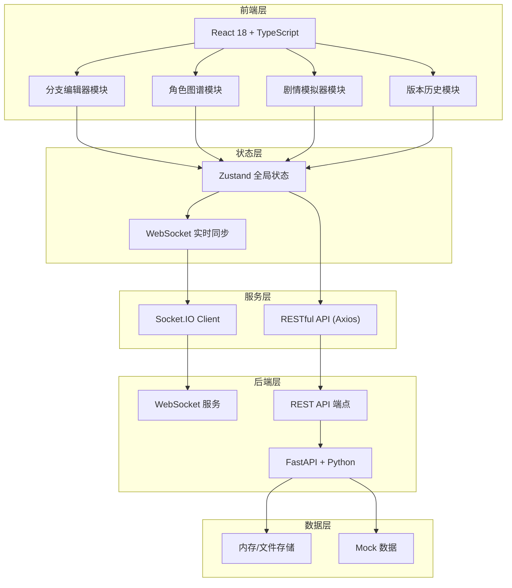
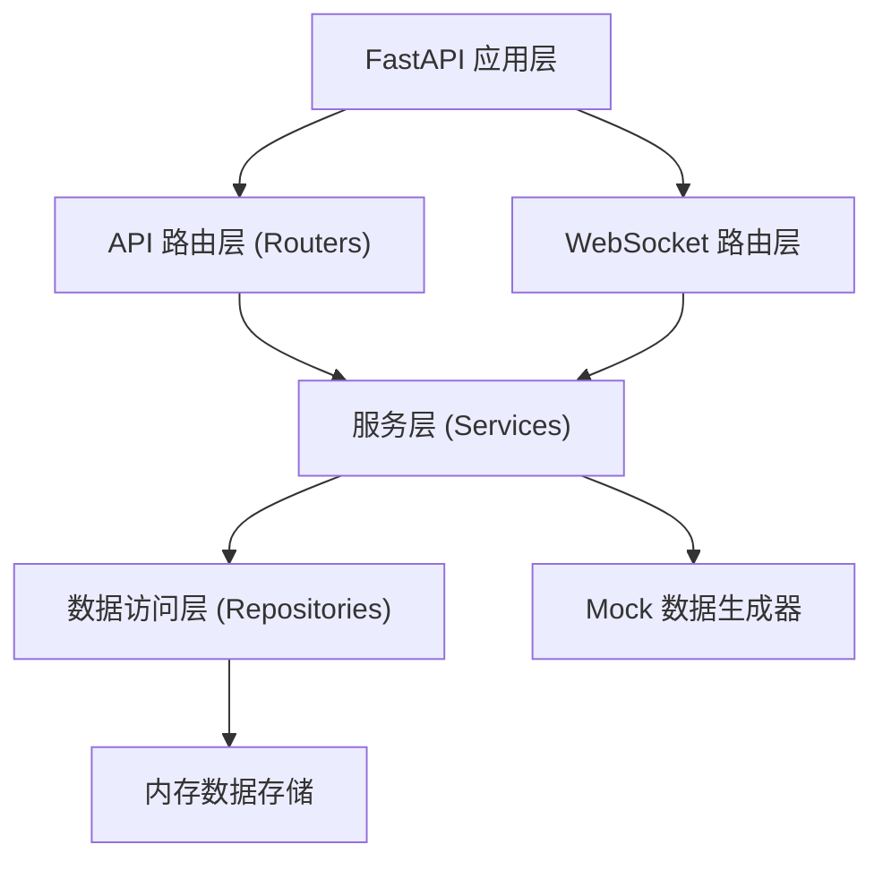
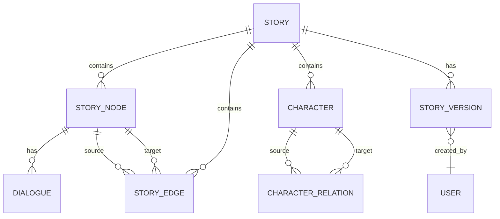

## 1. 架构设计



## 2. 技术选型说明

- **前端**：React@18 + TypeScript@5 + Vite@5，zustand 状态管理，d3-force 力导向图，socket.io-client 实时通信，axios HTTP请求，uuid 唯一ID，date-fns 日期处理，lucide-react 图标
- **初始化工具**：vite-init
- **后端**：FastAPI（Python）提供 RESTful API 和 WebSocket，uvicorn ASGI 服务器
- **数据库**：开发阶段使用内存存储 + Mock 数据，便于前端独立开发

## 3. 路由定义

| 路由 | 用途 |
|------|------|
| / | 故事列表/首页，创建或打开故事 |
| /story/:id | 故事编辑主界面，包含编辑器、图谱、模拟器 |

## 4. API 定义

### TypeScript 类型定义
```typescript
// 剧情节点
interface StoryNode {
  id: string;
  title: string;
  description: string;
  dialogues: Dialogue[];
  position: { x: number; y: number };
  createdAt: number;
  updatedAt: number;
}

// 对话
interface Dialogue {
  id: string;
  characterId: string;
  text: string;
}

// 分支连线
interface StoryEdge {
  id: string;
  sourceId: string;
  targetId: string;
  condition: BranchCondition;
  createdAt: number;
}

// 分支条件
interface BranchCondition {
  type: 'read_node' | 'has_item';
  targetNodeId?: string;
  itemId?: string;
}

// 角色
interface Character {
  id: string;
  name: string;
  avatar: string;
  color: string;
}

// 角色关系
interface CharacterRelation {
  id: string;
  sourceId: string;
  targetId: string;
  type: 'ally' | 'enemy' | 'lover' | 'unknown';
}

// 故事版本
interface StoryVersion {
  id: string;
  version: number;
  createdAt: number;
  creator: { id: string; name: string; avatar: string };
  nodes: StoryNode[];
  edges: StoryEdge[];
  characters: Character[];
  relations: CharacterRelation[];
}

// 协作光标
interface CollaboratorCursor {
  userId: string;
  userName: string;
  color: string;
  x: number;
  y: number;
}
```

### REST API 端点
| 方法 | 路径 | 用途 |
|------|------|------|
| POST | /api/stories | 创建新故事 |
| GET | /api/stories/:id | 获取故事详情（节点、连线、角色） |
| PUT | /api/stories/:id/nodes | 批量更新节点 |
| POST | /api/stories/:id/nodes | 创建节点 |
| PUT | /api/stories/:id/nodes/:nodeId | 更新节点 |
| DELETE | /api/stories/:id/nodes/:nodeId | 删除节点 |
| POST | /api/stories/:id/edges | 创建连线 |
| PUT | /api/stories/:id/edges/:edgeId | 更新连线条件 |
| DELETE | /api/stories/:id/edges/:edgeId | 删除连线 |
| POST | /api/stories/:id/characters | 创建角色 |
| GET | /api/stories/:id/versions | 获取版本历史列表 |
| GET | /api/stories/:id/versions/:versionId | 获取指定版本详情 |
| POST | /api/stories/:id/versions | 创建版本快照 |
| POST | /api/stories/:id/simulate | 执行剧情模拟 |

### WebSocket 消息类型
```typescript
type WSMessage =
  | { type: 'node:update'; payload: StoryNode }
  | { type: 'node:create'; payload: StoryNode }
  | { type: 'node:delete'; payload: { id: string } }
  | { type: 'edge:create'; payload: StoryEdge }
  | { type: 'edge:update'; payload: StoryEdge }
  | { type: 'edge:delete'; payload: { id: string } }
  | { type: 'cursor:move'; payload: CollaboratorCursor }
  | { type: 'character:update'; payload: Character };
```

## 5. 后端架构图



## 6. 数据模型

### 6.1 ER 图


### 6.2 核心数据结构
- **Story**: id, title, description, createdAt, updatedAt
- **StoryNode**: id, storyId, title, description, position{x,y}, dialogues[]
- **StoryEdge**: id, storyId, sourceId, targetId, condition{type, value}
- **Character**: id, storyId, name, avatar, color
- **CharacterRelation**: id, storyId, sourceId, targetId, type
- **StoryVersion**: id, storyId, version, createdAt, creatorId, snapshot(JSON)
- **User**: id, name, avatar, color
