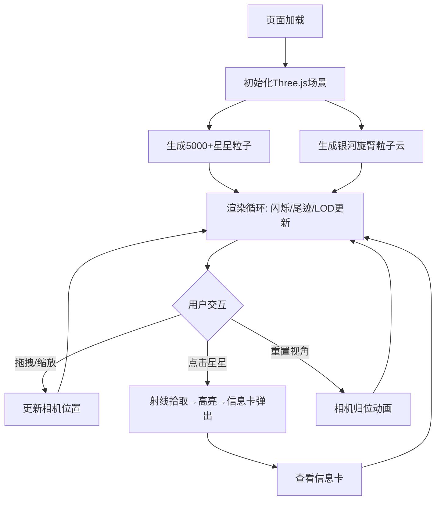

## 1. 产品概述

沉浸式3D星空图探索应用，基于Three.js构建全屏动态星空场景，用户可通过鼠标/触摸自由旋转缩放视角，点击星星查看详细信息，体验真实星空的壮丽与交互的流畅。

- 目标用户：天文爱好者、视觉体验追求者、3D交互演示受众
- 核心价值：以60FPS流畅性能呈现5000+动态闪烁星星与银河旋臂，打造高品质沉浸式星空探索体验

## 2. 核心功能

### 2.1 功能模块

1. **星空主场景**：全屏3D星空，5000+动态闪烁星星，远距光晕与流动尾迹，LOD自动控制
2. **银河旋臂**：渐变色粒子云模拟星云，缓慢旋转，深蓝紫渐变色调
3. **交互系统**：鼠标拖拽旋转、滚轮缩放、点击拾取星星，移动端触摸支持
4. **信息卡片**：点击星星高亮弹出半透明毛玻璃信息卡，显示名称/亮度/距离，淡入动画
5. **控制面板**：左下角悬浮面板，视角重置按钮+帧率显示，毛玻璃风格，弹簧动画

### 2.2 页面详情

| 页面名称 | 模块名称 | 功能描述 |
|----------|----------|----------|
| 星空主场景 | 星星粒子系统 | 生成5000+颗星星，每帧更新闪烁/尾迹/LOD状态 |
| 星空主场景 | 银河旋臂 | 渐变色粒子云缓慢旋转，深蓝紫色调 |
| 星空主场景 | 交互控制 | 拖拽旋转、滚轮缩放、点击拾取、触摸支持 |
| 星空主场景 | 信息卡片 | 点击星星弹出毛玻璃信息卡，淡入动画 |
| 星空主场景 | 控制面板 | 悬浮面板含重置按钮和FPS显示，弹簧动画 |

## 3. 核心流程

用户打开页面 → 全屏星空场景渲染完成 → 自由旋转缩放探索星空 → 点击感兴趣星星 → 星星高亮+信息卡弹出 → 查看名称/亮度/距离 → 继续探索或点击重置视角

## 4. 用户界面设计

### 4.1 设计风格

- 主色调：深蓝紫渐变（#0a0a2e → #1a0a3e → #2d1b69）
- 强调色：星芒金（#ffd700）、星光白（#e8e8ff）
- 按钮风格：圆角半透明毛玻璃，按下弹簧动画
- 字体：显示字体 Orbitron（科技感），信息字体 Exo 2（未来感）
- 布局风格：全屏沉浸式，覆盖层UI元素
- 图标风格：线性描边图标，与星空主题一致

### 4.2 页面设计概览

| 页面名称 | 模块名称 | UI元素 |
|----------|----------|--------|
| 星空主场景 | 星星粒子 | 深蓝紫背景，白色/淡金色粒子，远距光晕发光 |
| 星空主场景 | 银河旋臂 | 深蓝紫渐变粒子云，缓慢旋转 |
| 星空主场景 | 信息卡片 | 毛玻璃背景，半透明白色边框，淡入动画，星芒金标题 |
| 星空主场景 | 控制面板 | 左下角悬浮，毛玻璃背景，重置按钮+FPS数字 |
| 星空主场景 | 光标交互 | 悬停星星时光标变为pointer，点击涟漪效果 |

### 4.3 响应式设计

- 桌面端优先，全屏Canvas自适应
- 移动端触摸操作：单指拖拽旋转、双指缩放、点击拾取
- 控制面板和信息卡在小屏幕上缩放适配
- Canvas尺寸跟随窗口resize自动调整

### 4.4 3D场景指导

- 环境：深空背景，深蓝紫渐变氛围
- 灯光：无方向光源，使用粒子自发光（emissive）和点光源模拟星光
- 相机：透视相机，初始位置(0, 0, 500)，近裁面0.1，远裁面2000
- 交互：OrbitControls拖拽旋转+缩放，Raycaster点击拾取
- 后处理：可选bloom效果增强星光发光
- 性能预算：5000粒子+银河粒子，保持60FPS，LOD控制远处渲染密度
