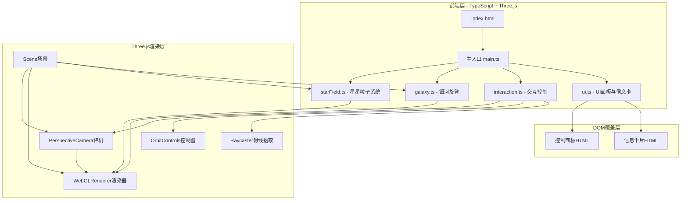

## 1. 架构设计



## 2. 技术说明

- 前端：TypeScript + Three.js + Vite
- 初始化工具：Vite
- 后端：无
- 数据库：无（所有数据前端随机生成）

### 核心依赖

| 依赖 | 版本 | 用途 |
|------|------|------|
| three | ^0.170.0 | 3D渲染引擎 |
| @types/three | ^0.170.0 | Three.js类型定义 |
| vite | ^6.0.0 | 构建工具与开发服务器 |

## 3. 路由定义

| 路由 | 用途 |
|------|------|
| / | 全屏星空主场景（单页面应用） |

## 4. 文件结构

```
d:\P\tasks\auto3\
├── package.json          # 依赖与脚本
├── vite.config.js        # Vite构建配置
├── tsconfig.json         # TypeScript严格模式配置
├── index.html            # 入口HTML，全屏Canvas容器
└── src/
    ├── main.ts           # 主入口，初始化场景与模块
    ├── starField.ts      # 星星粒子系统（5000+粒子，闪烁/尾迹/LOD）
    ├── galaxy.ts         # 银河旋臂粒子云（旋转/渐变色）
    ├── interaction.ts    # 交互系统（拖拽/缩放/点击拾取/触摸）
    └── ui.ts             # UI管理（控制面板/信息卡片/DOM交互）
```

## 5. 模块数据流

### starField.ts
- 初始化：创建BufferGeometry，生成5000+随机位置星星
- 每帧更新：计算闪烁亮度（sin波+随机偏移）、远距星星光晕透明度、尾迹偏移
- LOD逻辑：根据相机距离动态调整远处粒子渲染数量
- 导出：StarField类，提供 update(camera) 和 getMesh() 方法

### galaxy.ts
- 初始化：沿螺旋线生成粒子，渐变着色（深蓝紫）
- 每帧更新：整体绕Y轴缓慢旋转，更新粒子位置
- 导出：Galaxy类，提供 update() 和 getMesh() 方法

### interaction.ts
- 初始化：绑定鼠标/触摸事件，配置OrbitControls
- 事件处理：拖拽→OrbitControls旋转，滚轮→缩放，点击→Raycaster拾取
- 导出：Interaction类，提供 onStarClick 回调、resetView() 方法

### ui.ts
- 初始化：创建控制面板DOM（重置按钮+FPS显示）、信息卡片DOM
- 交互：接收交互事件→更新UI状态→触发CSS动画
- 导出：UI类，提供 showStarInfo(data)、hideStarInfo()、updateFPS(fps) 方法

## 6. 性能优化策略

- **LOD控制**：根据星星与相机距离，远处粒子降低闪烁频率和尾迹更新
- **BufferGeometry**：所有粒子使用BufferGeometry + PointsMaterial，减少drawcall
- **视锥剔除**：Three.js自动裁剪视锥外物体
- **requestAnimationFrame**：同步显示器刷新率
- **DPR限制**：限制设备像素比最大为2，避免高分屏性能瓶颈
- **防抖缩放**：缩放事件节流，平滑过渡避免卡顿
