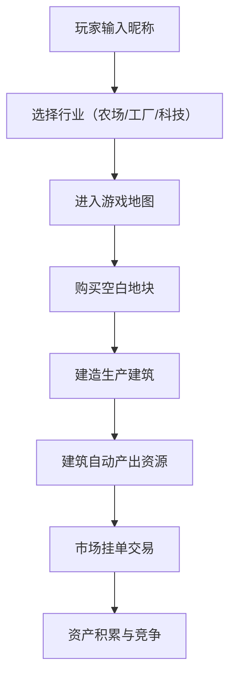

## 1. 产品概述

商业帝国模拟是一款多人在线模拟经营竞赛游戏，2-4名玩家在同一虚拟城市中经营企业，通过资源采集、产品生产和市场交易比拼最终资产总额。

- 目标用户：喜欢策略经营、桌游风格游戏的玩家群体
- 产品价值：提供沉浸式的多人竞争体验，结合资源管理、战略规划和市场博弈

## 2. 核心功能

### 2.1 用户角色

| 角色 | 注册方式 | 核心权限 |
|------|----------|----------|
| 玩家 | 昵称登录 | 选择行业、购买地块、建造建筑、生产交易 |

### 2.2 功能模块

1. **游戏主界面**：六边形地图、资源面板、操作详情区域
2. **行业选择**：农场/工厂/科技公司，各自拥有独特初始资源和生产配方
3. **地块系统**：六边形网格展示，点击购买，所有者颜色高亮
4. **建筑系统**：建造、升级、自动产出资源
5. **交易市场**：挂单买卖、实时成交、动画结算

### 2.3 页面详情

| 页面名称 | 模块名称 | 功能描述 |
|----------|----------|----------|
| 登录页面 | 昵称输入 | 输入玩家昵称进入游戏 |
| 行业选择页 | 行业卡片 | 展示三个行业特点和初始资源，点击选择 |
| 游戏主界面 | 六边形地图 | 可缩放拖拽，展示地块、建筑、所有者 |
| 游戏主界面 | 资源面板 | 实时显示货币、木材、铁矿、食物，数字变化有缩放动画 |
| 游戏主界面 | 操作详情区 | 显示选中地块/建筑的详细信息和操作按钮 |
| 游戏主界面 | 市场面板 | 挂单列表、挂单表单、成交动画 |

## 3. 核心流程

玩家登录后选择行业进入游戏，在六边形地图上购买地块，建造生产建筑获取资源，通过市场与其他玩家交易，最终比拼资产总额。

## 4. 用户界面设计

### 4.1 设计风格

- **主色调**：深蓝紫 #1a1a2e
- **辅色调**：玫红 #e94560
- **高亮色**：金色 #ffd700
- **背景风格**：墨绿色调仿桌游风格
- **按钮风格**：圆角矩形，悬浮有微缩放和发光效果
- **字体**：现代无衬线字体，标题加粗
- **布局风格**：左右分栏，左侧地图右侧面板
- **图标风格**：卡通像素风，3D旋转效果

### 4.2 页面设计概览

| 页面名称 | 模块名称 | UI 元素 |
|----------|----------|----------|
| 游戏主界面 | 六边形地图 | 六边形网格、可缩放拖拽、所有者颜色边框、建筑3D图标 |
| 游戏主界面 | 资源面板 | 资源图标 + 数字、数字变化缩放动画、金色高亮 |
| 游戏主界面 | 建筑菜单 | 弹出卡片、采集/生产/升级按钮、进度条 |
| 游戏主界面 | 市场面板 | 挂单卡片淡入、成交绿色闪烁、金币流动动画 |

### 4.3 响应式设计

- 桌面优先，PC端（≥1280px）左右分栏布局
- 平板端（768px-1280px）保持分栏，适当压缩间距
- 所有交互元素支持触控操作

### 4.4 动效设计

- 资源数字变化：150ms 缩放动画（1 → 1.2 → 1）
- 建筑建造：进度条匀速填充
- 资源飘字：+5木材 从建筑飘向面板，300ms
- 市场挂单：淡入效果 300ms
- 成交动画：绿色高亮闪烁 + 金币流动
- 按钮交互：点击 0.95 缩放，悬浮 1.05 缩放
