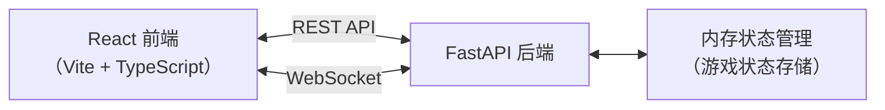
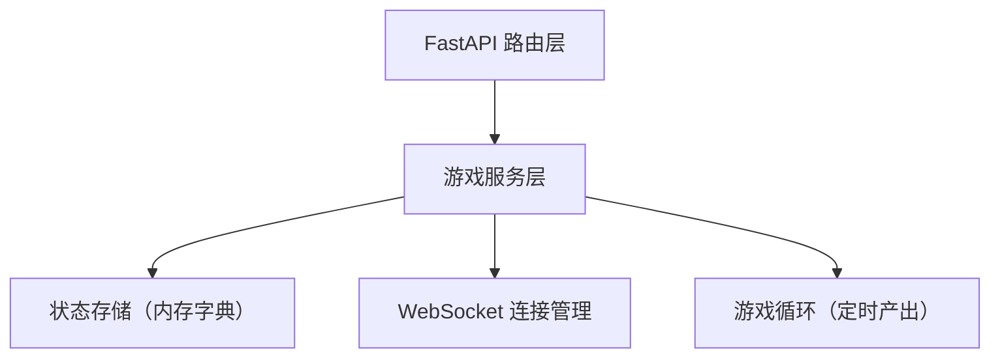
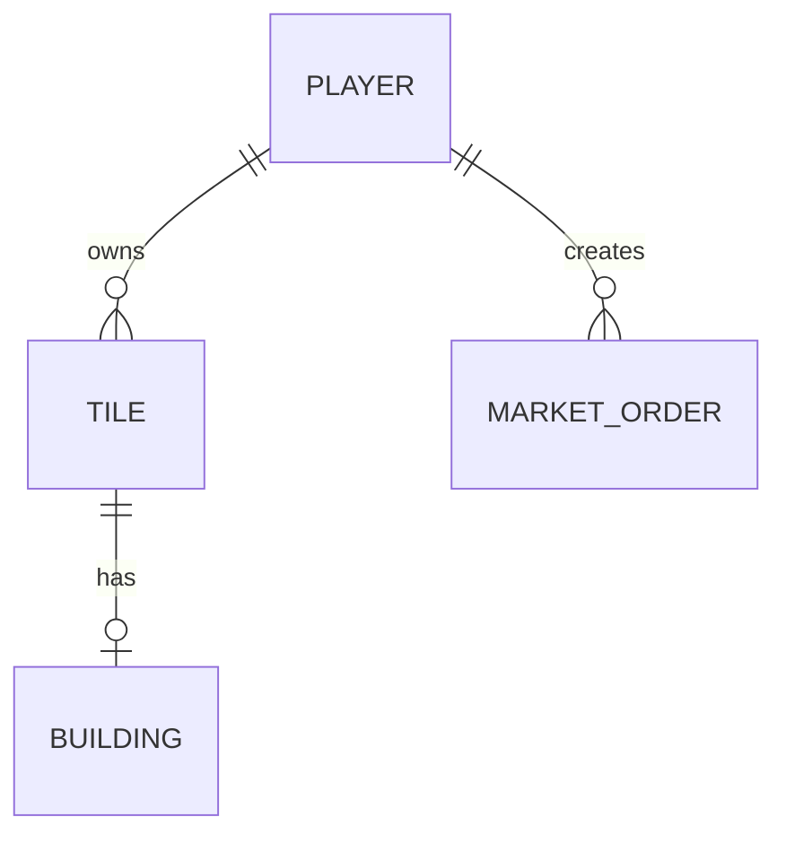

## 1. 架构设计



## 2. 技术栈说明

- **前端框架**：React 18 + TypeScript
- **构建工具**：Vite
- **状态管理**：Zustand
- **路由**：React Router DOM
- **HTTP 客户端**：Axios
- **实时通信**：Socket.IO Client
- **图表**：Recharts
- **唯一ID**：uuid
- **后端框架**：FastAPI（Python）
- **后端 WebSocket**：FastAPI WebSocket

## 3. 路由定义

| 路由 | 用途 |
|------|------|
| / | 登录页面 |
| /select-industry | 行业选择页面 |
| /game | 游戏主界面 |

## 4. API 定义

### 4.1 类型定义

```typescript
interface Player {
  id: string;
  name: string;
  industry: 'farm' | 'factory' | 'tech';
  color: string;
  resources: {
    money: number;
    wood: number;
    iron: number;
    food: number;
  };
}

interface HexTile {
  id: string;
  q: number;
  r: number;
  price: number;
  resourceType: 'wood' | 'iron' | 'food' | 'empty';
  ownerId: string | null;
  building: Building | null;
}

interface Building {
  id: string;
  type: 'lumbermill' | 'mine' | 'factory' | 'farm' | 'techlab';
  level: number;
  buildProgress: number; // 0-100
  lastProduction: number;
}

interface MarketOrder {
  id: string;
  sellerId: string;
  sellerName: string;
  itemType: 'wood' | 'iron' | 'food' | 'product';
  quantity: number;
  pricePerUnit: number;
  isBuyOrder: boolean;
  createdAt: number;
}
```

### 4.2 REST API 端点

| 方法 | 路径 | 描述 |
|------|------|------|
| POST | /api/players | 创建玩家 |
| GET | /api/players/{id} | 获取玩家信息 |
| GET | /api/tiles | 获取所有地块 |
| POST | /api/tiles/{id}/buy | 购买地块 |
| POST | /api/tiles/{id}/build | 建造建筑 |
| POST | /api/tiles/{id}/upgrade | 升级建筑 |
| GET | /api/market | 获取市场挂单 |
| POST | /api/market | 创建挂单 |
| POST | /api/market/{id}/accept | 接受挂单 |

### 4.3 WebSocket 事件

| 事件名 | 方向 | 描述 |
|--------|------|------|
| player_joined | 服务端→客户端 | 新玩家加入 |
| tile_updated | 服务端→客户端 | 地块状态更新 |
| resources_updated | 服务端→客户端 | 玩家资源更新 |
| building_progress | 服务端→客户端 | 建筑建造进度 |
| production | 服务端→客户端 | 资源产出通知 |
| market_order_created | 服务端→客户端 | 新挂单 |
| market_order_filled | 服务端→客户端 | 订单成交 |

## 5. 服务端架构



## 6. 数据模型

### 6.1 实体关系



### 6.2 内存数据结构

- `players: Dict[str, Player]` - 玩家字典
- `tiles: Dict[str, HexTile]` - 地块字典
- `market_orders: List[MarketOrder]` - 市场挂单列表
- `connections: Dict[str, WebSocket]` - WebSocket 连接

## 7. 文件结构

```
project/
├── package.json
├── vite.config.js
├── tsconfig.json
├── index.html
├── src/
│   ├── frontend/
│   │   ├── GameMap.tsx
│   │   ├── ResourcePanel.tsx
│   │   ├── Market.tsx
│   │   └── store.ts
│   └── backend/
│       └── main.py
```

## 8. 性能指标

- 地图渲染帧率 ≥ 50fps（使用 Canvas/SVG 优化六边形绘制）
- 交易列表更新延迟 ≤ 500ms（WebSocket 实时推送）
- 资源动画流畅无卡顿（CSS transform + GPU 加速）
