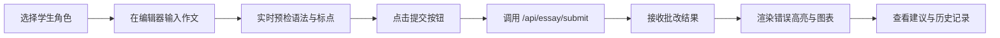
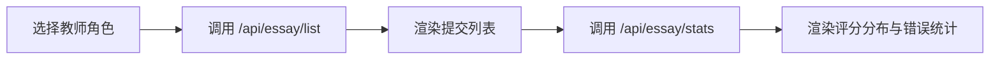

## 1. 产品概述

智能作文批改与反馈应用，面向在线教育场景，支持学生提交作文并获得自动化的语法检查、结构分析与综合评分，同时为教师提供班级提交管理与数据统计能力。

- 核心目标：解决人工批改效率低、反馈不统一的问题，通过AI辅助实现即时、结构化的作文反馈
- 目标用户：K12及高等教育阶段的学生与语文/英语教师
- 产品价值：提升写作训练效率，提供可量化的多维度评分，支持学习轨迹追踪

## 2. 核心功能

### 2.1 用户角色

| 角色 | 登录方式 | 核心权限 |
|------|---------|----------|
| 学生 | 角色选择进入 | 提交作文、查看个人批改结果与历史评分趋势 |
| 教师 | 角色选择进入 | 查看全部提交列表、班级评分分布、错误类型统计 |

### 2.2 功能模块

1. **学生端页面**：富文本编辑器、实时语法预检、批改结果展示（错误高亮、结构图、雷达图、历史趋势）
2. **教师端页面**：提交列表、评分分布可视化、错误类型统计

### 2.3 页面详情

| 页面名称 | 模块名称 | 功能描述 |
|---------|---------|----------|
| 学生端 | 富文本编辑区 | 基于Tiptap的编辑器，支持粘贴/输入，实时拼写与标点预检 |
| 学生端 | 错误高亮面板 | 按类型分组显示语法/拼写/标点错误，点击定位至原文位置 |
| 学生端 | 结构分析图 | 彩色条形图展示引言/正文/结论占比，缺失部分红色边框提示 |
| 学生端 | 综合评分雷达图 | 五维雷达图（语法/结构/词汇/内容/总分），平滑曲线半透明填充，进场动画 |
| 学生端 | 历史趋势图 | 多提交评分折线图，展示学习轨迹 |
| 教师端 | 提交列表 | 展示学生作文提交记录与分数 |
| 教师端 | 统计面板 | 评分分布柱状图、错误类型统计饼图 |

## 3. 核心流程

### 3.1 学生批改流程

### 3.2 教师统计流程

## 4. 用户界面设计

### 4.1 设计风格

- **主色系**：米白 `#FFF8E7`（背景）、浅蓝 `#E3F2FD`（次级面板）、珊瑚粉 `#FF7043`（强调色/错误）
- **辅助色**：语法错误红 `#E53935`、标点错误橙 `#FB8C00`、优秀绿 `#43A047`、中等蓝 `#1E88E5`
- **字体**：Google Fonts - Noto Serif SC（标题，衬线，体现学术感）+ Noto Sans SC（正文）
- **按钮风格**：圆角 12px，珊瑚粉主按钮带微阴影，hover 时轻微上浮
- **布局风格**：桌面端左右分栏（左60%编辑/右40%反馈），移动端手风琴折叠
- **图标风格**：Lucide React 线性图标

### 4.2 页面设计概览

| 页面名称 | 模块名称 | UI 元素 |
|---------|---------|---------|
| 学生端 | 顶部导航 | 角色切换标签、应用 Logo、历史记录入口 |
| 学生端 | 编辑器 | 米白背景卡片、Noto Serif 字体、行高 1.8、波浪线错误标记 |
| 学生端 | 反馈面板 | 浅蓝背景卡片组、手风琴折叠、错误气泡（阴影+圆角16px） |
| 学生端 | 雷达图 | Recharts 平滑曲线、半透明珊瑚粉填充、中心外扩动画 |
| 教师端 | 统计面板 | 卡片网格布局、评分分布柱图、错误类型饼图 |

### 4.3 响应式设计

- **桌面端（≥1024px）**：左右分栏 60/40，固定宽度内容居中
- **平板端（768-1023px）**：左右分栏 50/50，图表自适应缩放
- **移动端（<768px）**：垂直堆叠，反馈面板改为手风琴折叠，触控目标 ≥ 44px

### 4.4 动效规范

| 场景 | 动效 | 时长 | 缓动 |
|-----|------|-----|-----|
| 页面/面板加载 | 淡入（opacity 0→1，translateY 8px→0） | 0.3s | ease-out |
| 雷达图进场 | 径向扫描绘制（从中心向外扩散） | 0.8s | ease-out |
| 错误气泡 | 弹出缩放（scale 0.8→1） | 0.2s | cubic-bezier(0.34,1.56,0.64,1) |
| 按钮 hover | 轻微上浮 + 阴影增强 | 0.2s | ease-out |
