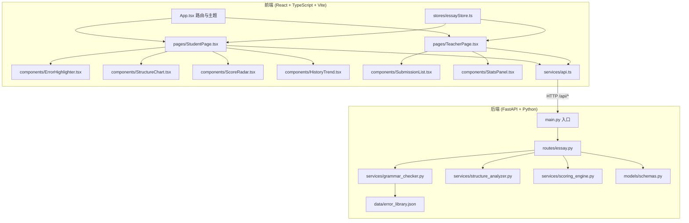
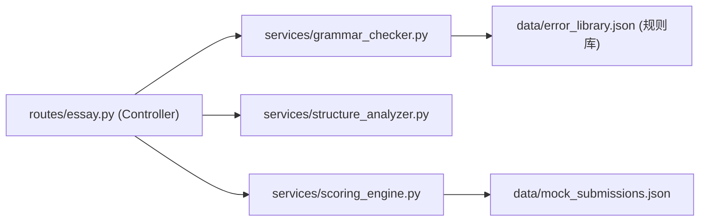

## 1. 架构设计



## 2. 技术说明

- **前端**：React 18 + TypeScript 5 + Vite 5
- **状态管理**：Zustand 4
- **路由**：React Router DOM 6
- **富文本编辑**：@tiptap/react + @tiptap/starter-kit + @tiptap/extension-highlight
- **图表可视化**：Recharts 2
- **HTTP 客户端**：Axios 1
- **样式方案**：TailwindCSS 3 + CSS Variables
- **后端**：FastAPI 0.104 + Python 3.11 + Uvicorn
- **后端数据**：Mock 内存存储 + JSON 错误库（无需数据库）

## 3. 路由定义

| 路由 | 页面 | 说明 |
|-----|-----|-----|
| `/` | 角色选择页 | 学生/教师入口 |
| `/student` | 学生端 | 作文提交与批改反馈 |
| `/teacher` | 教师端 | 提交列表与统计 |

## 4. API 定义

### 4.1 TypeScript 类型

```typescript
interface GrammarError {
  id: string;
  type: 'spelling' | 'punctuation' | 'grammar';
  text: string;
  offset: number;
  length: number;
  suggestion: string;
  message: string;
}

interface StructureAnalysis {
  hasIntro: boolean;
  hasBody: boolean;
  hasConclusion: boolean;
  introPercent: number;
  bodyPercent: number;
  conclusionPercent: number;
  suggestions: string[];
}

interface ScoreBreakdown {
  grammar: number;    // 1-5
  structure: number;  // 1-5
  vocabulary: number; // 1-5
  relevance: number;  // 1-5
  total: number;      // 0-100
}

interface EssaySubmission {
  id: string;
  title: string;
  content: string;
  submittedAt: string;
  errors: GrammarError[];
  structure: StructureAnalysis;
  scores: ScoreBreakdown;
}

interface StatsResponse {
  totalSubmissions: number;
  scoreDistribution: Record<string, number>;
  errorTypeCount: Record<string, number>;
  averageScore: number;
}
```

### 4.2 接口列表

| 方法 | 路径 | 请求体 | 响应 | 说明 |
|-----|-----|--------|-----|-----|
| POST | `/api/essay/submit` | `{ title, content }` | `EssaySubmission` | 提交作文并返回批改结果 |
| GET | `/api/essay/precheck` | Query: `content` | `GrammarError[]` | 实时预检（仅拼写/标点） |
| GET | `/api/essay/list` | - | `EssaySubmission[]` | 获取全部提交列表 |
| GET | `/api/essay/stats` | - | `StatsResponse` | 获取统计数据 |
| GET | `/api/essay/history` | Query: `limit` | `EssaySubmission[]` | 获取历史提交（用于趋势图） |

## 5. 后端架构分层



- **Controller 层**：参数校验、响应组装、CORS 处理
- **Service 层**：核心业务逻辑（语法匹配、段落切分、评分算法）
- **Data 层**：静态 JSON 错误词库与 Mock 数据

## 6. 文件结构与调用关系

### 6.1 前端

```
src/
├── App.tsx                    # 根组件，路由分发 → 调用 pages/*
├── main.tsx                   # 入口
├── services/
│   └── api.ts                 # axios 封装 → submitEssay / getEssayList / getStats / precheck / getHistory
├── stores/
│   └── essayStore.ts          # Zustand → 提交缓存、当前选中、实时预检结果
├── pages/
│   ├── StudentPage.tsx        # → api.submitEssay, api.precheck, api.getHistory; 渲染 ErrorHighlighter/StructureChart/ScoreRadar/HistoryTrend
│   ├── TeacherPage.tsx        # → api.getEssayList, api.getStats; 渲染 SubmissionList/StatsPanel
│   └── RoleSelect.tsx         # 角色选择
├── components/
│   ├── ErrorHighlighter.tsx   # 从 StudentPage 接收 errors[]，在 Tiptap 中 mark 高亮 + 右侧列表
│   ├── StructureChart.tsx     # 接收 StructureAnalysis → Recharts BarChart
│   ├── ScoreRadar.tsx         # 接收 ScoreBreakdown → Recharts RadarChart（带动画）
│   ├── HistoryTrend.tsx       # 接收历史提交 → Recharts LineChart
│   ├── SubmissionList.tsx     # 接收 EssaySubmission[] → 表格
│   └── StatsPanel.tsx         # 接收 StatsResponse → 柱状图 + 饼图
└── types/
    └── index.ts               # 全局 TypeScript 类型
```

### 6.2 后端

```
backend/
├── main.py                    # FastAPI 入口，挂载 routes
├── requirements.txt
├── routes/
│   └── essay.py               # 定义 5 个 API 端点，调用 services/*
├── services/
│   ├── grammar_checker.py     # 基于 error_library 的规则匹配，返回 GrammarError[]
│   ├── structure_analyzer.py  # 段落切分，计算引言/正文/结论占比
│   └── scoring_engine.py      # 四维度加权打分
├── models/
│   └── schemas.py             # Pydantic 模型
└── data/
    ├── error_library.json     # 常见错误词库（拼写/标点/语法规则）
    └── mock_submissions.json  # 初始 Mock 提交数据
```

### 6.3 数据流向（核心路径）

**学生提交路径：**
StudentPage 输入 → `essayStore.precheckErrors` 实时预检 → 点击提交 → `api.submitEssay(title, content)` → 后端 `grammar_checker.check()` + `structure_analyzer.analyze()` + `scoring_engine.score()` → 返回 `EssaySubmission` → StudentPage 将 errors 传给 ErrorHighlighter、structure 传给 StructureChart、scores 传给 ScoreRadar、同时存入 store 供 HistoryTrend 使用。

**教师查看路径：**
TeacherPage 加载 → 并行调用 `api.getEssayList()` 与 `api.getStats()` → 分别传给 SubmissionList 与 StatsPanel 渲染。

## 7. 性能保障策略

| 约束 | 实现方式 |
|-----|---------|
| 语法检查 ≤ 2s | 前端预检去抖（debounce 300ms），后端规则匹配使用 Aho-Corasick 风格的前缀匹配 + 单次扫描 |
| 批量提交 ≤5 篇不卡顿 | 前端使用 Web Worker 做预检计算，避免阻塞主线程；接口并发上限 5 |
| 雷达图动画 ≥30FPS | Recharts 使用 `isAnimationActive` + CSS `will-change: transform`，避免重排 |
