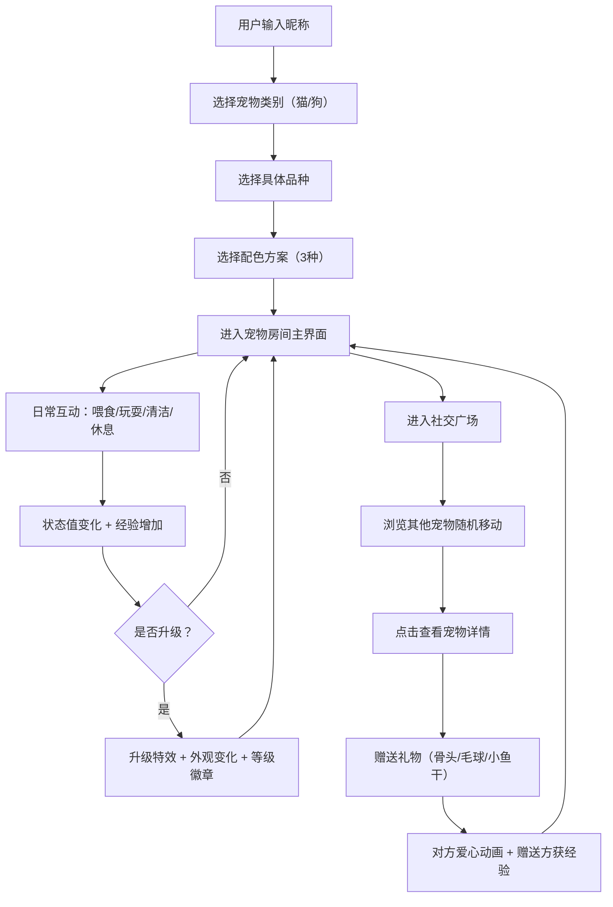

## 1. 产品概述
在线虚拟宠物养成与社交平台，用户可领养猫狗宠物进行日常养成互动，并在广场与其他用户宠物社交送礼
- 核心价值：提供治愈系养成体验 + 轻量社交互动，面向喜欢可爱元素与轻松游戏的用户群体
- 市场定位：Web端休闲养成类应用，支持PC与手机响应式体验

## 2. 核心功能

### 2.1 用户角色
| 角色 | 注册方式 | 核心权限 |
|------|----------|----------|
| 普通用户 | 昵称注册 + 宠物选择 | 宠物养成、广场互动、赠送礼物、升级系统 |

### 2.2 功能模块
1. **注册/宠物选择页**：用户输入昵称，选择宠物种类（猫/狗）和品种，选择配色方案
2. **宠物房间页（主界面）**：宠物展示与互动、状态条监控、家具点击互动
3. **社交广场页**：其他用户宠物展示、宠物详情查看、礼物赠送
4. **升级系统**：经验值累积、等级提升、外观变化、庆祝特效

### 2.3 页面详情
| 页面名称 | 模块名称 | 功能描述 |
|----------|----------|----------|
| 宠物选择页 | 品种选择 | 猫（普通家猫/苏格兰折耳/布偶）、狗（柴犬/金毛/柯基），3种配色各 |
| 宠物选择页 | 配色选择 | 点击预览宠物外观，确认后进入主界面 |
| 宠物房间页 | 宠物动画区 | 中央展示带骨骼动画的宠物SVG，支持眨眼/摇尾/走动 |
| 宠物房间页 | 状态条系统 | 顶部4条彩色进度条：饥饿（红橙黄渐变）、快乐（蓝渐变）、清洁（紫渐变）、体力，带数字动画，低数值闪烁警告 |
| 宠物房间页 | 家具互动 | 食盆（3种食物）、玩具（抛接球游戏）、水盆（喝水）、睡垫（休息） |
| 宠物房间页 | 文字提示 | 互动后宠物上方浮现 '+XX快乐' 等提示，1秒消失 |
| 宠物房间页 | 音效系统 | Web Audio API模拟互动提示音 |
| 社交广场页 | 宠物网格 | 其他用户宠物可点击小图标随机移动，碰撞检测防重叠 |
| 社交广场页 | 宠物详情弹窗 | 显示主人昵称、宠物名、品种、等级 |
| 社交广场页 | 礼物赠送 | 骨头/毛球/小鱼干3种礼物，对方头顶爱心动画，赠送方获经验 |
| 升级系统 | 经验累积 | 喂食/玩耍/清洁增加经验值 |
| 升级系统 | 等级徽章 | 头顶星形徽章：1-3星铜色、4-6银色、7-10金色 |
| 升级系统 | 升级特效 | CSS keyframes金色光芒闪烁 + 庆祝音效 |
| 升级系统 | 外观变化 | 升级后宠物变大、猫加蝴蝶结、狗加项圈 |

## 3. 核心流程
用户注册输入昵称 → 选择宠物类别（猫/狗）→ 选择具体品种 → 选择配色方案 → 进入宠物房间主界面 → 日常互动养成（喂食/玩耍/清洁/休息）→ 累积经验升级 → 进入社交广场 → 浏览其他宠物 → 查看详情/赠送礼物 → 继续养成循环

## 4. 用户界面设计

### 4.1 设计风格
- **主色调**：暖色系整体，浅米黄 (#FFF8E7) 为背景主色
- **按钮色**：淡黄到橙色渐变 (#FFE58F → #FFA940)，圆角设计
- **房间背景**：浅蓝到浅粉渐变 (#E3F2FD → #FCE4EC)
- **广场背景**：翠绿到草绿渐变 (#A5D6A7 → #C5E1A5)
- **字体**：Google Fonts Fredoka One（卡通粗体标题）+ 配套圆润字体
- **卡片样式**：圆角卡片，柔和阴影，悬浮时阴影加深 + 轻微上移
- **进度条**：圆角渐变进度条，带平滑过渡动画
- **风格关键词**：可爱卡通风、圆润边缘、柔和阴影、圆形头像、粗字体

### 4.2 页面设计概览
| 页面名称 | 模块名称 | UI元素 |
|----------|----------|--------|
| 宠物选择页 | 卡片容器 | 居中大卡片，浅米黄背景，圆角20px，柔和阴影 |
| 宠物选择页 | 品种按钮 | 圆角按钮组，选中态橙色渐变，未选中米白色 |
| 宠物选择页 | 配色预览 | 圆形配色缩略图，选中态加橙色粗边框 |
| 宠物房间页 | 状态条区域 | 顶部固定条，4条并排彩色圆角进度条，数值随进度条动画跳动 |
| 宠物房间页 | 宠物区域 | 中央大区域，渐变背景，宠物SVG居中 |
| 宠物房间页 | 家具区 | 底部家具图标排列，圆形大按钮，悬浮放大效果 |
| 宠物房间页 | 食物选择 | 食盆点击后弹出3个食物选项卡片，带价格/效果标签 |
| 社交广场页 | 场景容器 | 全屏渐变背景，CSS绘制草地、树木、长椅装饰 |
| 社交广场页 | 宠物网格 | 可点击宠物小卡片，随机移动，圆形头像+名字标签 |
| 社交广场页 | 详情弹窗 | 居中卡片，宠物大图+信息列表，底部礼物按钮组 |
| 升级特效层 | 全屏遮罩 | 金色光芒辐射动画，中心徽章缩放弹出 |

### 4.3 响应式设计
- **桌面端（PC）**：房间主区域居中最大宽度800px，状态条水平排列4列，家具区底部横向排列
- **移动端（手机）**：宠物房间全屏自适应，状态条缩小为图标+数值上下紧凑排列，家具区网格2行布局，广场宠物网格间距减小
- **触摸优化**：所有可点击元素最小44px触摸区域，家具按钮加大点击热区

### 4.4 动效与性能
- **宠物动画**：SVG SMIL + CSS transform 实现60FPS流畅走动/奔跑
- **状态条**：CSS transition 平滑宽度变化，数值用 requestAnimationFrame 跳动
- **文字提示**：CSS keyframes 上浮+淡出，1秒完成
- **碰撞检测**：矩形碰撞算法，每帧计算调整位置
- **性能目标**：交互响应 <100ms，动画帧率稳定60FPS
