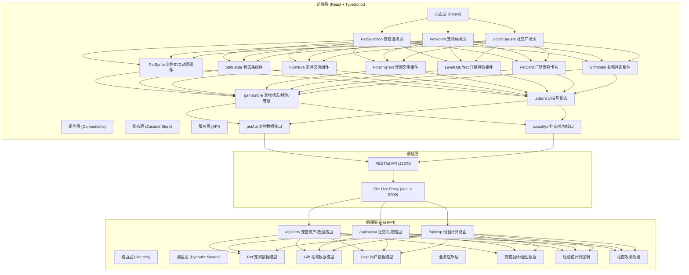
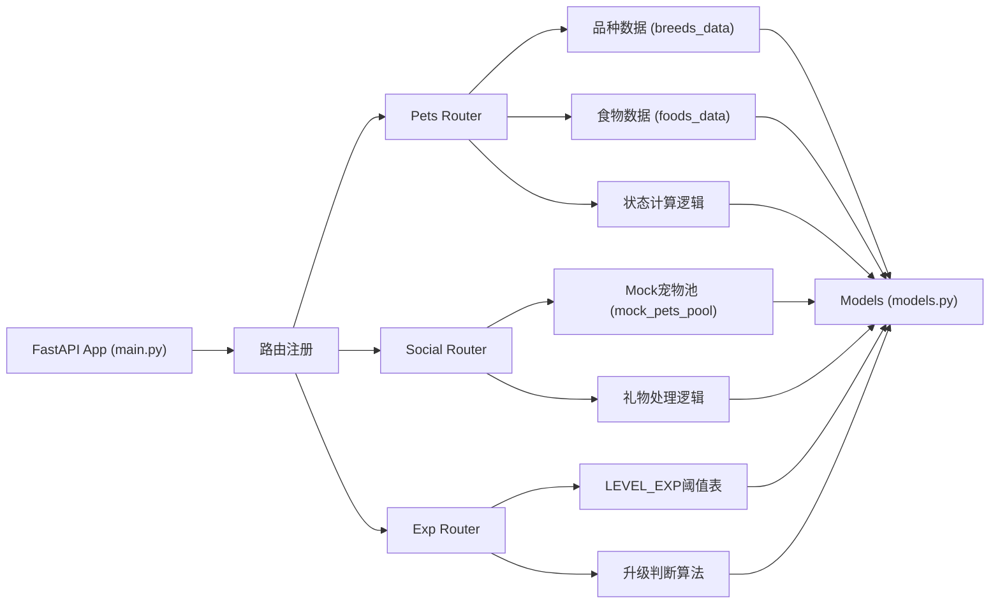
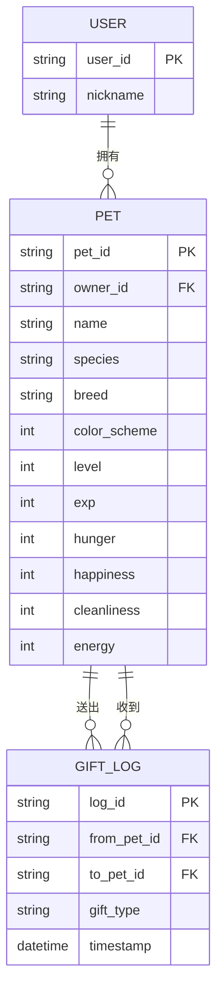

## 1. 架构设计



## 2. 技术描述
- **前端框架**: React 18 + TypeScript 5
- **构建工具**: Vite 5（配置 /api 代理到后端 5000 端口）
- **状态管理**: Zustand 4
- **路由**: React Router DOM 6
- **HTTP客户端**: Axios 1
- **SVG动画**: 原生SVG SMIL + CSS transform（不使用react-konva，改用纯SVG以获得更好的60FPS性能）
- **ID生成**: uuid 9
- **后端框架**: FastAPI（Python）
- **ASGI服务器**: Uvicorn
- **并发启动**: Concurrently（同时启动Vite和Uvicorn）
- **字体**: Google Fonts - Fredoka One
- **数据层**: 后端内置静态Mock数据（无需数据库，保证开箱即用）

## 3. 路由定义
| 路由路径 | 页面组件 | 用途 |
|----------|----------|------|
| `/` | PetSelection | 注册/宠物选择页面（昵称、种类、品种、配色） |
| `/room` | PetRoom | 宠物房间主界面（互动养成、状态监控） |
| `/square` | SocialSquare | 社交广场（其他宠物浏览、送礼） |

## 4. API 定义

### 4.1 TypeScript 类型定义

```typescript
// 宠物种类
type PetSpecies = 'cat' | 'dog';

// 猫品种
type CatBreed = 'domestic' | 'scottish' | 'ragdoll';
// 狗品种
type DogBreed = 'shiba' | 'golden' | 'corgi';
type PetBreed = CatBreed | DogBreed;

// 配色方案
type ColorScheme = 0 | 1 | 2;

// 宠物完整数据
interface Pet {
  id: string;
  ownerId: string;
  ownerName: string;
  name: string;
  species: PetSpecies;
  breed: PetBreed;
  colorScheme: ColorScheme;
  level: number;        // 1-10
  exp: number;
  hunger: number;       // 0-100
  happiness: number;    // 0-100
  cleanliness: number;  // 0-100
  energy: number;       // 0-100
}

// 食物类型
type FoodType = 'dry' | 'can' | 'snack';
interface FoodItem {
  type: FoodType;
  name: string;
  icon: string;
  hungerEffect: number;
  happinessEffect: number;
  expReward: number;
}

// 礼物类型
type GiftType = 'bone' | 'yarn' | 'fish';
interface GiftItem {
  type: GiftType;
  name: string;
  icon: string;
  happinessEffect: number;
  expReward: number;
}

// 状态劣化配置
interface DecayConfig {
  hungerPerTick: number;
  happinessPerTick: number;
  cleanlinessPerTick: number;
  energyPerTick: number;
  tickIntervalMs: number;
}

// 升级所需经验
const LEVEL_EXP: number[] = [
  0, 50, 120, 220, 350, 520, 730, 980, 1280, 1630, 2030
];
```

### 4.2 后端API端点

| 方法 | 路径 | 请求体 | 响应 | 用途 |
|------|------|--------|------|------|
| GET | `/api/pets/breeds` | - | `{ cats: BreedInfo[], dogs: BreedInfo[] }` | 获取所有宠物品种及配色信息 |
| GET | `/api/pets/foods` | - | `FoodItem[]` | 获取食物列表 |
| GET | `/api/pets/gifts` | - | `GiftItem[]` | 获取礼物列表 |
| POST | `/api/pets/create` | `{ ownerName, species, breed, colorScheme, name }` | `Pet` | 创建新宠物 |
| GET | `/api/pets/{id}` | - | `Pet` | 获取单个宠物数据 |
| PUT | `/api/pets/{id}/feed` | `{ foodType: FoodType }` | `{ pet: Pet, effects: { hunger, happiness, exp } }` | 喂食宠物 |
| PUT | `/api/pets/{id}/play` | - | `{ pet: Pet, effects: { happiness, energy, exp } }` | 玩耍互动 |
| PUT | `/api/pets/{id}/clean` | - | `{ pet: Pet, effects: { cleanliness, exp } }` | 清洁/喝水 |
| PUT | `/api/pets/{id}/rest` | - | `{ pet: Pet, effects: { energy } }` | 休息恢复体力 |
| GET | `/api/exp/levelup` | `?currentLevel=&currentExp=&gain=` | `{ leveledUp, newLevel, newExp }` | 计算是否升级 |
| GET | `/api/social/pets` | - | `Pet[]` | 获取广场其他用户宠物列表（Mock 8-12只） |
| POST | `/api/social/gift` | `{ fromPetId, toPetId, giftType: GiftType }` | `{ success, senderExpGain, receiverHappinessGain }` | 赠送礼物 |

## 5. 后端服务架构图



## 6. 数据模型

### 6.1 ER 关系图



### 6.2 核心数据表（Mock数据说明）

后端无需真实数据库，使用内存字典保存数据：

```python
# 内存数据存储
pets_db: Dict[str, Pet] = {}  # pet_id -> Pet 对象

# 预设品种数据
CAT_BREEDS = {
    "domestic": {
        "name": "普通家猫",
        "colors": [
            {"body": "#F5A623", "ears": "#D4891C", "eyes": "#7C4D1A"},  # 橘猫
            {"body": "#2C2C2C", "ears": "#1A1A1A", "eyes": "#FFD700"},  # 黑猫
            {"body": "#FAFAFA", "ears": "#E0E0E0", "eyes": "#5C97BF"},  # 白猫
        ]
    },
    "scottish": {
        "name": "苏格兰折耳",
        "colors": [
            {"body": "#C9B8A0", "ears": "#A89070", "eyes": "#95A5A6"},  # 灰色折耳
            {"body": "#F4E4C1", "ears": "#E0C88A", "eyes": "#7F8C8D"},  # 奶油色
            {"body": "#D3B8B8", "ears": "#B89898", "eyes": "#9B59B6"},  # 淡紫
        ]
    },
    "ragdoll": {
        "name": "布偶猫",
        "colors": [
            {"body": "#FAEBD7", "ears": "#8B7355", "eyes": "#4A90D9"},  # 海豹双色
            {"body": "#E8E8E8", "ears": "#9370DB", "eyes": "#2980B9"},  # 紫丁香
            {"body": "#FFEFD5", "ears": "#D2691E", "eyes": "#3498DB"},  # 火焰色
        ]
    }
}

DOG_BREEDS = {
    "shiba": {
        "name": "柴犬",
        "colors": [
            {"body": "#E8A35A", "ears": "#C97F3A", "eyes": "#5C3317"},  # 赤柴
            {"body": "#2C2C2C", "ears": "#1A1A1A", "eyes": "#8B4513"},  # 黑柴
            {"body": "#F5F5DC", "ears": "#D2B48C", "eyes": "#8B4513"},  # 白柴
        ]
    },
    "golden": {
        "name": "金毛",
        "colors": [
            {"body": "#DAA520", "ears": "#B8860B", "eyes": "#8B4513"},  # 深金
            {"body": "#F4D03F", "ears": "#D4AC0D", "eyes": "#A0522D"},  # 浅金
            {"body": "#CD853F", "ears": "#A0522D", "eyes": "#654321"},  # 秘鲁色
        ]
    },
    "corgi": {
        "name": "柯基",
        "colors": [
            {"body": "#FAF0E6", "ears": "#CD5C5C", "eyes": "#4A2C2A"},  # 红白
            {"body": "#FFE4B5", "ears": "#8B4513", "eyes": "#5C3317"},  # 棕白
            {"body": "#D3D3D3", "ears": "#696969", "eyes": "#2F4F4F"},  # 黑白
        ]
    }
}

# 食物数据
FOODS = {
    "dry": {"name": "干粮", "icon": "🥣", "hungerEffect": 25, "happinessEffect": 5, "expReward": 5},
    "can": {"name": "罐头", "icon": "🥫", "hungerEffect": 40, "happinessEffect": 15, "expReward": 10},
    "snack": {"name": "零食", "icon": "🍖", "hungerEffect": 10, "happinessEffect": 25, "expReward": 8},
}

# 礼物数据
GIFTS = {
    "bone": {"name": "骨头", "icon": "🦴", "happinessEffect": 15, "expReward": 10},
    "yarn": {"name": "毛球", "icon": "🧶", "happinessEffect": 20, "expReward": 12},
    "fish": {"name": "小鱼干", "icon": "🐟", "happinessEffect": 25, "expReward": 15},
}

# 升级经验阈值 (索引为等级)
LEVEL_EXP_TABLE = [0, 50, 120, 220, 350, 520, 730, 980, 1280, 1630, 2030]

# 广场Mock宠物池
MOCK_SQUARE_PETS = [
    # 预置8-12只其他用户宠物，随机ID和数据
]
```

### 6.3 前端Zustand Store结构

```typescript
// gameStore.ts
interface GameState {
  // 用户信息
  userId: string | null;
  nickname: string;
  
  // 当前宠物
  currentPet: Pet | null;
  
  // UI状态
  floatingTexts: FloatingText[];  // 浮起文字队列
  showLevelUp: boolean;            // 升级特效开关
  activeFurniture: FurnitureType | null;  // 当前激活的家具
  
  // Actions
  registerUser: (nickname: string) => void;
  createPet: (data: CreatePetData) => Promise<void>;
  feedPet: (foodType: FoodType) => Promise<void>;
  playPet: () => Promise<void>;
  cleanPet: () => Promise<void>;
  restPet: () => Promise<void>;
  sendGift: (toPetId: string, giftType: GiftType) => Promise<void>;
  addFloatingText: (text: string, color: string) => void;
  triggerLevelUp: () => void;
  setActiveFurniture: (f: FurnitureType | null) => void;
  decayTick: () => void;  // 定时器调用的状态劣化
}
```

### 6.4 文件结构总览

```
auto33/
├── index.html                      # 入口HTML (含Google Fonts)
├── package.json                    # 依赖 + 启动脚本
├── vite.config.js                  # Vite配置 + /api代理
├── tsconfig.json                   # TypeScript严格模式
├── src/
│   ├── main.tsx                    # 应用入口
│   ├── App.tsx                     # 路由配置
│   ├── pages/
│   │   ├── PetSelection.tsx        # 宠物选择页
│   │   ├── PetRoom.tsx             # 宠物房间页（主界面）
│   │   └── SocialSquare.tsx        # 社交广场页
│   ├── components/
│   │   ├── PetSprite.tsx           # 宠物SVG动画组件（骨骼状态）
│   │   ├── StatusBar.tsx           # 顶部状态条（渐变进度条）
│   │   ├── FurnitureBar.tsx        # 底部家具交互栏
│   │   ├── FoodPicker.tsx          # 食物选择弹窗
│   │   ├── FloatingText.tsx        # 浮起文字组件
│   │   ├── LevelUpEffect.tsx       # 升级特效组件
│   │   ├── LevelBadge.tsx          # 等级星形徽章
│   │   ├── SquarePet.tsx           # 广场宠物小卡片
│   │   ├── PetDetailModal.tsx      # 宠物详情弹窗
│   │   └── NavBar.tsx              # 导航栏
│   ├── stores/
│   │   └── gameStore.ts            # Zustand全局状态
│   ├── api/
│   │   └── index.ts                # Axios封装 + API调用
│   ├── types/
│   │   └── index.ts                # TypeScript类型定义
│   ├── utils/
│   │   ├── audio.ts                # Web Audio音效工具
│   │   └── helpers.ts              # 通用工具函数
│   └── styles/
│       └── global.css              # 全局样式 (CSS变量/动画)
└── backend/
    ├── main.py                     # FastAPI主应用 + 路由
    ├── models.py                   # Pydantic数据模型
    └── requirements.txt            # Python依赖
```
